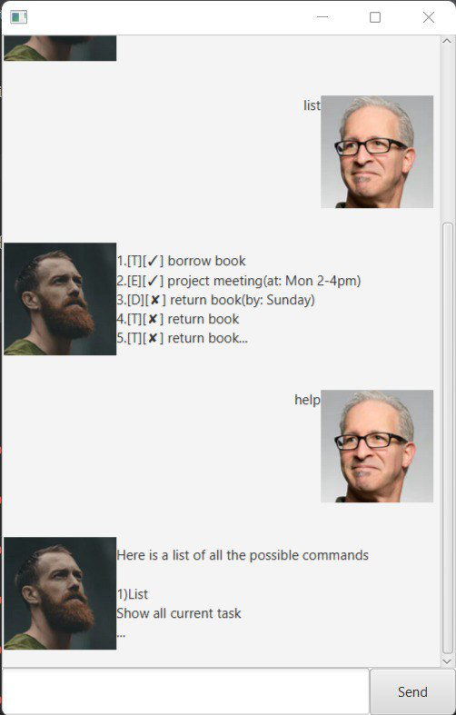

# User Guide - Duke Task Manager


## Features

## Feature - List all Tasks
Retrieve all tasks from storage.
### Usage
### `list`

Expected outcome: All tasks will be displayed, regardless whether it is marked or not.

## Feature - Search
Search for a saved task description.
### Usage
### `find <query string`

- Example Usage
    - `find church`

## Feature - Mark
Mark a task as done.
### Usage
### `mark <index of task shown in the list>`

- Example Usage
    - `mark 1`

Expected outcome: A task specified by the given index will be marked as done

## Feature - Unmark
Mark a task as un done.
### Usage
### `unmark <index of task shown in the list>`

- Example Usage
    - `unmark 1`

Expected outcome: A task specified by the given index will be marked as undone.

## Feature - Delete
Delete a task
### Usage
### `delete <index of task shown in the list>`

- Example Usage
    - `delete 1`

Expected outcome: A task specified by the given index will be deleted.

## Feature - ToDo
Create a new todo task.
### Usage
### `todo <insert todo here>`

- Example Usage
    - `todo Go to Heaven`

Expected outcome: An unmarked Todo task will be created and stored in the list.

## Feature - Deadline
Create a new Deadline task.
### Usage
### `deadline <describe deadline> /by <LocalDateTime string>`

- Example Usage
    - `deadline Submit cheque to heaven /by 1234 12 Dec 2024`

Expected outcome: An unmarked deadline task will be created and stored in the list.

## Feature - Event
Create a new Event task.
### Usage
### `event <describe event> /at <LocalDateTime string>`

- Example Usage
    - `event Heaven Homecoming /at 2359 24 Dec 2022`

Expected outcome: An unmarked event task will be created and stored in the list.

## Feature - Schedules
Get schedules of a specified time frame
### Get all schedules in chronological order
#### Usage
`schedule_general`

Expected outcome: All tasks will be returned sorted based on their date of creation or date.

### Get schedules in specified time range
### Use Cases
#### Get schedules from given datetime onwards
    - `schedule_range /from <LocalDateTime string>`

- Example Usage:
    - Displays all tasks that fall from 1200 19 Dec 2022 onwards.

      `schedule_range /from 1200 19 Dec 2022`

#### Get schedules from given datetime range
`schedule_range /from <LocalDateTime string> /to <LocalDateTime string>`

- Example Usage:
    - Displays all tasks that fall from 1200 19 Dec 2022 onwards to 0001 25 Dec 2025.

      `schedule_range /from 1200 19 Dec 2022 /to 0001 25 Dec 2025`

## Feature - Exit
Exit the program
### Usage
`bye`

## Supported LocalDateTime strings
```
"yyyy-MM-dd HHmm"
"yyyy/MM/dd HHmm"
"HHmm dd/MM/yyyy"
"HHmm yyyy-MM-dd"
"HHmm yyyy/MM/dd"
"dd/MM/yyyy HHmm"
"dd-MM-yyyy HHmm"
"HHmm dd-MM-yyyy"
"MMM dd yyyy HHmm"
"HHmm dd MMM yyyy"
"dd MMM yyyy HHmm"
```