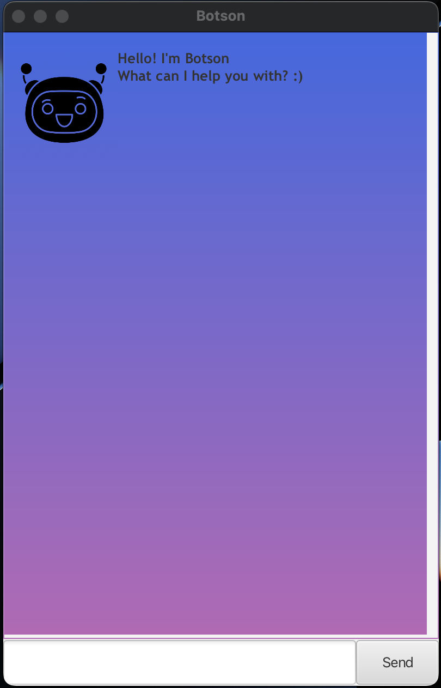

# Botson 

## Basic Overview
Chatbot application that helps you keep track of what needs to be done.


## Demonstration of Botson


## How to use
Prerequisites: Java 11, update Intellij to the most recent version.

1. Download the [latest jar](https://github.com/jicsontoh/Botson/releases) file from the releases
2. Copy the file to the folder you want to use as the home folder for your JeeqTracker. 
3. Double-click the file to start the app. The GUI similar to the below should appear in a few seconds.
   - If double-clicking the jar file doesn't work, use the following command to run the app.
   ```
    $ java -jar {file_name} command to open it.
    ```



## Features of Botson

- ### Add new Task
Adds a new task to the list.

| Type            | Command                |
|-----------------|------------------------|
| Normal Task [T] | todo TASK              |
| Event       [E] | event TASK /at DATE    |
| Deadline    [D] | deadline TASK /by DATE |

Note: DATE should be in DD/MM/YYYY format.

- ### Edit Task

Make changes to the name of the specified task by the index.
```
update

INDEX:rename:NEW_NAME
```

- ### Mark Task

Mark the status of the specified task as complete.
```
mark INDEX
```

- ### Delete Task

Remove unwanted task specified by the index position.
```
delete INDEX
```

- ### Find Task

Search for a task specified by the keyword.
```
find KEYWORD
```

- ### List all Tasks

View all the tasks currently in the list.
```
list
```

