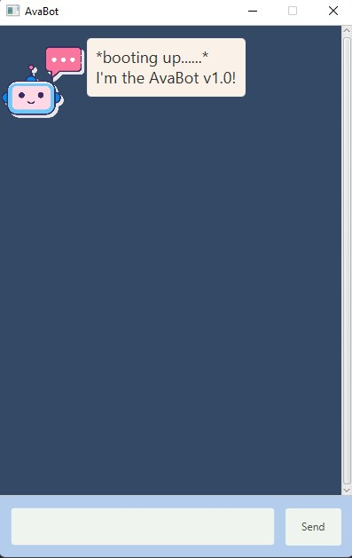

# Ava Chatbot Project

_Ava_ is a GUI based todo manager bot built with Java. Hence, the name Ava. Write once, run anywhere!

## Setting up in Intellij

Prerequisites: JDK 11, update Intellij to the most recent version.

1. Open Intellij (if you are not in the welcome screen, click `File` > `Close Project` to close the existing project first)
2. Open the project into Intellij as follows:
   1. Click `Open`.
   1. Select the project directory, and click `OK`.
   1. If there are any further prompts, accept the defaults.
3. Configure the project to use **JDK 11** (not other versions) as explained in [here](https://www.jetbrains.com/help/idea/sdk.html#set-up-jdk). 
   In the same dialog, set the **Project language level** field to the `SDK default` option.
4. After that, locate the `src/main/java/Launcher.java` file, right-click it, and choose `Run Launcher.main()` 
   (if the code editor is showing compile errors, try restarting the IDE). 
   If the setup is correct, you should see a window like this:
   

## Acknowledgments
This project uses the following Java libraries:
1. [JavaFX](https://openjfx.io/)
