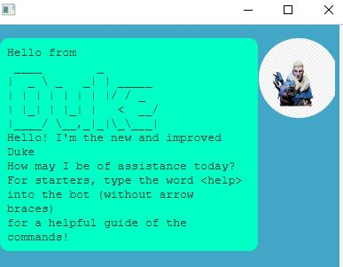

# Our new and improved Duke 

Duke simulates a task manager where you can add 3 types of events, individually known as: Todo / Event / Deadline. These all come with descriptions which you will specify You can mark/unmark/delete/view a list and more! 

## What do I need to use the project?

Prerequisites: JDK 11 [Download and setup guide here!](https://www.oracle.com/sg/java/technologies/javase/jdk11-archive-downloads.html)

## How do I set up this project? 
There are 3 simple steps! 

1. Download the latest release from [here!](https://github.com/cowlinn/ip/releases) 
2. Extract the file to a working directory of your choice. 
3. Execute the jar format
   1. Ensure you're on the correct working directory 
   2. Entering the command `java -jar duke.jar` in the terminal 
3. If the setup is correct, you should see a :

## Using our commands 
Enter the corresponding input as required! 

| Command Functionality | Syntax Example | Format Example | Description |
| --- | --- | --- | --- |
| Add todo | `todo (description)` | todo clean dishes | Adds a todo event to the list |
| Add event | `event <description> /at <date>`| event submit assignment  /at 2020-05-05 | Adds an event to the list. Notice that these have dates tagged to them, with the syntax: `YYYY-MM-DD`|
| Add Deadline| `deadline <description> /by <date>` | deadline submit assignment  /at 2020-05-05 | Adds a deadline to the list. Same format as event
| Delete |  `delete <taskListNumber>` |  delete 5 | This deletes the specified task in the list. Note that the tasks go in running order, starting from 1 | 
Find | `find <keyWord(s)>` | : find homework | Searches the descriptions of all the tasks in the list, and returns a list view of all the tasks which contain the specified keyword inside. |
| List out a bunch of tasks | `list` | list (no further arguments) | Single word command that returns a list view of the tasks 
| mark/unmark tasks | `(un)mark <taskListNumber>` | mark 3 / unmark 4 | Keeps track of whether tasks are done / undone. When loading in a task, it is not done (unmarked by default). Marking adds a cross next to the item in list view, and unmarking does the opposite.
| view schedule on available day | `viewSchedule <date>` | viewSchedule 2022-05-05 | Returns a list view of tasks that happen on that specific day. Do take note of the standard date syntax: `YYYY-MM-DD` |

