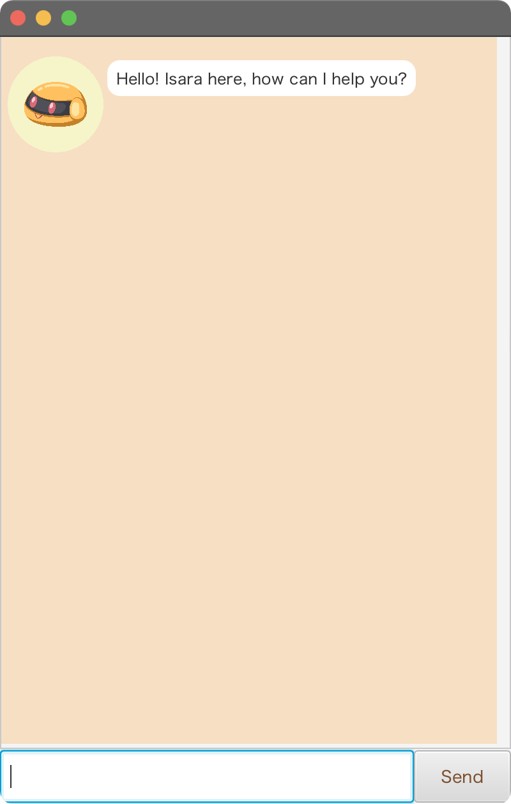

# Hello! I am Isara.
_Having trouble remembering your tasks?_ Do not fret; with __Isara__, forgetting your
deadlines, events, or todos are _not_ a problem anymore! With Isara, you can:
- Add your tasks
- Categorize your tasks into three types: deadlines, events, todos
- List all of your tasks
- Find your tasks with a keyword
- Mark your tasks as done, or unmark them if it was a mistake
- Delete your tasks in the list
- Reschedule deadlines if there are changes in plans
- Save your tasks in a file, so you can load them back up

## Setting up in Intellij

Prerequisites: JDK 11, update Intellij to the most recent version.

1. Open Intellij (if you are not in the welcome screen, click `File` > `Close Project` to close the existing project first)
2. Open the project into Intellij as follows:
   1. Click `Open`.
   1. Select the project directory, and click `OK`.
   1. If there are any further prompts, accept the defaults.
3. Configure the project to use **JDK 11** (not other versions) as explained in [here](https://www.jetbrains.com/help/idea/sdk.html#set-up-jdk).  
   In the same dialog, set the **Project language level** field to the `SDK default` option.
4. After that, locate the `src/main/java/isara/Launcher.java` file, right-click it, and choose
   `Run Launcher.main()` (if the code editor is showing compile errors, try restarting the IDE). If
   the setup is correct, you should see something like the below as the output:   
   
