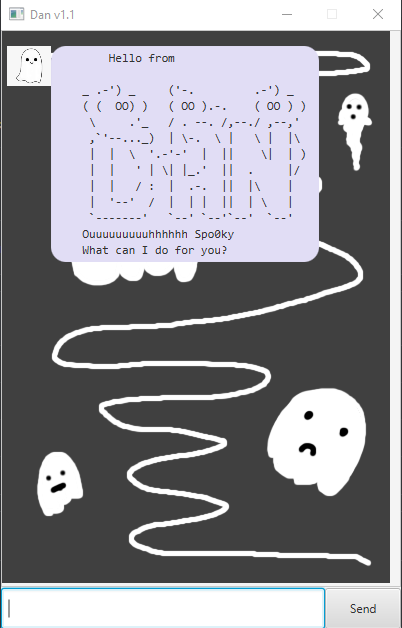

# Dan User Guide

**Dan** is an **interactive text-based desktop todo list app for managing tasks,
optimized for use via a Command Line Interface (CLI)** Never forget another task again 
with Dan 👻 👻 👻!

## First App View

## General Command Format

- Words in `UPPER_CASE` are the parameters to be supplied by the user,
  e.g. in `todo TODO_NAME`, `TODO_NAME` is a parameter which can be used
  as `todo clean room`.
- Commands enclosed in square brackets `[INPUT]` are optional arguments that can be entered 
  by the user, separated by spaces.
- ` dd/MM/yyyy HHmm` refers to the standard date-time format, e.g. `31/12/2022 1900`.
  Invalid dates or dates that are not in this format won't be accepted.
- If parameters are specified for commands that do not take in parameters,
  the input will be rejected and error message will be shown.

## Commands Summary

- `list`
- `todo TODO_NAME`
- `deadline DEADLINE_NAME /by  dd/MM/yyyy HHmm`
- `event EVENT_NAME /at  dd/MM/yyyy HHmm`
- `mark TASK_NUMBER [TASK_NUMBERS]`
- `unmark TASK_NUMBER [TASK_NUMBERS]`
- `delete TASK_NUMBER [TASK_NUMBERS]`
- `find KEYWORD [KEYWORDS]`
- `help`
- `bye`

## Commands

### Adding a todo task: `todo`

Adds a todo task to Dan the ghost.

Format: `todo TODO_NAME`

Examples:

- `todo Clean my room`
- `todo study for midterms`

### Adding a deadline task: `deadline`

Adds a deadline task to Dan the ghost.

Format: `deadline DEADLINE_NAME /by  dd/MM/yyyy HHmm`

- An error will be shown if the input satisfies one of the three conditions below
    - " /by " separator is not found
    - Datetime is not valid
    - Datetime is not in format `dd/MM/yyyy HHmm`

Examples:

- `deadline Submit iP /by 16/09/2022 2359`
- `deadline complete cs3243 project 1 /by 18/09/2022 2359`

### Adding an event task: `event`

Adds an event task to Dan the ghost.

Format: `event EVENT_NAME /at  dd/MM/yyyy HHmm`

- An error will be shown if the input satisfies one of the three conditions below
    - " /at " separator is not found
    - Datetime is not valid
    - Datetime is not in format `dd/MM/yyyy HHmm`

Examples:

- `event birthday party /at 18/09/2022 2000`
- `event definitely an event /at 31/12/2022 0000`

### Listing all tasks: `list`

Shows a list of all tasks Dan the ghost is playing with.

Format: `list`

- An error will be shown if the command is followed by parameters

### Marking a task as done: `mark`

Marks a task stored with Dan the ghost as completed.

Format: `mark TASK_NUMBER [TASK_NUMBERS]`

- An error will be shown if `TASK_NUMBER` satisfies one of the three conditions below
    - Not an integer
    - Non-positive number
    - Exceeds the number of tasks with Dan the ghost

Examples:
- `mark 1`
- `mark 8`
- `mark 10 12 3 1`

### Marking a task as not done: `unmark`

Marks a task stored with Dan the ghost as not completed.

Format: `unmark TASK_NUMBER [TASK_NUMBERS]`

- An error will be shown if `TASK_NUMBER` satisfies one of the three conditions below
    - Not an integer
    - Non-positive number
    - Exceeds the number of tasks with Dan the ghost

Examples:
- `unmark 1`
- `unmark 8`
- `unmark 10 12 3 1`

### Deleting a task: `delete`

Deletes a task stored with Dan the ghost.

Format: `delete TASK_NUMBER [TASK_NUMBERS]`

- An error will be shown if `TASK_NUMBER` satisfies one of the three conditions below
    - Not an integer
    - Non-positive number
    - Exceeds the number of tasks with Dan the ghost

Examples:
- `delete 1`
- `delete 8`
- `delete 10 12 3 1`

### Finding a task by name: `find`

Finds a task stored with Dan the ghost. Task with matching and partially matching descriptions will be shown.
Regular expressions can be used as well. Refer to this [regex documentation page](https://docs.oracle.com/javase/7/docs/api/java/util/regex/Pattern.html) for more details

Format: `find KEYWORD [KEYWORDS]`

Examples:
- `find clean`
- `find cle exam mid final`
- `find [bp]ear \d [a-zA-Z]`

### Viewing help: `bye`

*Ghost-busts* Dan the ghost. Guess we will see him another time  ♫ ☺ ♫

Format: `bye`

- An error will be shown if the command is followed by parameters
