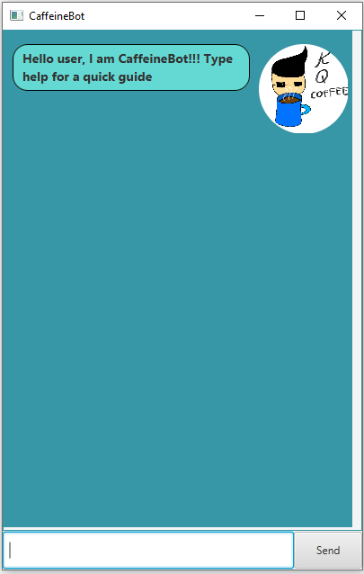

# User Guide

Duke is a **desktop chatbot** that will help you **remember your tasks** so that you can leave the remembering to us and relax with a good cup of coffee. Duke is optimised for use via a **Command Line Interface** (CLI) while still having a benefits of a Graphical User Interface (GUI). If you possess a fast typing speed, Duke will remember you tasks **faster** than traditional GUI apps.

1. [Quick start](#quick-start)
2. [Features](#features)
3. [Usage](#usage)
4. [Command Summary](#command-summary)
5. [Product Screenshot](#product-screenshot)

## Quick start

1. Ensure that you have Java `11` installed in your computer.
2. Download the latest `duke.jar` from [here](https://github.com/Kang-Quan/ip/releases/download/A-Release/duke.jar).
3. Copy the jar file to an empty folder you want to use as the home folder for Duke.
4. Open a command window in that folder.
5. Run the command `java -jar duke.jar`.
6. The GUI will be similar to the image shown below which should appear within a few seconds.

6. Type the command in the command box and press `Enter` or click on `Send` button to execute it. Eg, typing help then press Enter will open the help window where it will show all the commands you can use. 
Here are some examples of command you can try:

    - `todo finish math assignment`: Adds a Todo tasks with a description finish math assignment to Duke
    - `list`: List all tasks you currently have.
    - `mark 1`: Mark task that is index 1 as shown after executing `list` command to be done.
    - `unmark 1`: Unmark task that is index 1 as shown after executing `list` command to be not done.
    - `delete 1`: Delete task that is index 1 as shown after executing `list` command.
    - `bye`: Exits the app.
7. Refers to Usage below for details for each command.

## Features
### Manage Your Tasks
- Add/Delete Tasks to Duke.
- Support different type of tasks such as todo and tasks with date and time such as event and deadline.
- Able to mark/unmark tasks as done or not done
- Find tasks that description contains the keyword you have input.
- Prevent you from having duplicate task

## Usage
### `help` - list all commands Duke has
Display a list of all command Duke has

Format: `help`

### `todo` - Adds a todo task

Adds a todo task to Duke task list

Format: `todo <description>`

Example of usage: `todo finish computer science assignment`

### `deadline` - Adds a deadline task
Adds deadline task to Duke task list. A deadline task is a task that has to be completed by a specific time.

Format: `deadline <description> /by <yyyy-mm-dd HH:MM>`

Note: yyyy-mm-dd HH:MM represents, year, month, day, hour and minute respectively.

Example of usage: `deadline submit homework /by 2022-08-10 20:00`

### `event` - Adds an event task
Adds event task to Duke task list. An event task is a task that occur at that specific time.

Format: `event <description> /at <yyyy-mm-dd HH:MM>`

Note: yyyy-mm-dd HH:MM represents, year, month, day, hour and minute respectively.

Example of usage: `event watch math lecture /at 2022-08-10 10:00`

### `list` - list all tasks in Duke task list
Display a list of all tasks in Duke task list

Format: `list`

### `mark` - Mark a task as done in Duke task list
Mark a task as done in Duke task list. 

Format: `mark <index>`

Note: index of task to be mark can be found after performing the list command

Example of usage: `mark 1`

### `unmark` - Unmark a task as not done in Duke task list
Unmark a task as not done in Duke task list. 

Format: `unmark <index>`

Note: index of task to be mark can be found after performing the list command

Example of usage: `unmark 1`

### `delete` - Delete a specified task in Duke task list
Delete a specified task in Duke task list. 

Format: `delete <index>`

Note: index of task to be mark can be found after performing the list command

Example of usage: `delete 1`

### `find` - Find all tasks in Duke that matches description of the task.
Find all tasks in Duke that matches description of the task. 

Format: `find <keyword>`

Note: any task that contains keyword will be displayed to user.

Example of usage: `find lecture`, `find homework`

### `bye` - Exits Duke program
Exits Duke program. 

Format: `bye`

## Command Summary

| Action      | Format, Examples |
| ----------- | ----------- |
| help      | `help` |
| todo   | `todo <description>` eg. `todo run 2.4km` |
| deadline      | `deadline <description> /by <yyyy-mm-dd HH:MM>` eg. `deadline submit homework /by 2022-08-10 20:00` |
| event   | `event <description> /at <yyyy-mm-dd HH:MM>` eg. `event watch math lecture /at 2022-08-10 10:00` |
| list      | `list` |
| mark   | `mark <index>` eg. `mark 1` |
| unmark      | `unmark <index>` eg. `unmark 1` |
| delete | `delete <index>` eg. `delete 1` |
| find      | `find <keyword>` eg. `find homework` |
| bye | `bye`        |

## Product Screenshot

