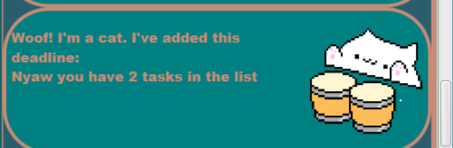
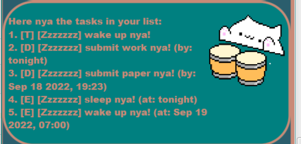
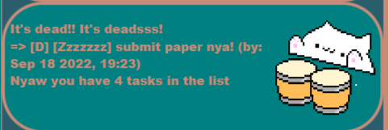
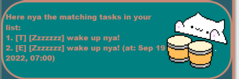
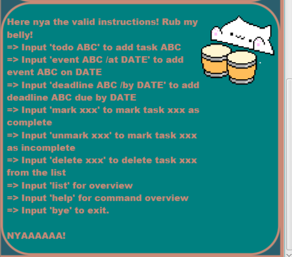

# User Guide: The Mythical Man-Meowth

## Features 

### Feature- Adding Tasks

With the Mythical Man-Meowth, you are able to 
add simple tasks, deadlines, and events to a 
task list with a catty twist.

### Feature- Marking Tasks

Want to track which tasks you have completed to boost
your fragile ego? No problem! The Mythical Man-Meowth
empowers you to tag which tasks you have completed, and 
which tasks you are soon to complete (surely).

### Feature- Listing Tasks

Finally, the Mythical Man-Meowth lets you bask in your
productivity or lack thereof as it lists all your tasks
for you to see. Moreover, the Mythical Man-Meowth saves
this list for you to refer to again should you ever leave
(You will never leave pspsps).

## Usage

### `todo` - Add a simple To-Do task

Adds a To-Do task with the given description to the list.

Example of usage: 

`todo wake up`

Expected outcome:

Description of the outcome:

The task with the description "wake up" is added to the list.

### `deadline` - Add a deadline

Adds a deadline with the given description 
and due date to the list.

Example of usage:

`deadline submit work /by tonight`

Expected outcome:

Description of the outcome:

The deadline with the description "submit work" 
and due date by "tonight" is added to the list.

Example of usage:

`deadline submit paper /by 2022-09-18 1923`

Expected outcome:

Description of the outcome:

The deadline with the description "submit paper" 
and due date by "Sep 18 2022, 19:23" is added to the list.

### `event` - Add an event

Adds an event with the given description and time to the list.

Example of usage:

`event sleep /at tonight`

Expected outcome:

Description of the outcome:

The event with the description "sleep" 
and time at "tonight" is added to the list.

Example of usage:

`event wake up /at 2022-09-19 0700`

Expected outcome:

Description of the outcome:

The event with the description "wake up" 
and time at "Sep 19 2022, 07:00" is added to the list.

### `list` - Display task list

Displays the status of all the tasks in the list.

Example of usage:

`list`

Expected outcome:

Description of the outcome:

The 5 tasks we added above are now displayed. We see their
identifying number, their task type (T/D/E- for To-Do, Deadline, and Event),
their completion status, and their description and attached times if relevant.
Zzzzzzz signifies an incomplete task while =^._.^= signifies a completed task.

### `mark` - Mark a task as complete

Marks a task as complete by changing its completion status.

Example of usage:

`mark 2`

Expected outcome:

Description of the outcome:

The second task in the list is marked as complete as seen from 
its completion status changing from Zzzzzzz to =^._.^= .

### `unmark` - Mark a task as incomplete

Marks a task as incomplete by changing its completion status.

Example of usage:

`unmark 2`

Expected outcome:

Description of the outcome:

The second task in the list is marked as incomplete as seen from
its completion status changing back to Zzzzzzz from =^._.^= .

### `delete` - Delete a task from the list

Deletes a task from the list and shows us the remaining number of tasks.

Example of usage:

`delete 3`

Expected outcome:

Description of the outcome:

The third task that was in the list is deleted from the list.
We see that the task with the task type of deadline that is incomplete, and
with the description of "submit paper" and due date of "Sep 18 2022, 19:23" 
is removed.

### `find` - Find tasks

Displays the tasks that contain the given keyword in their descriptions.

Example of usage:

`find wake`

Expected outcome:

Description of the outcome:

There are 2 tasks with the keyword "wake" in their descriptions.
Their task type, completion status, and their description and attached times,
if relevant, are displayed as well.

### `help` - Show command list

Displays the list of available instructions.

Example of usage:

`help`

Expected outcome:

Description of the outcome:

The full list of available commands and their respective formats are
displayed.

### `bye` - Exits the application

Closes the application after a few seconds.

Example of usage:

`bye`

Expected outcome:

Description of the outcome:

The application is exitted after an exit message is shown.
