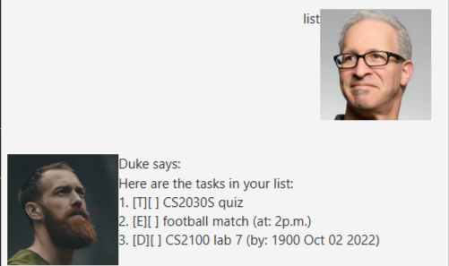
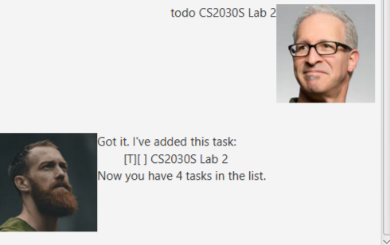
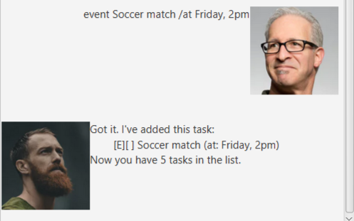
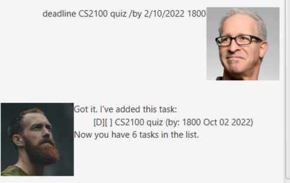
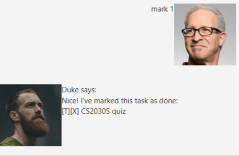
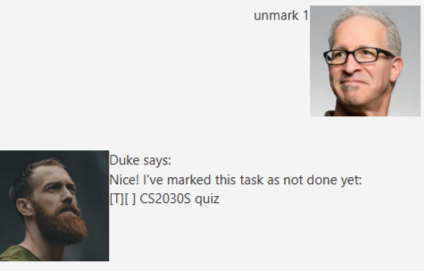
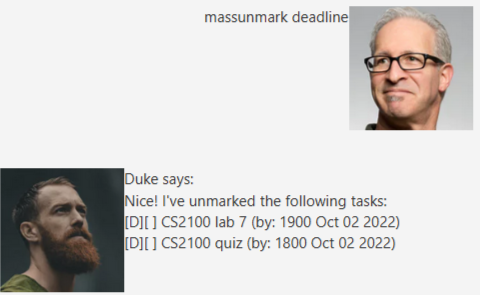
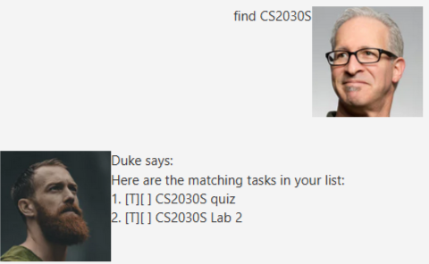
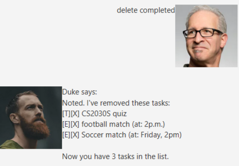

# Duke User Guide

Duke is a personalized chat bot that helps you keep track of your tasks, events and deadlines! It comes 
included with a gui to help you visualize the tasks better.

## Features

### Add

Add a todo/event/deadline task to the task list.

### List

Displays the list of all the tasks.

### Delete

Delete a task from the list.

### Mark/Unmark

Marks a task as complete or incomplete.

### Find

Find tasks based on description.

### Bye

Closes the application.

## Usage

### `list` - displays the task

Displays the list of all the tasks.

Example of usage: 

`list`

Expected outcome:

Duke returns the list of tasks.

### `todo` - adds a todo task

Adds a todo task to the list of tasks.

Example of usage:

`todo CS2030S Lab 2`

Expected outcome:

Duke adds the todo task to the lists of tasks.

### `event` - adds a event task

Adds a event task to the list of tasks.

Example of usage:

`event Soccer match /at Friday, 2pm`

Expected outcome:

Duke adds the event task to the lists of tasks.

### `deadline` - adds a deadline task

Adds a deadline task to the list of tasks.

Format: deadline `task name` /by `DD/MM/YYYY time`

Example of usage:

`deadline CS2100 quiz /by 2/10/2022 1800`

Expected outcome:

Duke adds the event task to the lists of tasks.

### `mark` - marks a task

Marks a task as completed in the task list. 

Format: mark `index of task`

Example of usage:

`mark 1`

Expected outcome:

Duke marks the task as completed with a `X`.

### `unmark` - unmarks a task

Marks a task as uncompleted in the task list.

Format: unmark `index of task`

Example of usage:

`unmark 1`

Expected outcome:

Duke unmarks the task.

### `massunmark` - mass unmarks the task

Duke unmarks the tasks that are mark as completed depending on the type given to the command.

Format: massunmark `type of task`

`type of task`: `event`, `todo`, `deadline`, `all`

Example of usage:

`massunmark deadline`

Expected outcome:

Duke unmarks the task that were previously marked as completed.

### `find` - finds the tasks

Finds and list all the tasks with the keywords.

Format: find `keywords`

Example of usage:

`find CS2030S`

Expected outcome:

Duke finds all the tasks with the keyword and lists them.

### `delete` - delete the tasks

Duke deletes the tasks with the index or all completed tasks.

Format: delete `index` or `completed`

Example of usage:

`delete completed`

Expected outcome:

Duke deletes the specified tasks.

### `bye` - exits duke

This exits Duke.

Example of usage:

`bye`

Expected outcome:

