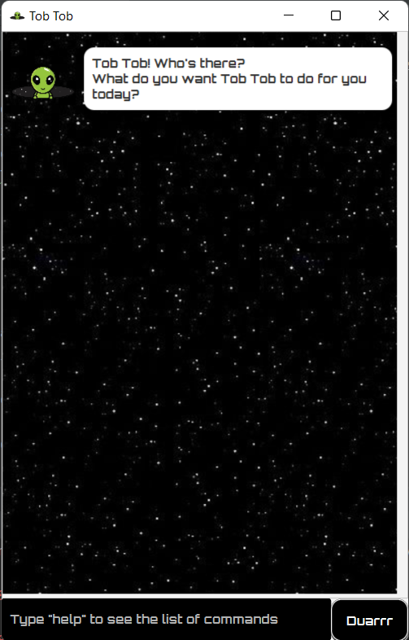

# Tob Tob User Guide

**Tob Tob** is an **interactive text-based desktop app for managing tasks, 
optimized for use via a Command Line Interface (CLI)** while still having 
the benefits of a ***Graphical User Interface (GUI)***. Regardless of whether
you are tech-savvy or not, **Tob Tob** will bring your tasks management 
skill to another level 🚀 🚀 🚀!

## First App View

## General Command Format

- Words in `UPPER_CASE` are the parameters to be supplied by the user,
  e.g. in `todo TODO_NAME`, `TODO_NAME` is a parameter which can be used 
  as `todo Apply for internships`.
- Commands that are not in lower case will still be acceptable, e.g. 
  `TODO Apply for internships` or `Todo Apply for internships`.
- `YYYY-MM-DD` refers to the standard date format, e.g. `2022-12-31`.
  Invalid dates or dates that are not in this format won't be accepted.
- If parameters are specified for commands that do not take in parameters, 
  the input will be rejected and error message will be shown.
  
## Commands Summary

- `todo TODO_NAME`
- `deadline DEADLINE_NAME \by YYYY-MM-DD`
- `event EVENT_NAME \at YYYY-MM-DD`
- `list`
- `mark TASK_NUMBER`
- `unmark TASK_NUMBER`
- `delete TASK_NUMBER`
- `find TASK_NAME`
- `help`
- `bye`

## Commands

### Adding a todo task: `todo`

Adds a todo task to Tob Tob's brain.

Format: `todo TODO_NAME`

Examples:

- `todo Apply for internships`
- `Todo prepare for midterms`
- `TODO book discussion room`

### Adding a deadline task: `deadline`

Adds a deadline task to Tob Tob's brain.

Format: `deadline DEADLINE_NAME \by YYYY-MM-DD`

- An error will be shown if the input satisfies one of the three conditions below
  - Not separated by " \by "
  - Date is not valid
  - Date is not in format `YYYY-MM-DD`

Examples:

- `deadline Submit iP \by 2022-09-16`
- `Deadline apply for UPIP \by 2022-11-08`
- `DEADLINE declare academic plan \by 2022-12-31`

### Adding an event task: `event`

Adds an event task to Tob Tob's brain.

Format: `event EVENT_NAME \at YYYY-MM-DD`

- An error will be shown if the input satisfies one of the three conditions below
    - Not separated by " \at "
    - Date is not valid
    - Date is not in format `YYYY-MM-DD`

Examples:

- `event CS2103 final \at 2022-11-25`
- `Event Billie Eilish concert \at 2022-08-21`
- `EVENT CS2103 tP meeting \at 2022-09-18`

### Listing all tasks: `list`

Shows a list of all tasks stored in Tob Tob's brain.

Format: `list`

- An error will be shown if the command is followed by parameters

### Marking a task as done: `mark`

Marks a task stored in Tob Tob's brain as done.

Format: `mark TASK_NUMBER`

- An error will be shown if `TASK_NUMBER` satisfies one of the three conditions below
  - Not an integer
  - Non-positive number
  - Exceeds the number of tasks in Tob Tob's brain

Examples:
- `mark 1`
- `Mark 10`
- `MARK 12`

### Marking a task as not done: `unmark`

Marks a task stored in Tob Tob's brain as not done.

Format: `unmark TASK_NUMBER`

- An error will be shown if `TASK_NUMBER` satisfies one of the three conditions below
    - Not an integer
    - Non-positive number
    - Exceeds the number of tasks in Tob Tob's brain

Examples:
- `unmark 1`
- `Unmark 10`
- `UNMARK 12`

### Deleting a task: `delete`

Deletes a task stored in Tob Tob's brain.

Format: `delete TASK_NUMBER`

- An error will be shown if `TASK_NUMBER` satisfies one of the three conditions below
    - Not an integer
    - Non-positive number
    - Exceeds the number of tasks in Tob Tob's brain

Examples:
- `delete 1`
- `Delete 10`
- `DELETE 12`

### Finding a task by name: `find`

Finds a task stored in Tob Tob's brain by the name or part of the name.

Format: `find TASK_NAME`

Examples:
- `find apply`
- `Find Billie`
- `FIND CS2103 final`

### Viewing help: `help`

Views all the commands available in Tob Tob's dictionary.

Format: `help`

- An error will be shown if the command is followed by parameters

### Viewing help: `bye`

Hibernates Tob Tob.

Format: `bye`

- An error will be shown if the command is followed by parameters
