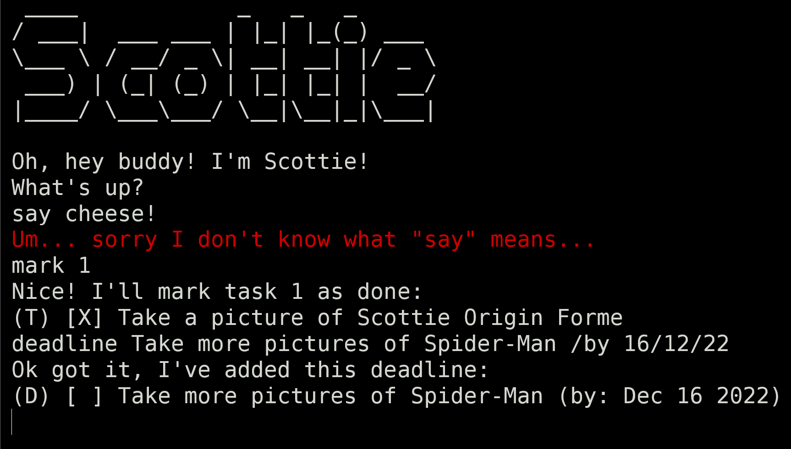

# Scottie User Guide


Scottie is a desktop app for managing tasks. It can manage 3 types of tasks: to-dos, deadlines and events. Scottie mainly operates using a Graphical User Interface (GUI), but it also features a working Command Line Interface (CLI). Scottie saves tasks to the hard disk automatically, so it can remember tasks after being closed.

* [How to Set Up](#how-to-set-up)
* [Command Cheatsheet](#command-cheatsheet)
* [Features](#features)
  * [List all tasks: `list`](#list-all-tasks-list)
  * [Add a to-do: `todo`](#add-a-to-do-todo)
  * [Add a deadline: `deadline`](#add-a-deadline-deadline)
  * [Add an event: `event`](#add-an-event-event)
  * [Delete a task: `delete`](#delete-a-task-delete)
  * [Mark a task as done: `mark`](#mark-a-task-as-done-mark)
  * [Mark a task as not done: `unmark`](#mark-a-task-as-not-done-unmark)
  * [Search for a task: `find`](#search-for-a-task-find)
  * [Sort tasks: `sort`](#sort-tasks-sort)
  * [Exit the application: `bye`](#exit-the-application-bye)
  * [Edit the save file](#edit-the-save-file)
  * [Run the CLI version](#run-the-cli-version)

## How to Set Up

To start using the Scottie task management application yourself, simply follow the steps below.

1. Install Java 11 or above on your computer
2. Download the latest `scottie.jar` from [GitHub](https://github.com/teekaytai/ip/releases)
3. Double-click the `.jar` file to start the app. Alternatively, open up a terminal, navigate to the folder containing the `.jar` file, and then run the following command
```shell
java -jar scottie.jar
```

Once you run the command, the application will start! To use the app, enter your commands into the text field at the bottom, then press Enter or click the Send button.

## Command Cheatsheet

Refer to the features list for more detailed explanations of the various commands.

> Notes about command formats:
>
> * Words in `SCREAMING_SNAKE_CASE` represent arguments that should be replaced with your own values.
> * Some commands contain components surrounded in square brackets `[]`. These components are optional.
> * Some commands contain flags and possibly arguments after them like `/by KEY`. These flags can be added behind the command in any order.

| Action   | Command Format                               |
|:---------|:---------------------------------------------|
| List     | `list`                                       |
| To-do    | `todo DESCRIPTION`                           |
| Deadline | `deadline DESCRIPTION /by D/M/YY [24H_TIME]` |
| Event    | `event DESCRIPTION /at D/M/YY [24H_TIME]`    |
| Delete   | `delete INDEX`                               |
| Mark     | `mark INDEX`                                 |
| Unmark   | `unmark INDEX`                               |
| Find     | `find SEARCH_TERM`                           |
| Sort     | `sort [/by KEY] [/desc]`                     |
| Exit     | `bye`                                        |

## Features

### List all tasks: `list`

List out all the tasks currently recorded in the app.

Command: `list`

### Add a to-do: `todo`

Add a to-do the list of tasks. A to-do requires a description.

Command: `todo DESCRIPTION`

Example: `todo Buy milk`

### Add a deadline: `deadline`

Add a deadline to the list of tasks. A deadline requires a description and an end date. The end date can optionally include a time as well. Note that you should only enter the last 2 digits of the year.

Command: `deadline DESCRIPTION /by D/M/YY [24H_TIME]`

Examples: `deadline Finish assignment 1 /by 1/9/22`, `deadline Finish assignment 2 /by 30/10/22 2359` 

### Add an event: `event`

Add an event to the list of tasks. An event requires a description and a date. The date can optionally include a time as well. Note that you should only enter the last 2 digits of the year.

Command: `event DESCRIPTION /at D/M/YY [24H_TIME]`

Examples: `event Tom's birthday /at 1/4/22`, `event Jerry's concert /at 24/12/22 2030`

### Delete a task: `delete`

Delete the specified task from the list of tasks.

Command: `delete INDEX`  
where `INDEX` is the current position of the task to be deleted in the list.

Example: `delete 1` (deletes the first task in the list)

### Mark a task as done: `mark`

Mark the specified task as done.

Command: `mark INDEX`  
where `INDEX` is the current position of the task to be marked as done in the list.

Example: `mark 1` (marks the first task in the list as done)

### Mark a task as not done: `unmark`

Mark the specified task as not done.

Command: `unmark INDEX`  
where `INDEX` is the current position of the task to be marked as not done in the list.

Example: `unmark 5` (marks the fifth task in the list as not done)

### Search for a task: `find`

Search for tasks which contain the given search term(s) in their descriptions. The search is case-insensitive.

Command: `find SEARCH_TERM`

Example: `find assignment 1` 

### Sort tasks: `sort`

Sort the tasks according to some order. The `/by` flag is used to specify what part of the tasks to sort by. If the `/desc` flag is added, the tasks are sorted in reverse order. If neither flag is provided, by default the tasks are sorted in alphabetical order using their descriptions. 

Command: `sort [/by KEY] [/desc]`  
where `KEY` is
* `name`, `description` or `desc` if you want to sort using descriptions.
* `date` if you want to sort using the task dates. Note that to-dos have no dates and will always be moved to the back of the list.

Examples:  
`sort`, `sort /by name` (both sort the tasks alphabetically by their descriptions)  
`sort /by date /desc` (sorts the tasks in reverse chronological order by using their dates)

### Exit the application: `bye`

Exit the application.

Command: `bye`

### Edit the save file

Scottie stores the data for tasks in the `tasks.txt` file in the `data` folder. (When you first start up the app, the folder and file are created.) For more experienced users, you can consider editing this file directly to add, remove, edit or reorder tasks. This can be particularly useful if you are trying to migrate data from one computer to another.

Here are some examples of task data:  
* A to-do that is marked as done: `T|1|Buy milk`  
* A deadline that is not marked as done: `D|0|Finish Assignment 2|20/10/22 2359`
* An event that is not marked as done: `E|0|Tom's birthday|1/4/22`

### Run the CLI version

Scottie also features a fully functional CLI. Though its main purpose is to aid in automated testing, it can also be used in place of the GUI. The CLI and GUI versions behave in largely the same way.



To run the CLI application, specify the `-cli` flag when starting up the app:

```shell
java -jar scottie.jar -cli
```
