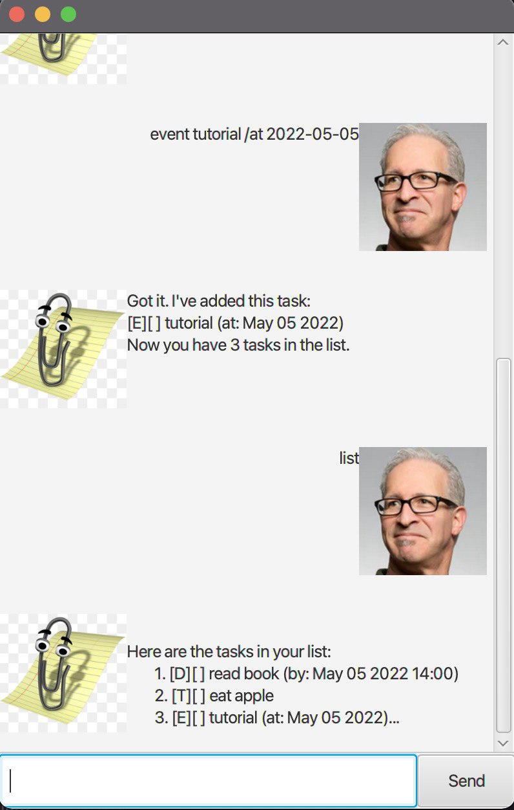

# User Guide



## Quick start
1. Ensure you have Java `11` or above installed in your Computer.

2. Download the latest `duke.jar` from [here](https://github.com/rjkoh/ip/releases).

3. Copy the file to the folder you want to use as the home folder for your Duke.

4. Double-click the file to start the app.

5. Type the command in the command box and press Enter to execute it. Refer to the Features below for details of each command.

## Features

### Feature-Todo

Creates a Todo task with medium priority and adds it to the list of tasks.

Format of usage:

`todo <description>`

Expected outcome:

```
Got it. I've added this task:
[T][] <description> medium priority
Now you have <number of tasks> tasks in the list.
```

### Feature-Deadline

Creates a Deadline task with a date and medium priority and adds it to the list of tasks.

Format of usage:

`deadline <description> /by YYYY-MM-DD`

Expected outcome:

```
Got it. I've added this task:
[D][] <description> <date> medium priority
Now you have <number of tasks> tasks in the list.
```

### Feature-Event

Creates a Event task with a date, time and medium priority and adds it to the list of tasks.

Format of usage:

`deadline <description> /at YYYY-MM-DD HH:mm`

Expected outcome:

```
Got it. I've added this task:
[E][] <description> <date> <time> medium priority
Now you have <number of tasks> tasks in the list.
```

### Feature-List

Displays all tasks in current list.

Format of usage:

`list`

Example outcome:

```
1. [T][X] buy groceries medium priority
2. [D][] submit homework 16 SEPTEMBER 2022 medium priority
3. [E][] exams 20 NOVEMBER 2022 09:30 medium priority
```
If there are no tasks,
```
There are no tasks at the moment!
```

### Feature-Find

Finds matching tasks in current list.

Format of usage:

`find <keyword>`

Expected outcome:

```
Here are the matching tasks in your list:
1. ... 
2. ...
```
If there are no matching tasks,
```
No matching tasks found.
```

### Feature-Mark

Marks task as completed.

Format of usage:

`mark <index number>`

Expected outcome:

```
Nice! I've marked this task as done:
[<Task type>][X] <description> <date (if applicable)> <time (if applicable)> <low/medium/high> priority
```
If there is no such index,
```
There is no task of that index!
```

### Feature-Mark

Unmarks task to uncompleted.

Format of usage:

`unmark <index number>`

Expected outcome:

```
Okay, I've marked this task as undone:
[<Task type>][] <description> <date (if applicable)> <time (if applicable)> <low/medium/high> priority
```
If there is no such index,
```
There is no task of that index!
```

### Feature-Delete

Deletes task from list.

Format of usage:

`delete <index number>`

Expected outcome:

```
Noted. I've removed this task:
[<Task type>][] <description> <date (if applicable)> <time (if applicable)> <low/medium/high> priority
Now you have <number of tasks> in the list.
```
If there is no such index,
```
OOPS!!! No such task exists.
```

### Feature-Priority

Sets priority level of task.

Format of usage:

`priority <index number> <level>`
level:
* low
* medium
* high

Expected outcome:

```
Okay, I've set the priority of this task to:
[<Task type>][] <description> <date (if applicable)> <time (if applicable)> <updated level> priority
```
If there is no such index,
```
OOPS!! Task does not exist!
```

### Feature-Bye

Writes the current list of tasks into a text file.

Format of usage:

`bye`

Expected outcome:

```
Your tasks have been saved.
Bye. Hope to see you again soon!
```


## Usage

### `Keyword` - Describe action

Describe the action and its outcome.

Example of usage: 

`keyword (optional arguments)`

Expected outcome:

Description of the outcome.

```
expected output
```
