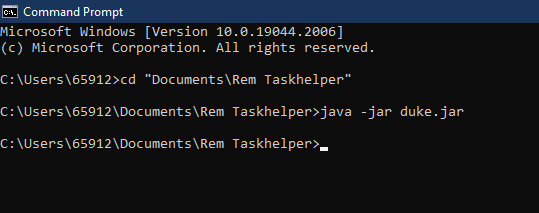
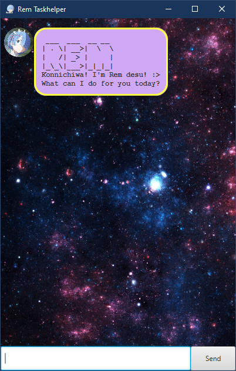
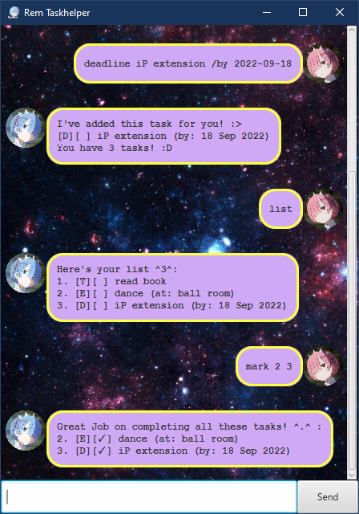

<h1 align="center">User Guide</h1>

##  *Introduction*

Inspired by Rem from Re:Zero, here is a comprehensive user guide to show
how you can use your personal assistant, **Rem Taskhelper**, to add tasks
to your personal checklist. Classify your tasks into _todo_, _deadline_ and _event_ tasks,
and **Rem Taskhelper** will help you keep track of them!

## *Table of Contents*

1. [Getting Started](#getting-started)
2. [Usage](#usage)
3. [Command Prompt](#command-prompt)
4. [Examples of Usage](#examples-of-usage)

## *Getting Started*

- Ensure that you have Java 11 or above installed in your Computer.
- Download the latest `duke.jar` from [here](https://github.com/nehcuy/ip).
- Move the file into your desired folder to run it from.
- Open up your command prompt/terminal and navigate to the folder containing
the duke.jar file.
- Run the file by typing in the command `java -jar duke.jar` and pressing Enter.
You can also double-click the file to start the app. (An illustration of this is shown
[below](#command-prompt))
- The GUI should appear in a few seconds. You will then arrive at the [landing page](#landing-page).
- Start typing in your commands into the text bar and press Enter or click the send button to interact
with **Rem Taskhelper**.

## *Summary of Commands*

|         Command         |                    Description                    |
|:-----------------------:|:-------------------------------------------------:|
|     [list](#`list`)     |             Displays task checklist.              |
|     [todo](#`todo`)     |      Adds a todo task to the task checklist.      |
| [deadline](#`deadline`) |    Adds a deadline task to the task checklist.    |
|    [event](#`event`)    |     Adds an event task to the task checklist.     |
|     [mark](#`mark`)     |  Marks given task numbers/all tasks as complete.  |
|   [unmark](#`unmark`)   | Marks given task numbers/all tasks as incomplete. |
|   [delete](#`delete`)   |       Deletes given task numbers/all tasks.       |
|     [find](#`find`)     | Displays tasks in task checklist matching input.  |
|    [clear](#`clear`)    |            Clears the window outputs.             |
|      [bye](#`bye`)      |       Saves tasks and exits Rem Taskhelper.       |
                                                                                                              |
## *Usage*

### `list` - Displays your checklist

**Description:** Retrieves the list of tasks from your local storage and displays your list of tasks.  
**Usage:** list  
**Example:** `list`

### `todo` - Adds a todo task

**Description:** Creates a todo task and adds it into your checklist.  
**Usage:** todo [*task description*]  
**Example:** `todo read book`

### `deadline` - Adds a deadline task

**Description:** Creates a deadline task and adds it into your checklist. Supports date formatting when
you enter *date* in the format `yyyy-mm-dd`.  
**Usage:** deadline [*task description*] /by [*date*]  
**Example:**  
- `deadline iP submission /by 2022-9-16`
- `deadline math assignment /by tomorrow`

### `event` - Adds an event task

**Description:** Creates an event task and adds it into your checklist. Supports date formatting when
you enter *date* in the format `yyyy-mm-dd`.  
**Usage:** event [*task description*] /at [*date* or *location*]  
**Example:**
- `event mid-autumn festival /at home`
- `event career fair /at 2022-9-14`

### `mark` - Marks a task as complete

**Description:** Marks the task corresponding to the given task number in the checklist as complete.
Supports multiple task marking when you enter multiple task numbers separated by a space.
Also supports marking all the tasks complete at once.  
**Usage:** 
- mark [*task numbers*]
- mark all

**Example:**
- `mark 1 2 5`
- `mark all`

### `unmark` - Marks a task as incomplete

**Description:** Marks the task corresponding to the given task number in the checklist as incomplete.
Supports multiple task marking when you enter multiple task numbers separated by a space.
Also supports marking all the tasks incomplete at once.  
**Usage:**
- unmark [*task numbers*]
- unmark all

**Example:**
- `unmark 2 7 1`
- `unmark all`

### `delete` - Deletes a task

**Description:** Deletes the task corresponding to the given task number in the checklist.
Supports multiple task deleting when you enter multiple task numbers separated by a space.
Also supports deleting all the tasks at once. This action is **IRREVERSIBLE**.  
**Usage:**
- delete [*task numbers*]
- delete all

**Example:**
- `delete 4 1 7`
- `delete all`

### `find` - Finds your tasks

**Description:** Searches for your tasks and displays all tasks that contain the task description.  
**Usage:** find [*task description*]  
**Example:** `find book`

### `clear` - Clears the window outputs

**Description:** Cleans the window of all Dialogue outputs between you and Rem Taskhelper.  
**Usage:** clear  
**Example:** `clear`

### `bye` - Saves and Exits Rem

**Description:** Saves and exits the Rem Taskhelper.
Please ensure all your changes are finalised before using this command, as your updated checklist
would **OVERWRITE** your previous checklist.  
**Usage:** bye  
**Example:** `bye`

## *Command Prompt*

<h3 align="center">Command Prompt Illustration</h3>

    

## *Examples of Usage*

<h3 align="center">Landing Page</h3>

    

<h3 align="center">Adding Tasks</h3>

    

<h3 align="center">Marking Tasks</h3>

    

