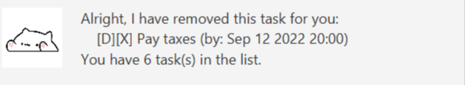

# User Guide

Tumu is a **Command Line interface (CLI) based application** for 
**managing your daily tasks.** 
If you are familiar with CLI, this application will allow you to manage tasks 
faster than a traditional, GUI based task manager.

[Quick start](#quick-start)

[Features](#features)

- [List](#list): List all tasks
- [Todo](#todo): Create a new todo task
- [Deadline](#deadline): Create a new deadline task
- [Event](#event): Create a new event task
- [Mark](#mark): Mark a task as complete
- [Unmark](#unmark): Unmark a task as uncomplete
- [Delete](#delete): Delete a task
- [Find](#find): Find a task by keyword
- [Sort](#sort): Sort all tasks in chronological order
- [Bye](#bye): Exit the application

[Command list summary](#command-list-summary)

## Quick start
1. You must have `Java 11` installed on your device.

2. Install `Tumu.jar` from [here](https://github.com/autumn-sonata/ip/releases)

3. Double click on `Tumu.jar` to open the task manager application.

## Features 

### List

Lists all the tasks currently available within the application.

Format: `list`

### Todo

Add a todo task to the list of tasks. This task will be unmarked when being added into
the list.

Format: `todo [task description]`

Examples:

- `todo Clean my room`
- `todo Make a sandwich`

### Deadline

Add a deadline task to the list of tasks. This task will be unmarked when being added
into the list.

Format: `deadline [task description] /by [date and time in YYYY-MM-DD HHmm format]`

Examples:

- `deadline Pay taxes /by 2022-09-12 2000`
- `deadline Complete homework /by 2022-09-13 0300`

### Event

Add an event task to the list of tasks. This task will be unmarked when being added
into the list.

Format: `event [task description] /at [date and time in YYYY-MM-DD HHmm format]`

Examples:

- `event Attend concert /at 2022-09-12 2200`

### Mark

Mark a task within the list by their index. Marked tasks will be demarcated with an `X`.
This index cannot be smaller than 1
and cannot be larger than the number of tasks within the list.

Format: `mark [index of task in list]`

Example: `mark 7`

### Unmark

Unmark a task within the list by their index. Unmarked tasks will have their 
mark `X` removed. This index cannot be smaller than 1
and cannot be larger than the number of tasks within the list.

Format: `unmark [index of task in list]`

Example: `unmark 7`

### Delete

Delete a task within the list by their index. This index cannot be smaller than 1
and cannot be larger than the number of tasks within the list.

Format: `delete [index of task in list]`

Example: `delete 7`

### Find

Find tasks based on a certain keyword. This command will list all tasks that contain
the keyword.

Note: The `keyword` is **case sensitive.**

Format: `find [keyword]`

Example: `find Take`

### Sort

Sort all current tasks in ascending chronological order (earlier tasks appear first).
Tasks which do not have a stated time are placed at the back of the list.

Format: `sort`

### Bye

Saves all changes to your list of tasks and exits the application.

Format: `bye`

## Command List Summary

| Command    |       Format        |
|------------|----------------------|
| `List`     | `list`               | 
| `Todo`     | `todo [task description]` |
| `Deadline` | `deadline [task description] /by [date and time in YYYY-MM-DD HHmm format]`|
| `Event`    | `event [task description] /at [date and time in YYYY-MM-DD HHmm format]`
| `Mark`     | `mark [index of task in list]` |
| `Unmark`   | `unmark [index of task in list]` |
| `Delete`   | `delete [index of task in list]` | 
| `Find`     | `find [keyword]` |
| `Sort`     | `sort` |
| `Bye`      | `bye`  |