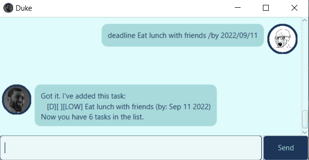
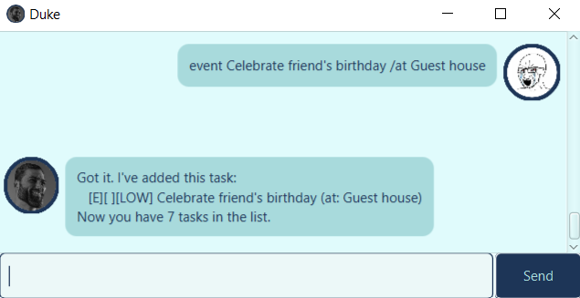
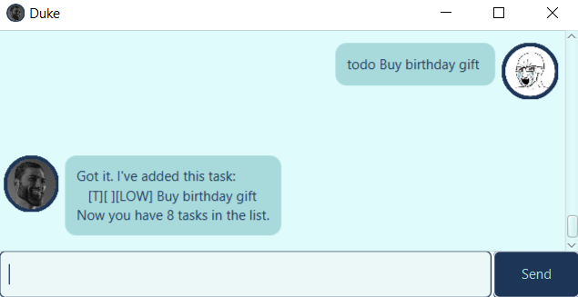
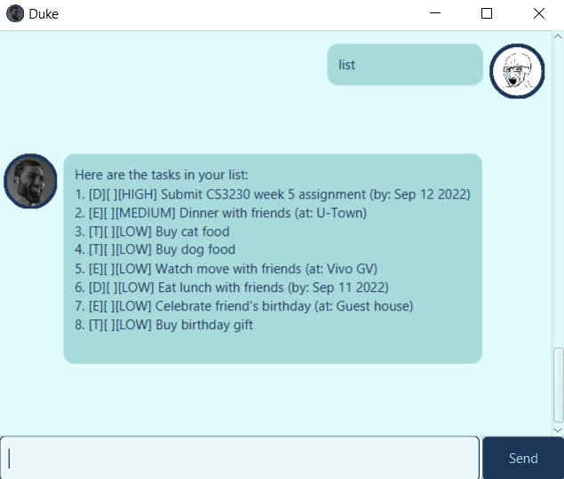
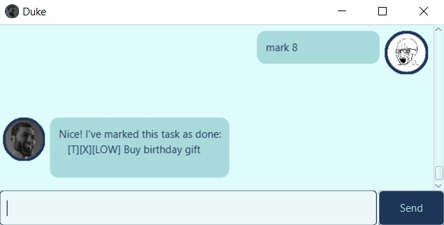
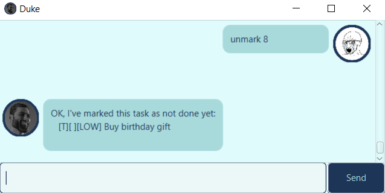
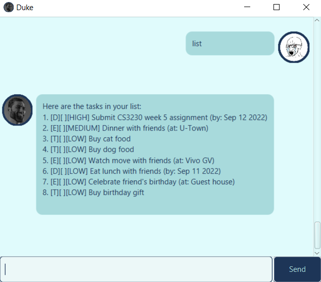

# `Duke` User Guide
`Duke` is an application for keeping tracking of tasks. You may use the 
following to navigate to the relevant section you are looking for:
1. [Feature showcase](#1-feature-showcase)
   * [1.1. Adding tasks](#11-adding-tasks)
     * [1.1.1. Adding deadlines](#111-deadline-a-task-with-a-due-date)
     * [1.1.2. Adding events](#112-event----a-task-with-a-venue)
     * [1.1.3. Adding tasks to do](#113-todo-----a-basic-task-to-be-completed)
   * [1.2. Deleting tasks](#12-deleting-tasks)
   * [1.3. Listing all tasks](#13-listing-all-tasks)
   * [1.4. Marking tasks as done](#14-marking-tasks-as-done)
   * [1.5. Marking tasks as undone](#15-marking-tasks-as-undone)

2. [Usage](#2-usage)
   * [2.1. `deadline`: How to add a deadline](#21-deadline---how-to-add-a-deadline-task)
   * [2.2. `event`: How to add an event](#22-event---how-to-add-an-event-task)
   * [2.3. `todo`: How to add a to-do task](#23-todo---how-to-add-a-to-do-task)
   * [2.4. `list`: How to list all tasks](#24-list---how-to-list-all-tasks)
   * [2.5. `delete`: How to delete tasks](#25-delete---how-to-delete-a-task)
   * [2.6. `mark`: How to mark tasks as done](#26-mark---how-to-mark-a-task-as-done)
   * [2.7. `unmark`: How to mark tasks as undone](#27-unmark---how-to-mark-a-task-as-undone)
   * [2.8. `bye`: How to exit the application](#28-bye---how-to-exist-the-application)

## 1. Feature showcase
### 1.1. Adding tasks
There are three possible tasks you can add:
#### 1.1.1 `deadline`: a task with a due date
   <p align="center">
      
   </p>

#### 1.1.2. `event`   : a task with a venue
   <p align="center">
      
   </p>

#### 1.1.3. `todo`    : a basic task to be completed
   <p align="center">
      
   </p>

### 1.2. Deleting tasks
Tasks can be deleted:
   <p align="center">
      
   </p>

### 1.3. Listing all tasks
You can list all available tasks:
   <p align="center">
      
   </p>

### 1.4. Marking tasks as done
Tasks can be marked as done:
   <p align="center">
      
   </p>
The task marked as done will now be marked with a `[X]`:
   <p align="center">
      
   </p>

### 1.5. Marking tasks as undone
Tasks can be marked as undone:
   <p align="center">
      
   </p>
The check mark `[X]` will now be removed:
   <p align="center">
      
   </p>

## 2. Usage
### 2.1. `deadline` - How to add a "deadline" task.
A task with a deadline can be added using `deadline` along with the `/by ` 
flag. This will default the task to the **lowest priority**:
```
deadline DEADLINE DESCRIPTION /by YYYY/MM/DD
```
Alternatively, you may choose to specify either `high`, `med` or `low` as the 
priority with the `/p ` flag:
```
deadline DEADLINE DESCRIPTION /by YYYY/MM/DD /p PRIORITY
```

### 2.2. `event` - How to add an "event" task.
A task with a venue can be added using `event` along with the `/at `
flag. This will default the task to the **lowest priority**:
```
event EVENT DESCRIPTION /at VENUE
```
Alternatively, you may choose to specify either `high`, `med` or `low` as the
priority with the `/p ` flag:
```
event EVENT DESCRIPTION /at VENUE /p PRIORITY
```

### 2.3. `todo` - How to add a "to-do" task.
A "todo" task can be added using the `todo` command. No flags are required/ 
This will default the task to the **lowest priority**:
```
todo TASK DESCRIPTION
```
Alternatively, you may choose to specify either `high`, `med` or `low` as the
priority with the `/p ` flag:
```
todo TASK DESCRIPTION /p PRIORITY
```

### 2.4. `list` - How to list all tasks.
To list all tasks, simply use the `list` command:
```
list
```

### 2.5. `delete` - How to delete a task.
Before you delete a task, you need to know the task number using the [`list` 
command](#24-list---how-to-list-all-tasks). You can then use the `delete` command:
```
delete TASK NUMBER
```

### 2.6. `mark` - How to mark a task as done.
Before you mark a task as done, you need to know the task number using the 
[`list` command](#24-list---how-to-list-all-tasks). You can then use the `mark` 
command:
```
mark TASK NUMBER
```

### 2.7. `unmark` - How to mark a task as undone.
Before you mark a task as undone, you need to know the task number using the
[`list` command](#24-list---how-to-list-all-tasks). You can then use the `unmark`
command:
```
unmark TASK NUMBER
```

### 2.8. `bye` - How to exist the application.
You may exit the application using the `bye` command
```
bye
```

