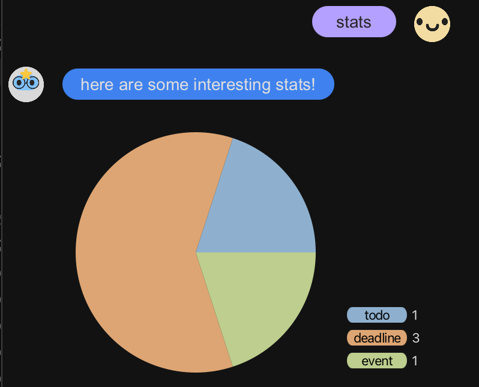
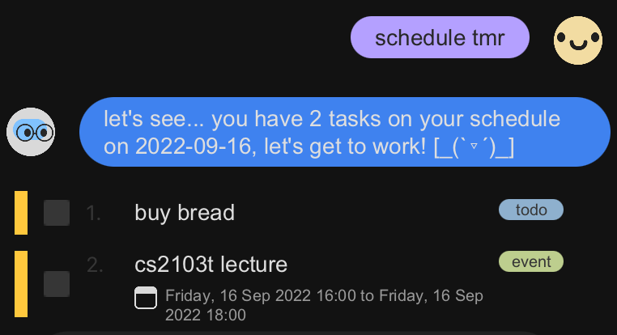
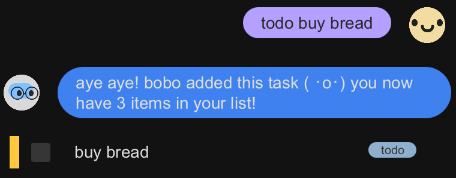
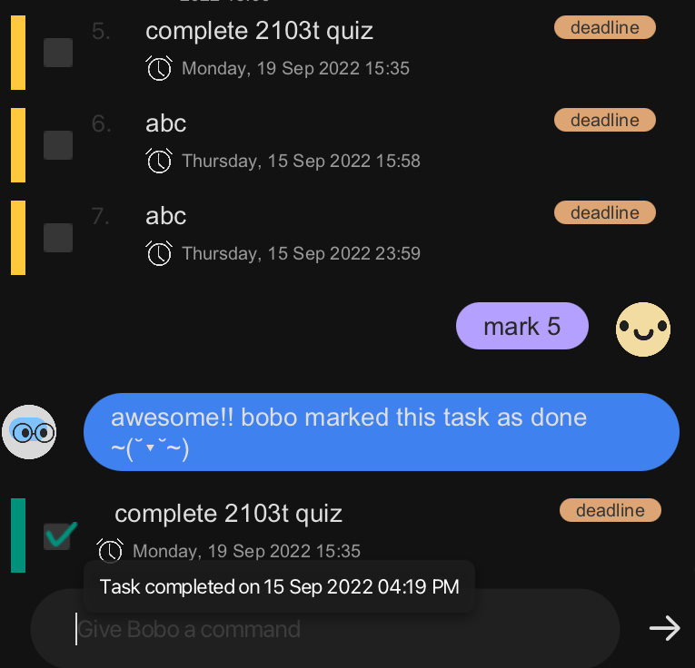
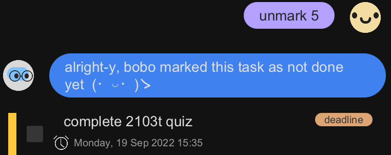
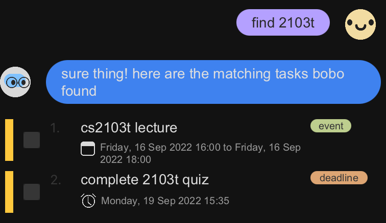
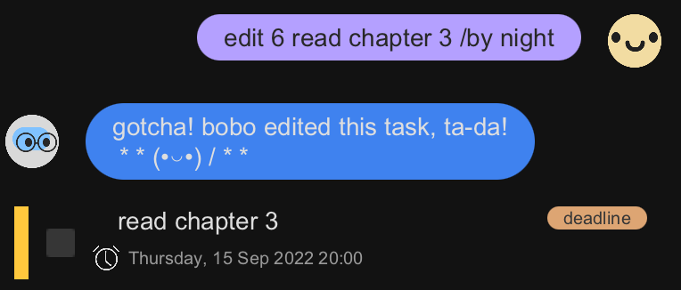
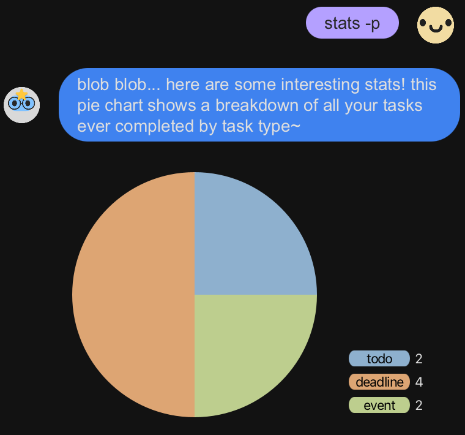
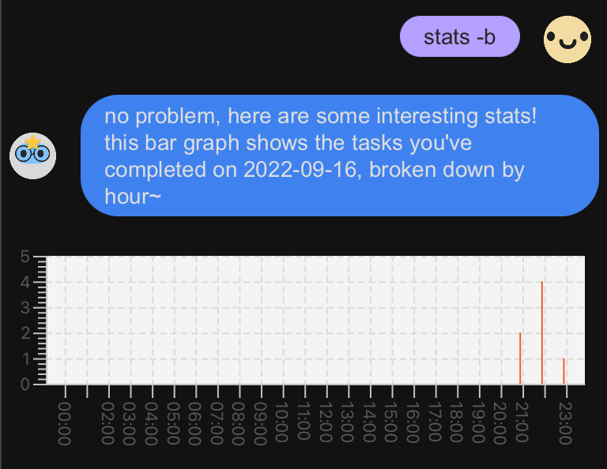
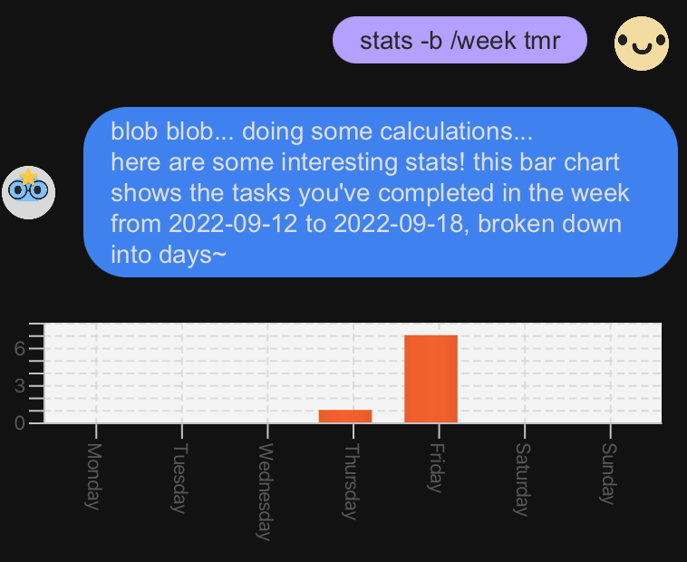

# User Guide

## Features 

### Keep track of your tasks

Bobo the bot enables you to keep track of your tasks by adding, viewing,
editing, and deleting. Manage your to-dos, deadlines, and events in one app!

### Supports natural dates

With a wide support of dates, bobo understands many date formats with bobo's own
date library- including natural dates, so you can easily enter dates.

See the [Supported Natural Dates](#supported-natural-dates) section for more details.

### Generate statistics to track your progress

Leverage statistics about the items managed by the App! Bobo breaks down
your tasks for you and allows you to keep track of your progress with
data visualisation.

### Schedule your day

Bobo can even help you schedule your day! Just ask bobo for your
schedule, so you can have a productive day and stay on top of your tasks!

## Usage

### `list` - List of all tasks

Lists out all the tasks stored by the App.

Example of usage: 

`list`

Expected outcome:

Lists the tasks stored by the app in a list view.

The coloured task bar to the left indicates the completion status
of the task (green indicates that a task is complete, and yellow
indicates  an incomplete task).

Hover over a checked checkbox to display the completion date of the
completed task.

### `todo DESCRIPTION` - Add a to-do task

Adds a to-do task to your task list. A to-do task is a task with only a description.
It has no associated datetime.

Example of usage:

`todo buy bread`

Expected outcome:

Adds a to-do task, with the description `buy bread`.

### `event DESCRIPTION /at EVENT_START_DATETIME /by EVENT_END_DATETIME` - Add an event task

Adds an event task to your task list. An event task is a task with a description, and an associated
start and end datetime.

> ℹ️️ Dates in Bobo
> 
> Bobo supports many, many different date and datetimes formats like
> * `22/03`: which will be interpreted as 22nd March of the current year,
> * `24 Mar 2019 9AM`: which will be interpreted as 24th March 2019 9:00AM,
> * `21 June 2016 13:50`: which will be interpreted as 21st June 2016 1:50PM,
> * `12/20`: which will be interpreted as December 2020
> * `9AM`: which will be interpreted as 9am of the current day
>
> and many more!
> 
> The day, month, year, and time fields will be defaulted to the current
> day, month, year, and time respectively, if they are not specified.
> 
> Bobo also supports natural dates, with commands like `today`, `now`,
> `night`, `morning`, `evening`, `monday`, `Tues`, `tmr`, `yesterday`.
> 
> You may find the complete list of natural date supported by Bobo [here](#supported-natural-dates).

> ️⚠️ Event start date **cannot** be after end date
> 
> Do note that valid events in Bobo cannot have start dates that are after end dates.

Example of usage:

`event cs2103t lecture /at 16/09 4pm /to 16 sep 6pm`

Expected outcome:

Adds an event task, with the description `cs2103t lecture`
with start time `16 September 2022, 4pm` and end time
`16 September 2022, 6pm` (assuming the event was created in 2022).

### `deadline DESCRIPTION /by DUE_DATE` - Add a deadline task

Adds a deadline task to your task list. A deadline task is a task with a description, and an associated
due date by which the task should be completed.

Example of usage:

`deadline complete cs2103t quiz /by mon`

Expected outcome:

Adds a deadline task, with the description `complete cs2103t quiz`
due on the next Monday on which the task was created (eg: if the
deadline task was created on `15 September 2022 3:35PM`, the due date
will be  set on `19 September 2022 15:35`).

### `mark TASK_NUMBER` - Mark a task as done

Marks the task associated to the task number in your task list
as done. The completion date of the task will be set the current
date and time.

If the task was already completed, the previous completion time
will simply be overridden to the current datetime.

Example of usage:

`mark 5`

Expected outcome:

Marks the 5th item of your task list (the to-do task with
description `complete 2103t quiz` in the image above) as done.

The completion date of the task will be set to the current
date time, as revealed when hovering over the checked
check box.

### `unmark TASK_NUMBER` - Mark a task as not done

Marks the task associated to the task number in your task list
as not completed.

If the task was previously marked completed, the completion date
time of the task will be removed.

Example of usage:

`unmark 5`

Expected outcome:

Marks the 5th item of your task list (the to-do task with
description `complete 2103t quiz` in the image above) as not done.

### `find TASK_DESCRIPTION_KEYWORD` - Find tasks containing a specified keyword or phrase

Find tasks in your task lists with description containing the specified
keyword or phrase `TASK_DESCRIPTION_KEYWORD`.

Example of usage:

`find 2103t`

Expected outcome:

A list of tasks with descriptions that contain `2103t`.

### `edit TASK_NUMBER EDITED_TASK` - Edits/ Updates a task

Edits (ie: updates) the task in your task list associated to
the specified task number.

The usage depends on the type of task.

Editing a `todo` task: `edit TASK_NUMBER DESCRIPTION`
Editing a `deadline` task: `edit TASK_NUMBER DESCRIPTION /by DUE_DATE`
Editing an `event` task: `edit TASK_NUMBER DESCRIPTION /at START_DATETIME /to END DATETIME`

Note that this command only allows you to update the details of the specified task.
This means that you cannot change the task type with this command.

Example of usage:

`edit 6 read chapter 3 /by night`

Expected outcome:

Edits the task with task number 6 (which in this case is a
deadline task) with the description `read chapter 3` and
due date `night` (which is a natural date for `8PM` of the
current day).

### `delete TASK_NUMBER` - Delete a task

Removes the task with the associated task number `TASK_NUMBER`
in the task list.

Example of usage:

`delete 6`

Expected outcome:

Modifies your task list so that the specified task
is removed from the task list.

### `stats [-STATISTIC_TYPE_FLAG]` - Generate statistics

Generates statistics for the completed tasks stored in your task
list. Currently supports two types of data visualisation, pie chart
and bar graph. See the following sections on how to generate each
statistic.

Note that if no `[-STATISTIC_TYPE_FLAG]` is provided (ie: command
`stats` is typed), Bobo will simply generate a pie chart.

Example of usage:

`stats`

Expected outcome:

A pie chart breaking down completed tasks by their task type
will be generated.

### `stats [-p]` - Generate statistics in a pie chart

Generates the breakdown of **all** completed tasks by their task type
in a pie chart. If there are no completed tasks, no pie chart
will be generated.

Example of usage:

`stats -p`

Expected outcome:

A pie chart breaking down completed tasks by their task type
will be generated.

### `stats -b [/BAR_CHART_TYPE] [DATE]` - Generate statistics in a bar chart

Generates the breakdown of completed tasks by their completion date
in a bar chart. If there are no completed tasks, no bar chart
will be generated.

There are two types of bar charts supported by Bobo. You can
view either **daily** (`/day`) or **weekly** (`/week`) statistics.
You can specify the type of bar chart to generate with the
`/BAR_CHART_TYPE` tag. If no `/BAR_CHART_TYPE` tag is specified, Bobo will default to a
daily-type bar chart statistic.

In addition, you can also specify the date to view the statistics
for. If no date is specified, Bobo will default to the current day.

For a **day-type bar** chart, this means viewing the breakdown
of tasks completed by hour for that specified day.

For a **week-type bar** chart, this means viewing the breakdown of
tasks completed by week for the week the specified day falls within.

Example of usage:

`stats -b /day yesterday`

Expected outcome:

A bar chart breaking down completed tasks by hour yesterday will
be generated.

Example of usage:

`stats -b /week 21/09/22`

Expected outcome:

A bar chart breaking down completed tasks by day on the week of
21st September 2022 will be generated.

### `schedule [DATE]` - Get the daily schedule

Gets the daily schedule for the specified date. This schedule
will show:
* All incomplete to-dos (since to-dos have no associated 
  datetime, they will be assumed to be on the
  schedule for the day)
* All deadlines that are overdue (incomplete and the due date
  has passed, relative to the specified date) or are due on the
  specified date (even if they are completed)
* All events that are overdue (incomplete but the event has
  passed, relative to the specified date), or that takes place
  during the specified date (even if they are completed)

> ℹ️️ If no date is specified (ie: input command `schedule`),
> Bobo assumes the schedule is to be generated
> for the current day (`schedule today`).

Example of usage:

`schedule tmr`

Expected outcome:

A list of tasks scheduled for the next day.

### `bye` - Save data and exits Bobo

Saves the task list locally and exits the program.

Example of usage:

`bye`

Expected outcome:

Saves the task list and exits from Bobo.

## Supported Natural Dates
<table>
  <tr>
    <th>Natural Date</th>
    <th>Date</th>
    <th>Time</th>
  </tr>
  <tr>
    <td><code>now</code></td>
    <td>Today</td>
    <td>Current time</td>
  </tr>
  <tr>
    <td><code>today</code>/ <code>tdy</code></td>
    <td>Today</td>
    <td><code>23:59</code></td>
  </tr>
  <tr>
    <td><code>morning</code></td>
    <td>Today</td>
    <td><code>08:00</code></td>
  </tr>
  <tr>
    <td><code>evening</code></td>
    <td>Today</td>
    <td><code>18:00</code></td>
  </tr>
  <tr>
    <td><code>night</code></td>
    <td>Today</td>
    <td><code>20:00</code></td>
  </tr>
  <tr>
    <td><code>tomorrow</code>/ <code>tmr</code></td>
    <td>Tomorrow</td>
    <td>Current time</td>
  </tr>
  <tr>
    <td><code>yesterday</code>/ <code>yst</code></td>
    <td>Yesterday</td>
    <td>Current time</td>
  </tr>
  <tr>
    <td><code>next week</code>/ <code>next wk</code></td>
    <td>Next week (7 days later)</td>
    <td>Current time</td>
  </tr>
  <tr>
    <td><code>last week</code>/ <code>last wk</code></td>
    <td>Last week (7 days before)</td>
    <td>Current time</td>
  </tr>
  <tr>
    <td><code>next month</code>/ <code>next mth</code></td>
    <td>1 month later</td>
    <td>Current time</td>
  </tr>
  <tr>
    <td><code>last month</code>/ <code>last mth</code></td>
    <td>1 month ago</td>
    <td>Current time</td>
  </tr>
  <tr>
    <td><code>next year</code>/ <code>next yr</code></td>
    <td>1 year later</td>
    <td>Current time</td>
  </tr>
  <tr>
    <td><code>last year</code>/ <code>last yr</code></td>
    <td>1 year ago</td>
    <td>Current time</td>
  </tr>
  <tr>
    <td><code>next year</code>/ <code>next yr</code></td>
    <td>Next year (same date, same month, next year)</td>
    <td>Current time</td>
  </tr>

  <tr>
    <td><code>mon</code>/ <code>monday</code></td>
    <td>The next Monday</td>
    <td>Current time</td>
  </tr>
  <tr>
    <td><code>tues</code>/ <code>tuesday</code></td>
    <td>The next Tuesday</td>
    <td>Current time</td>
  </tr>
  <tr>
    <td><code>wed</code>/ <code>weds</code>/ <code>wednesday</code></td>
    <td>The next Wednesday</td>
    <td>Current time</td>
  </tr>
  <tr>
    <td><code>thur</code>/ <code>thurs</code>/ <code>thursday</code></td>
    <td>The next Thursday</td>
    <td>Current time</td>
  </tr>
  <tr>
    <td><code>fri</code>/ <code>friday</code></td>
    <td>The next Friday</td>
    <td>Current time</td>
  </tr>
  <tr>
    <td><code>sat</code>/ <code>saturday</code></td>
    <td>The next Saturday</td>
    <td>Current time</td>
  </tr>
  <tr>
    <td><code>sun</code>/ <code>sunday</code></td>
    <td>The next Sunday</td>
    <td>Current time</td>
  </tr>
</table>