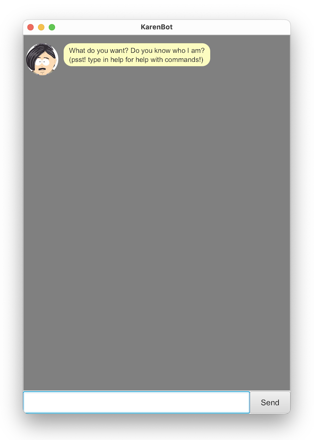

# User Guide
_KarenBot_ is a rude, self entitled desktop **chatbot** that will help you remember your **tasks**, all for the 
_low cost_ of having to deal with her attitude. _KarenBot_ is optimized for use via a Command Line Interface (CLI) while
still having the benefits of a Graphical User Interface (GUI). _KarenBot_ is best suited for the quick typist, 
maximising your productivity by spending less time on handling your tasks!

1. [Quick start](#quick-start)
2. [Features](#features)
3. [Usage](#usage)
4. [Command summary](#command-summary)
5. [Product screenshots](#product-screenshots)

## Quick start
1. Ensure you have Java 11 or above installed in your Computer.
2. Download the latest `duke.jar` from [here](https://github.com/sikai00/ip/releases/tag/A-Release).
3. Copy the file to the folder you want to use as the home folder for your _KarenBot_.
4. Navigate to the folder containing _KarenBot_ via CLI.
5. Run _KarenBot_ using the following command: `java -jar duke.jar`
6. The GUI similar to the below should appear in a few seconds.

7. Type the command in the input box and press Enter to execute it.   
e.g., typing `help` and pressing Enter will display a list of possible commands.
Some example commands you can try:
- `add todo Get groceries`: Adds a Todo with the description `Get groceries` to the list of tasks.
- `list`: Lists all tasks.
- `mark 1`: Marks the task with index 1 (as indicated by `list`) as done.
- `unmark 1`: Marks the task with index 1 (as indicated by `list`) as not done.
- `delete 1`: Deletes the task with index 1 (as indicated by `list`) from the list of tasks.
- `exit`: Exits the app.
8. Refer to [Features](#features) below for more detailed descriptions of each command.

## Features

### Modifying saved data
_KarenBot_ stores saved data in a text file named `duke.txt`. Advanced users can directly modify the text files if 
they find it quicker for niche actions such as mass deletion. The text file can be located in
a folder named `data` in _KarenBot_'s folder.

### Safeguarding against data corruption
On the event of a corruption of the text file `duke.txt` due to user modifications and _KarenBot_ is 
unable to parse it, _KarenBot_ can prevent loss of user data by renaming the corrupted
file to `duke-corrupt.txt` and continue to operate in a clean state. Users can then 
attempt to fix the erroneous modification (ensure that the file is renamed back to `duke.txt`). If there exists 
corrupted files already, _KarenBot_ will not overwrite `duke-corrupt.txt`. Instead, an incremental version, e.g.,
`duke-corrupt1.txt` will be created.

## Usage
**Note:** 
- Where angle brackets i.e., `<>`  are used, users must replace them with
appropriate values as specified.
- All time values have to be formatted in this specific format: `yyyy-mm-dd HH:MM`.   
Allowed delimiter characters are: `-:.|/`.

### `help`: Viewing list of all possible commands
Displays a list of all possible commands.  

Format: `help`

### `add todo`: Adds a Todo
Adds a Todo to the list of tasks.  

Format: `add todo <description>`

### `add deadline`: Adds a Deadline
Adds a Deadline to the list of tasks. A Deadline is used to create tasks due by a specific time.

Format: `add deadline <description> /by <time>`  
Example:
- `add deadline Complete assignment 1 /by 2022-09-17 23-59`
- `add deadline Review contract agreement /by 2022.12.12 23:59`  

Note: `time` is formatted as `yyyy-mm-dd HH:MM`. Allowed delimiter characters are: `-:.|/`.

### `add event`: Adds an Event
Adds an Event to the list of tasks. An Event is used to create tasks happening at a specific time.

Format: `add event <description> /at <time>`  
Example:
- `add deadline Gym /at 2022-09-17 18-00`
- `add deadline Internship day /at 2022/09/14 11:00`

Note: `time` is formatted as `yyyy-mm-dd HH:MM`. Allowed delimiter characters are: `-:.|/`.

### `list`: Lists all tasks
Displays a list of all tasks.  
Format: `list`

### `mark`: Marks a task as done
Marks a specified task as done.  
Format: `mark <task index>`  
Example:
- `mark 1`
- `mark 12`

Note: `task index` can be found by performing the [list](#list-lists-all-tasks) command.

### `unmark`: Marks a task as not done
Marks a specified task as not done.  
Format: `unmark <task index>`  
Example:
- `unmark 5`
- `unmark 9`

Note: `task index` can be found by performing the [list](#list-lists-all-tasks) command.

### `delete`: Deletes a task
Deletes a specified task.  
Format: `delete <task index>`  
Example:
- `delete 1`
- `delete 4`

Note: `task index` can be found by performing the [list](#list-lists-all-tasks) command.

### `find`: Find tasks using keyword
Finds all tasks whose description matches the keyword.  
Format: `find <keyword>`  
Example:
- `find assignment`
- `find comp`

### `view`: View tasks happening within a specific period
Displays a list of tasks happening within a specific period.  
Format: `view <period>`  
Example:
- `view today`
- `view tomorrow`

Note: There are 3 different types of period specifiable, namely:
- `today`: Today
- `tomorrow`: Tomorrow
- `week`: One week from today

### `exit`: Exits the program 
Exits _KarenBot_.  
Format: `exit`

## Command summary  

| Command                                 | Description                                                   |
|-----------------------------------------|---------------------------------------------------------------|
| `help`                                  | Displays a list of all possible commands.                     |
| `add todo <description>`                | Adds a Todo with the given description.                       |
| `add deadline <description> /by <time>` | Adds a Deadline with the given description and time.          |
| `add event <description> /at <time>`    | Adds an Event with the given description and time.            |
| `list`                                  | Displays a list of all tasks.                                 |
| `mark <task index>`                     | Marks the task with the given task index as done.             |
| `unmark <task index>`                   | Marks the task with the given task index as not done.         |
| `delete <task index>`                   | Deletes the task with the given task index.                   |
| `find <keyword>`                        | Finds all tasks whose description matches the keyword.        |
| `view <period>`                         | Displays a lists of tasks happening within a specific period. |
| `exit`                                  | Exits _KarenBot_.                                             |

## Product screenshots
