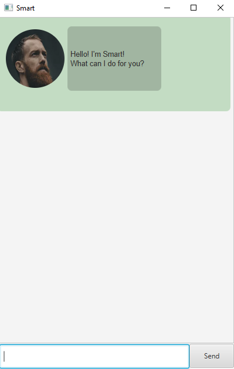

# Smart User Guide

Smart is an automated chatbot that helps a person 
to save and keep track of their tasks.

- [Quick start](#quick-start)
- [Features](#features)
  - [Adding a todo task: `todo`](#adding-a-todo-task-todo)
  - [Adding a deadline task: `deadline`](#adding-a-deadline-task-deadline)
  - [Adding an event task: `event`](#adding-an-event-task-event)
  - [Listing all tasks : `list`](#listing-all-tasks-list)
  - [Deleting a task: `delete`](#deleting-a-task-delete)
  - [Marking a task: `mark`](#marking-a-task-mark)
  - [Unmarking a task: `unmark`](#unmarking-a-task-unmark)
  - [Finding a list of task: `find`](#finding-a-list-of-task-find)
  - [Snoozing a deadline or event task: `snooze`](#snoozing-a-deadline-or-event-task-snooze)
  - [Exiting the program : `bye`](#exiting-the-program--bye)
- [Command summary](#command-summary)

---

## Quick start
1. Ensure you have Java `11` or above installed in your Computer. 
2. Download the latest duke.jar from [here](https://github.com/LianGuoYang/ip)
3. Copy the file to the folder you want to use as the *home folder* for Smart.
4. Double click the file to start the app. The GUI similar to the below should appear in a few seconds.

5. Type the command in the command box and press Enter to execute it. 
e.g. typing `list` and pressing Enter will show the list of tasks.
   - `todo homework` Add a `todo` task with name `homework` into the task list.
   - `delete 2` Deletes the 2nd task shown in the current list.
   - `bye` Exits the app.
6. Refer to the [Features](#features) below for details of each command.

---

## Features

Notes about the command format:
- Words in `UPPER_CASE` are the parameters to be supplied by the user.
  e.g. in `todo n/NAME`, `NAME` is a parameter which can be used as `todo n/physics`.

 

### Adding a todo task: `todo`

Adds a todo task into the task list.

Format:  `todo n/NAME`
- Only one whitespace between words allowed.

Examples:
- `todo markdown`
adds a `todo` task with name `markdown`.
   
   

### Adding a deadline task: `deadline`

Adds a deadline task into the task list.

Format:  `deadline n/NAME /by d/DATETIME`
- Only one whitespace between words allowed.
- Must have `/by` between `NAME` and `DATETIME`.
- `DATETIME` must be specified in `HHmm, d/MM/yyyy` format.

Examples:
- `deadline assignment /by 1200, 12/10/2022`
adds a `deadline` task with name `assignment` and date time `1200, 12/10/2022`.
   
   

### Adding an event task: `event`

Adds an event task into the task list.

Format:  `event n/NAME /at d/DATETIME`
- Only one whitespace between words allowed.
- Must have `/at` between `NAME` and `DATETIME`.
- `DATETIME` must be specified in `HHmm, d/MM/yyyy` format.

Examples:
- `event night /at 1200, 12/10/2022` 
adds an `event` task with name `night` and date time `1200, 12/10/2022`.
   
   

### Listing all tasks: `list`

Shows a list of all tasks in the task list.

Format:  `list`
- Tasks will be listed in this format `INDEX. [TASKTYPE][ISDONE] NAME (PREFIX: DATETIME)`
  - `INDEX` indicates the index of task.
  - `TASKTYPE` indicates the type of task.
    - [T] indicates `todo` task.
    - [D] indicates `deadline` task.
    - [E] indicates `event` task.
  - `ISDONE` indicates the status of task.
    - `[]` indicates that the task is not done.
    - `[X]` indicates that the task is done.
  - `NAME` indicates the name of task
  - `PREFIX` indicates the prefix for datetime.
    - `by` for deadline task.
    - `at` for event task.
  - `DATETIME` indicates the date time of task for deadlines and events only.
        
        

### Deleting a task: `delete`

Deletes a task in the task list according to its index number.

Format:  `delete i/INDEX`
- Deletes the task at the specified `INDEX`. 
- The index refers to the index number shown in the displayed task list. 
- The index must be a positive integer 1, 2, 3, ...

Examples:
- `delete 2` deletes the second task in the task list.
   
   

### Marking a task: `mark`

Marks a task as done in the task list according to its index number.

Format:  `mark i/INDEX`
- Marks the task at the specified `INDEX`.
- The index refers to the index number shown in the displayed task list.
- The index must be a positive integer 1, 2, 3, ...

Examples:
- `mark 2` marks the second task in the task list as done.
   
   

### Unmarking a task: `unmark`

Unmarks a task as done in the task list according to its index number.

Format:  `mark i/INDEX`
- Unmarks the task at the specified `INDEX`.
- The index refers to the index number shown in the displayed task list.
- The index must be a positive integer 1, 2, 3, ...

Examples:
- `unmark 2` unmarks the second task in the task list as done.
   
   

### Finding a list of task: `find`

Find tasks with names that contains the keyword.

Format:  `find k/KEYWORD`

Examples :
- `find assign` returns a list of tasks with names containing the keyword `assign`
   
   

### Snoozing a deadline or event task: `snooze`

Snoozes a deadline or event to a later date.

Format :  `snooze i/INDEX d/DATETIME`
- Deletes the task at the specified `INDEX`.
- The index refers to the index number shown in the displayed task list.
- The index must be a positive integer 1, 2, 3, ...
- `DATETIME` must be specified in `HHmm, d/MM/yyyy` format.

Examples :
- `snooze 2 0000, 24/03/2025` snoozes a deadline or event task 
at the second index to a later date at `0000, 24/03/2025`.
   
   

### Exiting the application : `bye`

Exits the app.

Format :  `bye`
   
   

---

## Command Summary

| Action       | Format, Examples                                                                    |
|--------------|-------------------------------------------------------------------------------------|
| Add todo     | `todo n/NAME` e.g. `todo markdown`                                              |
| Add deadline | `deadline n/NAME /by d/DATETIME` e.g. `deadline assignment /by 1200, 12/10/2022` |
| Add event    | `event n/NAME /at d/DATETIME` e.g. `event night /at 1200, 12/10/2022`           |
| List         | `list`                                                                              |
| Delete       | `delete i/INDEX` e.g. ``delete 2``                                              |
| Mark         | `mark i/INDEX` e.g. `mark 2`                                                    |
| Unmark       | `unmark i/INDEX` e.g. `unmark 2`                                                |
| Find         | `find k/KEYWORD` e.g. `find assign`                                             |
| Snooze       | `snooze i/INDEX d/DATETIME` e.g. `snooze 2 0000, 24/03/2025`                    |
| Exit         | `bye`                                                                               |