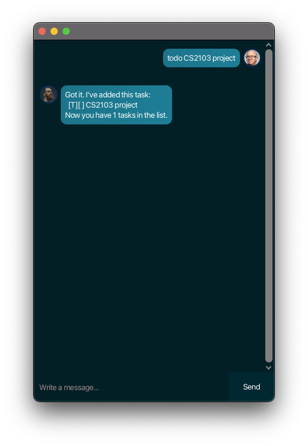
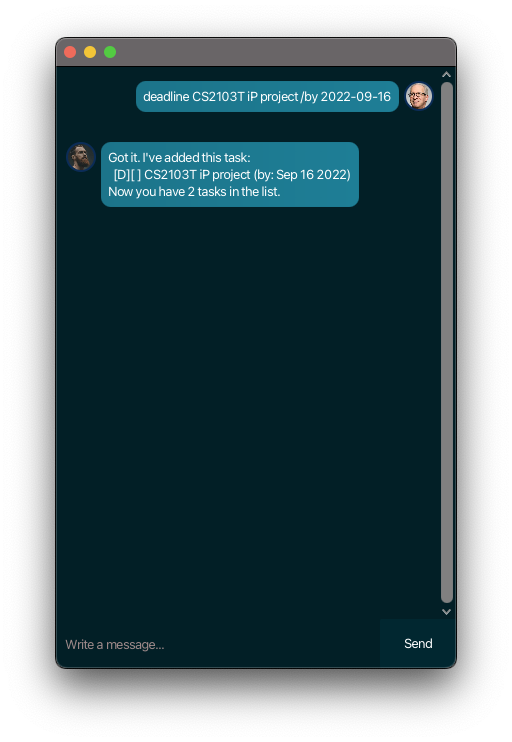
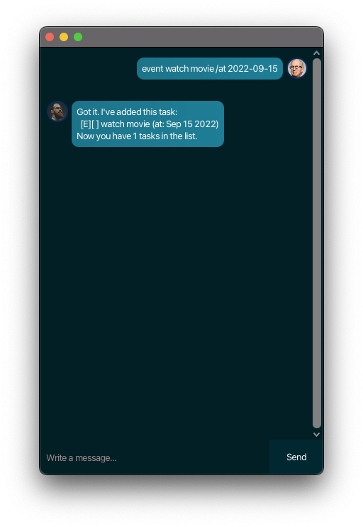
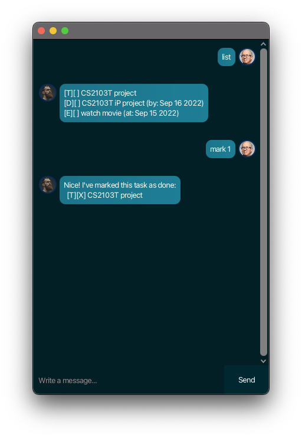
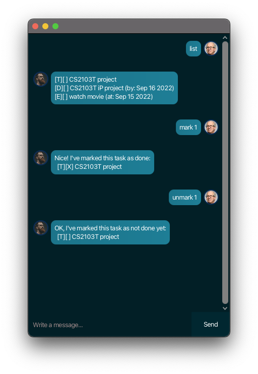
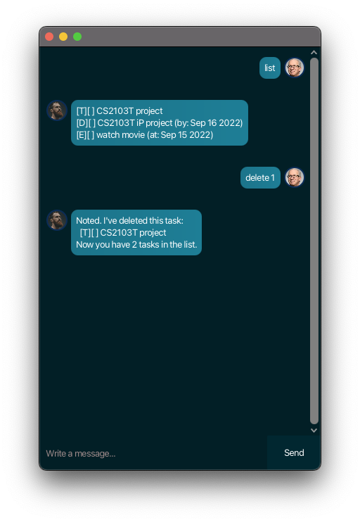
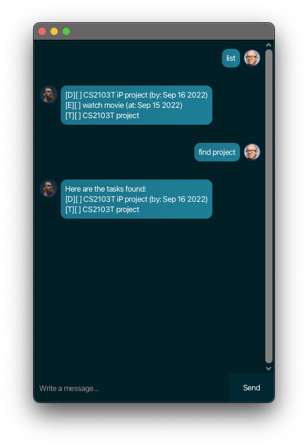

# User Guide

Welcome to Duke! This simple chat bot will allow you to store, view, and keep track of your todos, events and deadlines. This one-stop-shop Java application has an intuitive graphical user interface which is optimized for users who prefer typing. 

## Quick start

1. Ensure you have Java 11 or above installed.
2. Download the latest duke.jar from here.
3. Copy the file to the folder you want to use as the home folder for Duke.
4. Double-click the file to start the app.
5. Enter a command in the command box to execute it.

## Features 

### Adding a todo task: `todo`

Adds a todo task to the task list.

Format: `todo DESCRIPTION`

Examples:

- `todo homework`
- `todo CS2103T project`
- `todo research into Github Actions CI/CD`

Expected outcome:

### Adding a deadline task: `deadline`

Adds a deadline task to the task list.

Format: `deadline DESCRIPTION /by DATE`

- `DATE` is to be provided as a `YYYY-MM-DD` format.

Examples:

- `deadline CS2101 homework /by 2022-09-14`
- `deadline CS2103T iP project /by 2022-09-16`

Expected outcome:

### Adding an event task: `event`

Adds an event task to the task list.

Format: `event DESCRIPTION /at DATE`

- `DATE` is to be provided as a `YYYY-MM-DD` format.

Examples:

- `event watch movie /at 2022-09-15`
- `event go out with friends /at 2022-09-10`

Expected output:

### Listing all tasks: `list`

Lists all tasks stored in the task list.

Format: `list`

Expected output:

### Marking task as done: `mark`

Marks task with specified index as done.

Format: `mark INDEX`

- `INDEX` is referenced from the list and are 1-indexed.

Example of usage:

- `mark 1`

Expected output:

### Marking task as undone: `unmark`

Marks task with specified index as undone.

Format: `unmark INDEX`

- `INDEX` is referenced from the list and are 1-indexed.

Example of usage:

- `unmark 1`

Expected output:

### Deleting a task: `delete`

Deletes task with specified index from the task list.

Format: `delete INDEX`

- `INDEX` is referenced from the list and are 1-indexed.

Example of usage:

- `delete 1`

### Finding a task: `find`

Finds all tasks containing `SEARCH_STRING`in their description from the task list.

Format: `find SEARCH_STRING`

Example of usage:

- `find movie`
- `find homework`

Expected output:

### Exiting the application: `bye`

Exits the application.

Format: `bye`

Expected outcome: Closes and exits the application.

### Saving the data

Duke data is saved on the hard disk automatically after any command that changes the data. There is no need to save manually.

### Editing the data file

Duke data is saved as a text file at `[JAR file location]/data/tasks.txt`. You may wish to manually update this file. Each task is stored on one line and follows the format:

`[T(ask) | E(vent) | D(eadline)] | [0 (undone) | 1 (done)] | DESCRIPTION[ | DATE]`

The `DATE` is only included for event and deadline tasks.