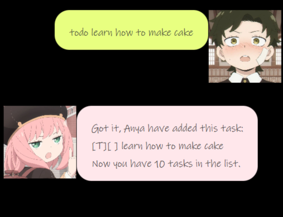
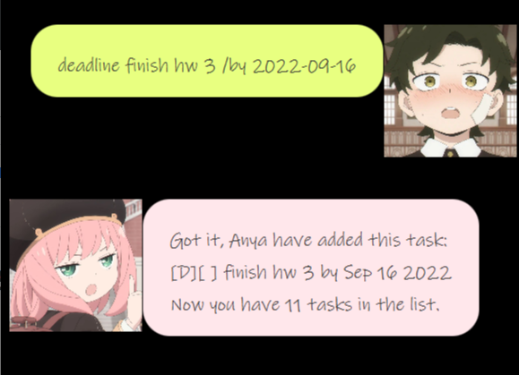
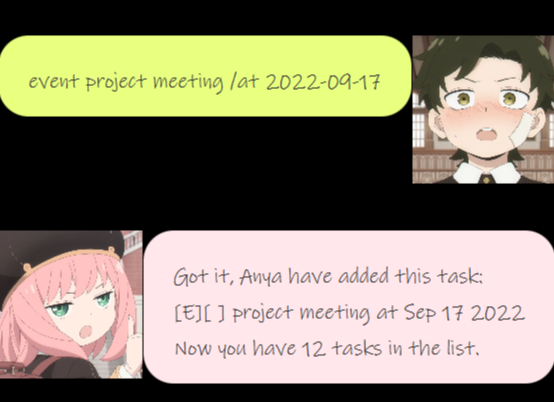
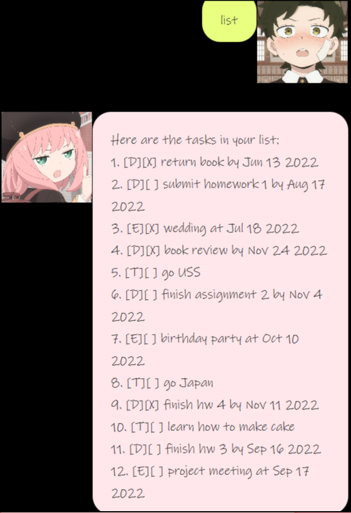
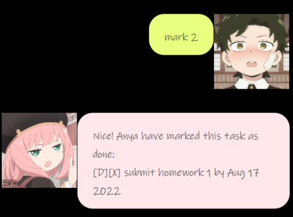
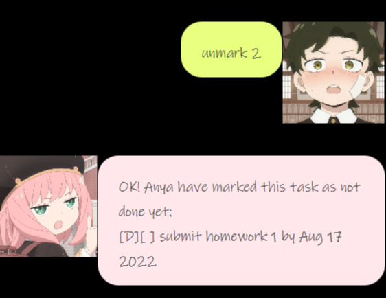
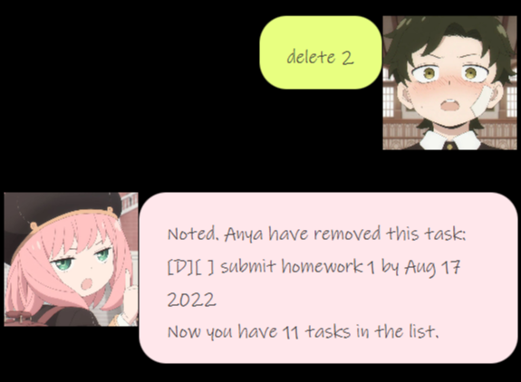
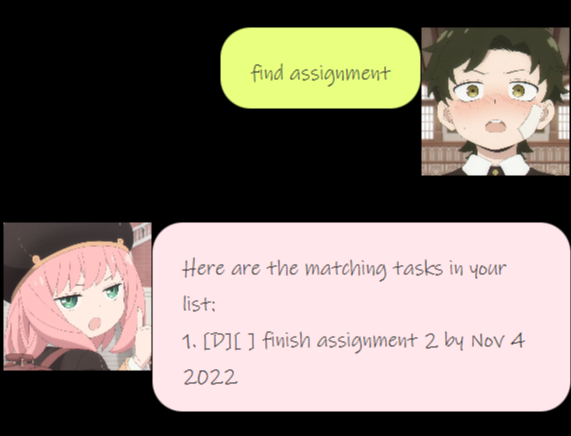
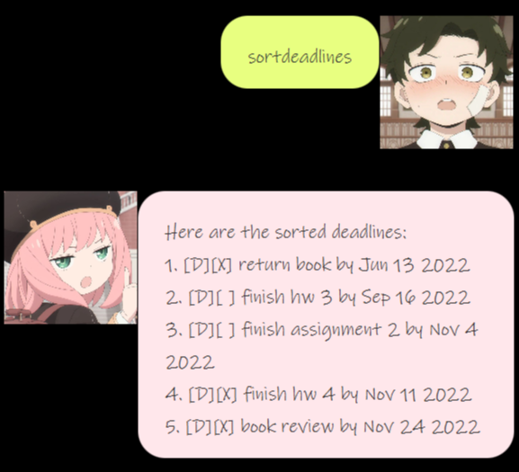
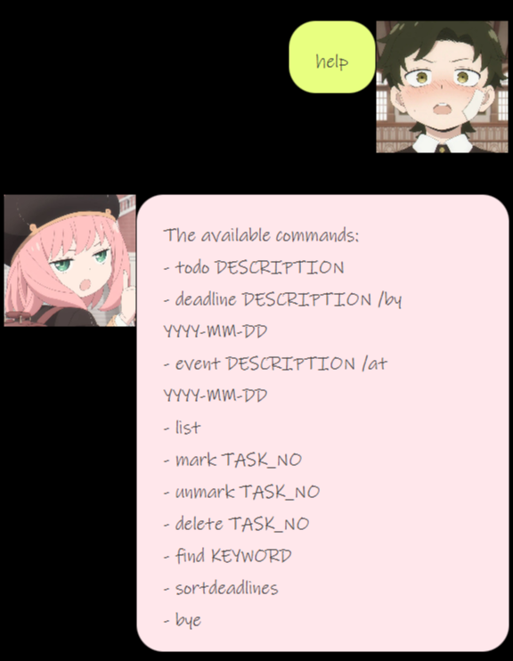

# User Guide

## Features 

### Keep track of your tasks

Anya chatbot can help you keep track of your deadlines, events and todos.  

### Keep track of your deadlines dates

Anya chatbot can sort your deadlines according to dates so that you can see which one you need to do first. 

## Usage

### `todo DESCRIPTION` - Add a todo 

Add a todo task with description given into the task list.

Example of usage: 

`todo learn how to make cake`

Expected outcome:

Add a todo with description 'learn how to make cake' into the task list. 

Update the total number of tasks in the task list. 

### `deadline DESCRIPTION /by YYYY-MM-DD` - Add a deadline 

Add a deadline task with description and date given into the task list.

Example of usage:

`deadline finish hw 3 /by 2022-09-16`

Expected outcome:

Add a deadline with description 'finish hw 3' and date '2022-09-16' into the task list.

Update the total number of tasks in the task list.

### `event DESCRIPTION /at YYYY-MM-DD` - Add an event 

Add an event task with description and date given into the task list.

Example of usage:

`event project meeting /at 2022-09-17`

Expected outcome:

Add an event with description 'project meeting' and date '2022-09-17' into the task list.

Update the total number of tasks in the task list.

### `list` - List all tasks in the task list

List out all the tasks in the task list. 

Example of usage:

`list`

Expected outcome:

### `mark TASK_NO` - Mark the task as done

Mark the task with the task.no given as done. 

Example of usage:

`mark 2`

Expected outcome:

Mark task with task.no 2 as done. 

### `unmark TASK_NO` - Unmark the task 

Unmark the task with the task.no given.

Example of usage:

`unmark 2`

Expected outcome:

Unmark task with task.no 2. This task is not done yet. 

### `delete TASK_NO` - Delete the task

Delete the task with the task.no given from the task list.

Example of usage:

`delete 2`

Expected outcome:

Delete task with task.no 2 from the task list.

Update the total number of tasks in the task list. 

### `find KEYWORD` - Find the tasks that contain keyword

Find the tasks that its task description contain the keyword given. 

Example of usage:

`find assignment`

Expected outcome:

List out all the tasks that contain 'assignment'. 

### `sortdeadlines` - List out the sorted deadlines in the task list. 

Sort the deadlines in the task list according to dates.  

List out the sorted deadlines. 

Example of usage:

`sortdeadlines`

Expected outcome:

List out the sorted deadlines.

### `help` - List out the available commands.

List out available commands in Anya chatbot.

Example of usage:

`help`

Expected outcome:

List out the available commands.

### `bye` - Exit the application

Example of usage:

`bye`

