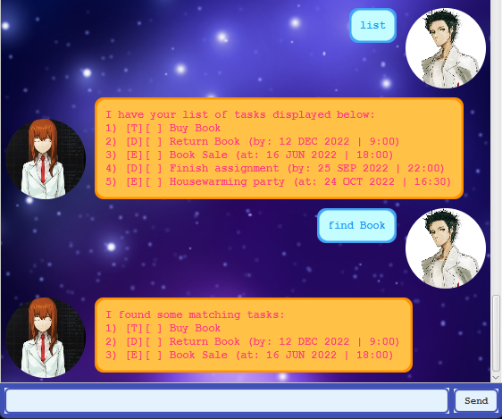

# User Guide

 

DukePro is a **ChatBot application for managing tasks with Command Line style syntax** with a Graphical User Interface (GUI). You get to talk to the ChatBot **_Christina_**!

* Table of Contents
{:toc}

## Quick start

1. Ensure that you have Java `11` or above installed in your Computer.

2. Download `DukePro.jar` from [here](https://github.com/BlopApple/ip/releases).

3. Double-click the file to start the app and you should be greeted by **_Christina_**!

4. Type in the text box and press `ENTER` or click on the `SEND` button and watch **_Christina_** respond!
    
    Some example commands that **_Christina_** can do:
    
    * **`todo`** : Adds a simple todo task.
    * **`list`** : List the current tasks in the list.
    * **`mark`** `1` : Marks the 1st task in the list as completed.
    * **`delete`** `3` : Deletes the 3rd task in the list.
    * **`bye`** : **_Christina_** says goodbye and exits.

 

> **_Christina_** will save its contents in the file _dukeSave.txt_ in its current folder and will read from the same file the next time it starts up.

 

## Features 

 

> **Notes about the command format:**
> * Words in `UPPER_CASE` are the parameters to be supplied by the user. 
  e.g. in `todo TASK_NAME`, `TASK_NAME` is a parameter which can be used as `todo Read Book`.
> * Commands that accepts no parameters would not be understood if you input parameters.
  eg. `list 123` or `list all` would be treated as invalid commands.

 

### Adds a todo task : `todo`

Adds a todo task to the task list.

Format: `todo TASK_NAME`

Examples:
* `todo Read Book`

### Adds a deadline task : `deadline`

Adds a deadline task with added deadline information to the task list.

Format: `deadline TASK_NAME /by DATE_TIME`

* `DATE_TIME` must be in the format of `DD/MM/YYYY,HHMM`

Examples:
* `deadline Return Book /by 12/12/2022,0900`
* `deadline Finish assignment /by 25/09/2022,2200`

### Adds a event task : `event`

Adds a event task with added event time information to the task list.

Format: `event TASK_NAME /by DATE_TIME`

* `DATE_TIME` must be in the format of `DD/MM/YYYY,HHMM`

Examples:
* `event Book Sale /at 16/06/2022,1800`
* `event Housewarming party /at 24/10/2022,1630`

### Listing all tasks : `list`

Displays the list of task present in the current task list.

Format: `list`

### Marks a task : `mark`

Marks a given task in the task list as completed.

Format: `mark INDEX`

* Marks the task at the specified `INDEX`. The index refers to the index number in the task list. The index **must be a positive integer** 1, 2, 3, …

Examples:
* `mark 1` marks the 1st task in the task list as completed.

### Unmarks a task : `unmark`

Unmarks a given task in the task list that was marked.

Format: `unmark INDEX`

* Unmarks the task at the specified `INDEX`. The index refers to the index number in the task list. The index **must be a positive integer** 1, 2, 3, …

Examples:
* `unmark 2` unmarks the 2nd task in the task list.

### Deletes a task : `delete`

Deletes the given task in the task list.

Format: `delete INDEX`

* Deletes the task at the specified `INDEX`. The index refers to the index number in the task list. The index **must be a positive integer** 1, 2, 3, …
* The index refers to the absolute index of the task in the task list.

Examples:
* `delete 3` deletes the 3rd task in the task list.

### Locate tasks that matches a keyword : `find`

Displays the list of task that matches the given keyword in the current task list.

Format: `find KEYWORDS`

* Only the task name for a task is searched.
* Matches will be returned as long as part of the task name matches the keywords. `Book` will match `Books`

Examples:
* `find Book` returns the `[T][ ] Read Book`, `[D][ ] Return Book (by: 12 DEC 2022 | 09:00` and `[E][ ] Book Sale (at: 16 JUN 2022 | 18:00)`.

### Updates a task : `update`

Updates an exisiting task in the task list with updated information.

Format: `update INDEX TASK_NAME`  `update INDEX TASK_NAME /by DATE_TIME` `update INDEX /by DATE_TIME`  `update INDEX TASK_NAME /at DATE_TIME` `update INDEX /at DATE_TIME`

* If only `TASK_NAME` is specified, any tasks can be updated with the new `TASK_NAME`
* If only `DATE_TIME` is specified, any deadline and event tasks can be updated with the new `DATE_TIME` with the `/by` and `/at` separator respectively.`
* If both `TASK_NAME` and `DATE_TIME` is specified, any deadline and event tasks can be updated with the new `TASK_NAME` and the new `DATE_TIME` with the `/by` and `/at` separator respectively.

Examples:
* `update 2 Sell Book` for the deadline task `[D][ ] Return Book (by: 12 DEC 2022 | 09:00` will update the task to `[D][ ] Sell Book (by: 12 DEC 2022 | 09:00`
* `update 3 /at 15/10/2022,1830` for the event task `[E][ ] Book Sale (at: 16 JUN 2022 | 18:00)` will update the task to `[E][ ] Book Sale (at: 15 OCT 2022 | 18:30)`

### Exiting the program : `bye`

Exits the program with a goodbye message!

Format: `bye`

--------------------------------------------------------------------------------------------------------------------

## FAQ

**Q**: How do I transfer my save data to another Computer? 
**A**: Install the app in the other computer and overwrite the empty save data file it creates with the file that contains the data of your previous DukePro home folder.

--------------------------------------------------------------------------------------------------------------------

## Command summary

Command | Format, Examples
--------|------------------
**Todo** | `todo TASK_NAME`   e.g. `todo Read Book`
**Deadline** | `deadline TASK_NAME /by DATE_TIME`   e.g. `deadline Return Book /by 12/12/2022,0900`
**Event** | `event TASK_NAME /at DATE_TIME`   e.g. `event Book Sale /at 16/06/2022,1800`
**List** | `list`
**Mark** | `mark INDEX`  e.g. `mark 1`
**Unmark** | `unmark INDEX`  e.g. `unmark 2`
**Delete** | `delete INDEX`  e.g. `delete 3`
**Find** | `find KEYWORDS `  e.g. `find Book`
**Update** | `update INDEX TASK_NAME`  `update INDEX TASK_NAME /by DATE_TIME` `update INDEX /by DATE_TIME`  `update INDEX TASK_NAME /at DATE_TIME` `update INDEX /at DATE_TIME`   e.g.`update 2 Sell Book`  `update 3 /at 15/10/2022,1830`
**Bye** | `bye`
