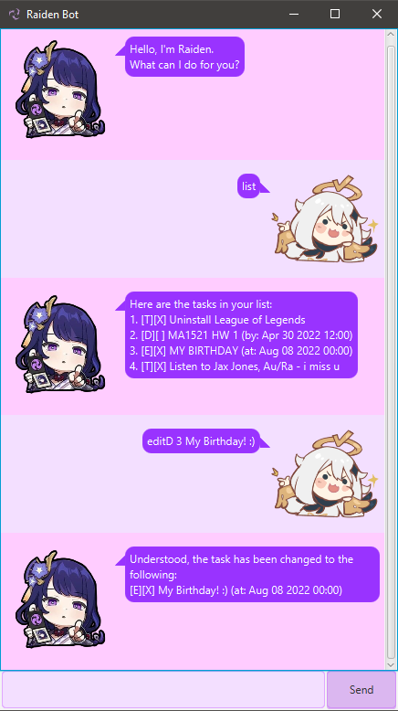

# <a name = "top"></a>User Guide
Are you missing deadlines because you can't remember all the work you have?<br> Do not worry!! We have **Bro**, your personal task manager to the rescue.

<p align = "left">

</p>

## Table of Content
* <a href = "#start">Quick Start</a>
* <a href = "#feature">Features</a>
* <a href = "#usage">Usage</a>
* <a href = "#summary">Command Summary</a>

## <a name = "start"></a>Quick Start
* Please ensure that you have Java 11 or above installed in your computer.
* Download the latest Bro.jar from [here](https://github.com/anuanas2007/ip/releases/download/A-Release/bro.jar).
* Copy the file to the directory you want to use.
* Please run the application.
* A GUI similar to the above one appears.
* If the previous step doesn't work, open the terminal and try running `java -jar bro.jar`.
* Type in the command and press *Enter* or click on the *Send* button to execute it.

## <a name = "feature"></a>Features
<input type="checkbox" checked="checked" disabled="disabled"> <a href = "#todo"> &nbsp;Add your ToDo task</a><br>
<input type="checkbox" checked="checked" disabled="disabled"> <a href = "#deadline"> &nbsp;Add your task with Deadline</a><br>
<input type="checkbox" checked="checked" disabled="disabled"> <a href = "#event"> &nbsp;Add your Event task</a><br>
<input type="checkbox" checked="checked" disabled="disabled"> <a href = "#list"> &nbsp;View all your tasks</a><br>
<input type="checkbox" checked="checked" disabled="disabled"> <a href = "#mark"> &nbsp;Mark your task as done</a><br>
<input type="checkbox" checked="checked" disabled="disabled"> <a href = "#unmark"> &nbsp;Mark your task as undone</a><br>
<input type="checkbox" checked="checked" disabled="disabled"> <a href = "#delete"> &nbsp;Delete your task</a><br>
<input type="checkbox" checked="checked" disabled="disabled"> <a href = "#find"> &nbsp;Find your task by keyword</a><br>
<input type="checkbox" checked="checked" disabled="disabled"> <a href = "#help"> &nbsp;Display help message</a><br>
<input type="checkbox" checked="checked" disabled="disabled"> <a href = "#bye"> &nbsp;Exit chatbot</a>

## <a name = "usage"></a>Usage

### <a name = "todo"></a>To add your ToDo task - `todo`

Adds To Do task to your task manager.

**Command Format :** todo [task description]

**Example of usage:** 

```
todo buy grocery
> [T][ ] buy grocery
> You only have 1 task left!
```
----
### <a name = "deadline"></a>To add your task with Deadline - `deadline`

Adds task with deadline to your task manager.

**Command Format :** deadline [task description] /by [dd/mm/yyyy hhmm]

**Example of usage:**

```
deadline CS2109S assignment /by 11/10/2022 2359
> [D][ ] CS1209S assignment (by: Oct 11 2022 2359)
> You only have 2 tasks left!
```
----
### <a name = "event"></a>To add your Event task - `event`

Adds an Event task to your task manager.

**Command Format :** event [task description] /at [dd/mm/yyyy hhmm]

**Example of usage:**

```
event birthday party /at 18/09/2022 2230
> [E][ ] birthday party (at: Sep 18 2022 2230)
> You only have 3 tasks left!
```
----
### <a name = "list"></a>To view all your tasks - `list`

Shows all the task in the task manager with the mark and unmark sign.

**Command Format :** list

**Example of usage:**

```
list
> Here are the tasks:
> 1.[T][X] buy grocery
> 2.[D][ ] CS1209S assignment (by: Oct 11 2022 2359)
> 3.[E][ ] birthday party (at: Sep 18 2022 2230)
> You can doo ittt!!
```
----
### <a name = "mark"></a>To mark your task as done - `mark`

Marks the task as done with a "X" sign.

**Command Format :** mark [index]

**Example of usage:**

```
mark 1
> I have marked this task
> [T][X] buy grocery
```
----
### <a name = "unmark"></a>To mark your task as undone - `unmark`

Marks the task as not done by replacing "X" sign with " ".

**Command Format :** unmark [index]

**Example of usage:**

```
unmark 1
> I have unmarked this task
> [T][ ] buy grocery
> You only have 3 tasks left!
```
----
### <a name = "delete"></a>To delete your task - `delete`

Removes the task from the task manager.

**Command Format :** delete [index]

**Example of usage:**

```
delete 1
> I have removed this task
> [T][ ] buy grocery
> You only have 2 tasks left!
```
----
### <a name = "find"></a>To find your task by keyword - `find`

Finds the task(s) with the given keyword.

**Command Format :** find [keyword]

**Example of usage:**

```
find party
> Here are the tasks:
> 1.[E][ ] birthday party (at: Sep 18 2022 2230)
> 2.[E][ ] diwali party (at: Oct 17 2022 1030)
```
----
### <a name = "help"></a>To display help message - `help`

Displays the help message.

**Command Format :** help

**Example of usage:**

```
help
> COMMAND        PURPOSE
> 1. list:
>            To view the tasks left
> 2. todo descr:
>            To add todo task
> 3. deadline descr /by dd/mm/yyyy hhmm:
>            To add task with deadline
> 4. event descr /at dd/mm/yyyy hhmm:
>            To add an event
> 5. mark index:
>            To mark the task as done
> 6. unmark index:
>            To mark the task as not done
> 7. delete index:
>            To delete the task in that index
> 8. find keyword:
>            To find task with the keyword
> 9. bye:
>            To exit the chatbot
```
----
### <a name = "bye"></a> To exit the chatbot - `bye`

Closes the program.

**Command Format :** bye

**Example of usage:**

```
bye
> See you later broo!
```
----
<p align = "right">
<a href = "#top">Back to top</a>
</p>

## <a name = "summary"></a> Command Summary


| COMMAND                    | FORMAT, EXAMPLES                                                                           |
|----------------------------|--------------------------------------------------------------------------------------------|
| Help                       | `help`                                                                                     |
| Add ToDo Task              | todo [descr] <br> e.g., `todo buy grocery`                                                 |
| Add Deadline Task          | deadline [descr] /by [dd/mm/yyyy hhmm]<br> e.g., `deadline CS2109S HW /by 10/10/2022 2359` |
| Add Event Task             | event [descr] /at [dd/mm/yyyy hhmm]<br> e.g., `event Neon Party /at 18/09/2022 2110`       |
| Mark Task                  | mark [index] <br> e.g., `mark 2`                                                           |
| Unmark Task                | unmark [index] <br> e.g., `unmark 2`                                                       |
| Find Task with the keyword | find [keyword] <br> e.g., `find party`                                                     |
| Delete Task                | delete [index] <br> e.g., `delete 1`                                                       |
| View all Tasks             | `list`                                                                                     |
| Exit                       | `bye`                                                                                      |

<p align = "right">
<a href = "#top">Back to top</a>
</p>