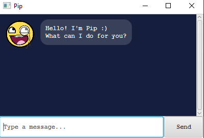
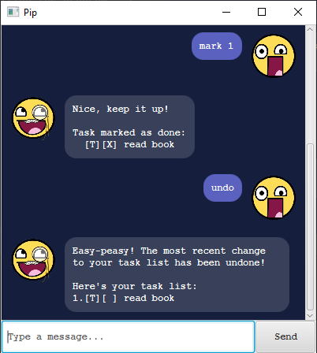

# User Guide

Pip is a Personal Assistant Chatbot that helps you manage your tasks.



## Features 

Notes about the command format:

- Words in UPPER_CASE are the arguments to be given by the user.
- Arguments in square brackets are optional.
- Arguments given for commands that do not take in arguments
(eg. `list`, `undo`, `bye`) will be ignored.

### Adding a Todo task

Adds a task without any date attached to it to the task list.

Usage: `todo TASK_DESCRIPTION`

Example: `todo bake muffins`

Expected outcome:
```
Sure! Task added:
  [T][ ] bake muffins
  
You have 1 task(s) in the list.
```

### Adding a Deadline task

Adds a task that needs to be done before a specific date to the task list.

Usage: `deadline TASK_DESCRIPTION /by DATE`

- `DATE` must be in the format: **YYYY-MM-DD**.

Example: `deadline return book /by 2022-01-24`

Expected outcome:
```
Sure! Task added:
  [D][ ] return book (by: 24 Jan 2022)
  
You have 2 task(s) in the list.
```

### Adding an Event task

Adds a task that occurs on a specific date.

Usage: `event TASK_DESCRIPTION /at DATE`

- `DATE` must be in the format: **YYYY-MM-DD**.

Example: `event meeting /at 2022-09-13`

Expected outcome:
```
Sure! Task added:
  [E][ ] meeting (by: 13 Sep 2022)
  
You have 3 task(s) in the list.
```

### Listing all tasks

Shows a list of all tasks in the task list.

Usage: `list`

Example: `list`

Expected outcome:
```
Here's your task list:
1.[T][ ] bake muffins
2.[D][ ] return book (by: 24 Jan 2022)
3.[E][ ] meeting (by: 13 Sep 2022)
```

### Marking a task as done

Marks a task as done.

Usage: `mark TASK_NUMBER`

- `TASK_NUMBER` refers to the number of the task shown in the task list.

Example: `mark 2`

Expected outcome:
```
Speedy, keep it up!

Task marked as done:
  [D][X] return book (by: 24 Jan 2022)
```

### Marking a task as not done

Marks a task as not done.

Usage: `unmark TASK_NUMBER`

- `TASK_NUMBER` refers to the number of the task shown in the task list.

Example: `unmark 2`

Expected outcome:
```
Welp, don't fall behind!

Task marked as not done:
  [D][ ] return book (by: 24 Jan 2022)
```

### Deleting a task

Deletes a task from the task list.

Usage: `delete TASK_NUMBER`

- `TASK_NUMBER` refers to the number of the task shown in the task list.

Example: `delete 1`

Expected outcome:
```
Alright! Task removed:
  [T][ ] bake muffins
  
You have 2 task(s) in the list.
```

### Finding tasks by date

Finds tasks that occur on a specific date.

Usage: `on DATE`

- `DATE` must be in the format: **YYYY-MM-DD**.

Example: `on 2022-24-01`

Expected outcome:
```
Aha, found them!

Here are your matching task(s):
1.[D][ ] return book (by: 24 Jan 2022)
```

### Finding tasks by description

Finds tasks whose descriptions contain any of the given keywords.

Usage: `find KEYWORD [MORE_KEYWORDS]`

Example: `find meeting`

Expected outcome:
```
Aha, found them!

Here are your matching task(s):
1.[E][ ] meeting (at: 13 Sep 2022)
```

### Undoing the last edit

Undos the most recent change to the task list.

Usage: `undo`

Example: `undo`

Expected outcome:



### Exiting the program

Exits the program.

Usage: `bye`

Example: `bye`

Expected outcome:
```
Goodbye and see you again soon!
```
