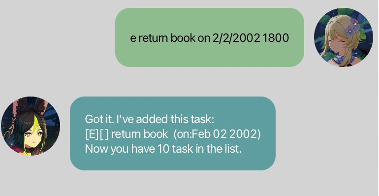

# Duke
>The world opens itself before those with noble hearts

This is a desktop application about task management that can keep record of your deadlines, todos and events.

Please read following instructions to find out more.
## Quickstart
1. Ensure you have Java 11 or above installed in your Computer.
2. Download the latest duke.jar from [here.](https://github.com/bokun2/ip/releases)
3. Copy the file to the folder you want to use as the home folder for your Duke.
4. Double-click the file to start the app.
## Features
### Add Deadlines
**Deadline/d/ddl/DEADLINE/D/deadline TASK DESCRIPTION by TIME**

Examples
````
  ddl return book by today
  d submit homework by next Sunday
````
### Add Events
**Event/E/EVENT/e/event TASK DESCRIPTION on TIME**

Examples
````
   e go to gym on tomorrow
   E internship day on this Thursday
````
### Add Todos
**Todo/T/TODO/t/todo TASK DESCRIPTION**

Example
````
   todo cut hair
   T asking questions
````
### List tasks
**LIST/L/l/List/list**

Example
````
   l
   List
````

### Mark and Unmark a task as done or undone ###
**mark/Mark/m/MARK/M NUMBER**
**unmark/U/u/UNMARK/Unmark NUMBER**

Example
````
   u 3
   mark 2
````
### Delete a task
**delete/DELETE/Delete NUMBER**

Example
````
   delete 3
````
### Get task on a specific day
**get/Get/g/G/GET YYYY-MM-DD**

Example
````
   g 2002-02-02
````
### Find tasks of certain type or contain certain string
**find/FIND/Find/f/F STRING/TYPE**

Examples
````
   f ddl
   F book
 ````

### Add tasks with certain day format
**When adding events or deadlines, write the description of time in the format "day/month/year time".
Duke will take the input day in the format of MMM DD YYYY**

Examples
````
   e return book on 2/2/2002 18:00
   ddl final submission by 12/12/2012 1800
````


### Goodbye message
**Bye/BYE/bye**

## Command Summary
- Deadlines: d/ddl/DEADLINE/D/Deadline/deadline DESCIPTION by TIME
- Todos: t/todo/T/TODO/Todo DESCRIPTION
- Events: e/event/Event/EVENT/E DESCRIPTION on TIME
- Delete: DELETE/Delete/delete NUMBER
- Mark/Unmark: mark/M/MARK/Mark/m NUMBER unmark/u/U/Unmark/UNMARK NUMBER
- List: l/list/L/List/LIST
- Find: find/FIND/Find/f/F STRING/TYPE
- Get: get/Get/g/G/GET YYYY-MM-DD
- Day format: day/month/year time
- Bye: bye/BYE/bye