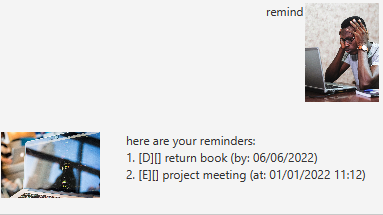

# User Guide
Welcome to Duke, your personal bot!

## Features 
1. Add tasks like Todos, Deadlines, Events to Duke!
2. Mark tasks as done, or unmark them
3. Search for tasks that you have
4. Delete unwanted tasks
5. Find reminders 

### `todo <description>` - Adds todo with specified description

Example of usage:

`todo create guide`

Expected outcome:

### `deadline <description> /by <date>` - Adds deadline with specified description and date

Example of usage:

`deadline create guide /by 11/09/2022`

Expected outcome:

### `event <description> /at <date>` - Adds event with specified description, date and time

Example of usage:

`event create guide /at 11/09/2022 0800`

Expected outcome:

### `delete <index>` - Deletes item at index

Example of usage:

`delete 6`

Expected outcome:

### `list` - Lists all current tasks

Example of usage:

`list`

Expected outcome:

### `done <number>` - Marks item at index number as done

Example of usage:

`done 5`

Expected outcome:

### `unmark <number>` - Marks item at index number as not done

Example of usage:

`unmark 5`

Expected outcome:

### `remind` - Gets all reminders of tasks with deadlines or events

Example of usage:

`remind`

Expected outcome:

### `find <description>` - Finds all tasks with matching descriptions

Example of usage:

`find read`

Expected outcome:

