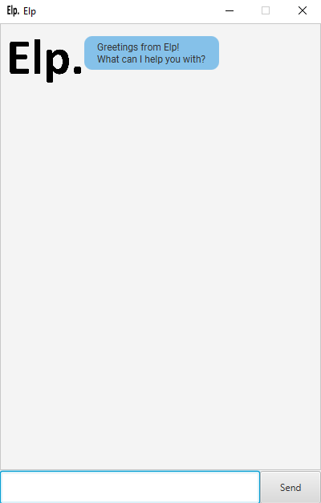

---
User Guide
---
Elp is a **desktop app for helping you manage any tasks you might have! Optimized for use via 
a Command Line Interface (CLI)** while having a graphical interface for a more pleasant experience!

## Quick Start
1. Ensure Java 11 or above is installed in your computer.
2. Download the latest version of 'Elp.jar' from [here](https://github.com/marclzh/ip/releases). 
3. Copy the file to the folder you want to use as the _home_ folder for Elp.
4. Double-click the file to start the app. A GUI similar to the one shown below should appear.<br>

5. Type in some commands in the command box and press Enter to execute it. Some example commands 
you can try are:
    * **'todo task 1 /p high'** : Creates a task **"task 1"** with a priority tagging of **"HIGH"**. 📒 
   
    * **'deadline deadline 2 /by 01-01-2023 0000 /p medium'** : Creates a **deadline "deadline 2"** with 
    a **deadline of 1st January 2023** and priority tagging **"MEDIUM"**. ⏰
   
    * **'event event 3 /at 02-02-2023 0000 /p low'** : Creates an **event "deadline 2"** with
    a **date of 1st January 2023** and priority tagging **"LOW"**. 📆

    * **'list'** : Lists all current events that have been input. 📜

    * **'mark 1'** : Marks the task indicated by the index input. ✅

    * **'unmark'** : Unmarks the task indicated by the index input. ❌

    * **'delete 1'** Deletes the task off the list of tasks indicated by the index input. ⛔

    * **'find keyword'** : Finds all tasks matching the description 'keyword'. 🔍

    * **'bye'** : Exits the app. 👋

Refer to the [Features](#features) below for details of each command!

## Features 
<div markdown="block" class="alert alert-info">
**Note: Words in 'UPPER_CASE' are the parameters to be supplied by the user.** <br>
e.g. in 'todo DESCRIPTION /p PRIORITY', 'DESCRIPTION' and 'PRIORITY' are parameters to be supplied by the user.
</div>

### To-Do 📒
A to-do is a simple task with a description field and priority field.

### Usage

### `todo` - Adds a to-do task to the task list

Format: **'todo DESCRIPTION /p PRIORITY'**

Example of usage:
`todo task 1 /p low`

Expected outcome:
```
[T][] task 1 Priority: LOW
```

### Deadline ⏰
A deadline is a task with a description field, a deadline field and a priority field.

### Usage

### `deadline` - Adds a deadline task to the task list

Format: **'deadline DESCRIPTION /by DD-MM-YYYY HHMM /p PRIORITY'**

Example of usage:
'deadline task 2 /by 01-01-2023 1200 /p medium'

Expected outcome:
```
[D][] task 2 (by: Jan 1 2023 1200) Priority: MEDIUM
```

### Event 📆
An event is a task with a description field, a time field and a priority field.

### Usage

### `event` - Adds an event task to the task list

Format: **'event DESCRIPTION /at DD-MM-YYYY HHMM /p PRIORITY'**

Example of usage:
'deadline task 3 /at 01-01-2023 1200 /p high'

Expected outcome:
```
[E][] task 3 (at: Jan 1 2023 1200) Priority: HIGH
```

### List 📜

A list of all the current tasks in the list.

### Usage

### `list` - Lists out the tasks in the task list.

Format: **'list'**

Example expected outcome:
```
1. [T][] task 1 Priority: LOW
2. [D][] task 2 (by: Jan 1 2023 1200) Priority: MEDIUM
3. [E][] task 3 (at: Jan 1 2023 1200) Priority: HIGH
```

### Mark ✅
Marks a task as done.

### Usage

### `mark` - Marks a task on the task list as done

Format: **'mark INDEX'**

Example of usage:
'mark 1'

Expected outcome:
```
1. [T][X] task 1 Priority: LOW
2. [D][] task 2 (by: Jan 1 2023 1200) Priority: MEDIUM
3. [E][] task 3 (at: Jan 1 2023 1200) Priority: HIGH
```

### Unmark ❌
Unmarks a task.

### Usage

### `unmark` - Unmarks a done task on the task list as undone

Format: **'unmark INDEX'**

Example of usage:
'unmark 1'

Expected outcome:
```
1. [T][] task 1 Priority: LOW
2. [D][X] task 2 (by: Jan 1 2023 1200) Priority: MEDIUM
3. [E][X] task 3 (at: Jan 1 2023 1200) Priority: HIGH
```

### Delete ⛔
Deletes a task.

### Usage

### `delete` - Deletes a task off the task list given an index

Format: **'delete INDEX'**

Example of usage:
'delete 2'

Expected outcome:
```
1. [T][] task 1 Priority: LOW
2. [E][] task 3 (at: Jan 1 2023 1200) Priority: HIGH
```

### Find 🔍
Finds any descriptions matching a keyword given by the user.

### Usage

### `find` - Finds a description of a task matching a given keyword

Format: **'find KEYWORD'**

Example of usage:
'find 1'

Expected outcome:
```
Here's all I could find with "1"!
1. [T][] task 1 Priority: LOW
```

### Bye 👋
Exits the program.

### Usage

### `bye` - Exits the program

Format: **'bye'**

Expected outcome: <br>
_Exits program._


## Command Summary

| Command      | Format, Examples                                                                                                  |
|--------------|-------------------------------------------------------------------------------------------------------------------|
| **todo**     | 'todo DESCRIPTION /p PRIORITY' <br> e.g., 'todo task 1 /p low'                                                    |
| **deadline** | 'deadline DESCRIPTION /by DD-MM-YYYY HHMM /p PRIORITY' <br> e.g., 'deadline task 2 /by 01-01-2023 1200 /p medium' |
| **event**    | 'event DESCRIPTION /at DD-MM-YYYY HHMM /p PRIORITY' <br> e.g., 'event task 3 /at 01-01-2023 1200 /p high'         |
| **list**     | 'list'                                                                                                            |
| **mark**     | 'mark INDEX' <br> e.g., 'mark 1'                                                                                  |
| **unmark**   | 'unmark INDEX' <br> e.g., 'unmark 2'                                                                              |
| **delete**   | 'delete INDEX' <br> e.g., 'delete 1'                                                                              |
| **find**     | 'find KEYWORD' <br> e.g., 'find task'                                                                             |
| **bye**      | 'bye'                                                                                                             |