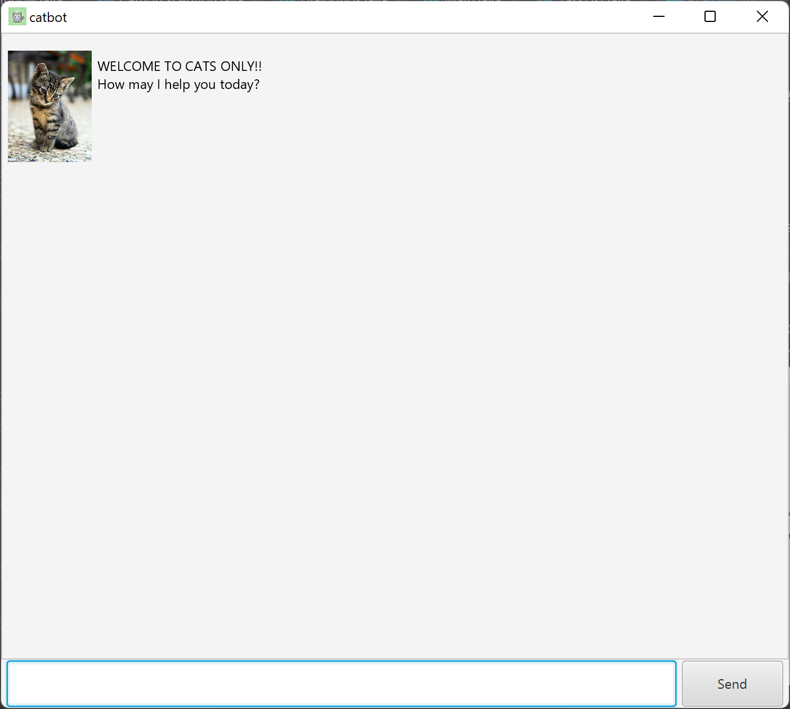

# User Guide

## Quick Start
1. Ensure you have Java `11` or above installed in your Computer.
2. Download the latest `catbot.jar` from [here](https://github.com/tyw2811/ip/releases).
3. Copy the file to the folder you want to use as the home folder for your catbot.
4. Double-click the file to start the app. The GUI similar to the below should appear in a few seconds.

5. Type the command in the command box and press Enter to execute it. e.g. entering anything will list the available commands.
   - Some example commands you can try:
     - `todo try out catbot`: Adds a task with name `try out catbot` to the task list.
     - `list`: Lists out all your tasks.
     - `bye`: Saves your tasks and exits the app.
6. Refer to the section below for details of each command.

## Features

### Notes about the features
- Words in `UPPER_CASE` are the parameters to be supplied by the user.
  - e.g. in `todo TASK`, `TASK` is a parameter which can be used as `todo read book`.
- Extraneous parameters for commands that do not take in parameters (such as `list` and `bye`) will be ignored.
  - e.g. if the command specifies `list 123`, it will be interpreted as `list`.

### Feature Summary

- Adding tasks
  - todo
  - deadline
  - event
  - fixed
- Editing tasks
  - mark / unmark
  - delete
- Utility
  - find
  - list
  - bye

## Features to add tasks

### Feature - `todo`

Adds a task to be done.

Format: `todo TASK`

### Feature - `deadline`

Adds a task to be done by a certain deadline.

Format: `deadline TASK /by DATE`

- DATE can be either DD-MM-YYYY or YYYY-MM-DD or in text form.

### Feature - `event`

Adds an event task at a certain date & time.

Format: `event TASK /at DATE/TIME`

- DATE/TIME can be either DD-MM-YYYY HH:MM or YYYY-MM-DD HH:MM or in text form.

### Feature - `fixed`

Adds a task that takes a fixed amount of time.

Format: `fixed TASK /takes DURATION`

- DURATION can be either hours (h) and minutes (mins) or both.
- e.g. fixed do chores /takes 1h 45mins

## Features to edit tasks

### Feature - `mark` / `unmark`

Marks / unmarks a task as completed / uncompleted.

Format: `mark INDEX` / `unmark INDEX`

- INDEX refers to the index number shown in the task list.
- INDEX must be a valid number in the list.

### Feature - `delete`

Deletes a task from the task list.

Format: `delete INDEX`

- INDEX refers to the index number shown in the task list.
- INDEX must be a valid number in the list.

## Features for utility

### Feature - `find`

Find tasks with the phrase in the task name.

Format: `find KEYPHRASE`

- The search is case-sensitive. e.g `read Book` will not match `read book`
- Only the task name will be searched.

### Feature - `list`

Shows a list of all tasks in the task list.

Format: `list`

### Feature - `bye`

Saves your current task list and exits the chat bot.

Format: `bye`
