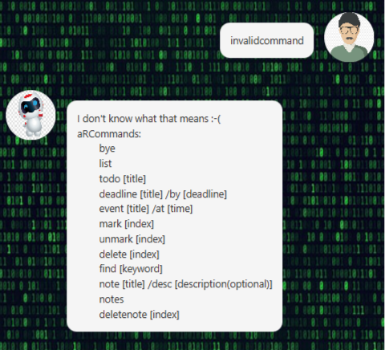
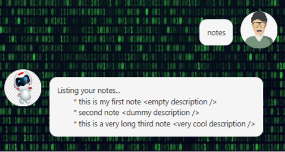
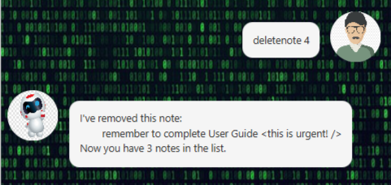

# User Guide
**aRC** is a desktop application that comes in a visually-appealing and pretty Graphical User Interface (GUI). 
It is a task and note management system that allows users to quickly and easily add their data onto the system.

## Features & Usages

### General

aRC boasts a permanent storage system. Tasks/notes that you added will be automatically saved in your local computer.
Subsequent usage of the aRC application will load these tasks/notes seamlessly and automatically.

#### General Commands

`bye` 

Exits the application

`[Invalid Command]`

Displays a list of valid aRCommands and their respective syntax

### Task

There are currently 3 types of Tasks that aRC can handle :
- Todo
- Deadline
- Event

All Tasks must have a non-empty `title` field.

#### Commands

`list`

Lists all available Tasks

`todo [title]`

Adds a Todo Task. `title` field cannot be empty.

Example usage : `todo complete User Guide`

Expected outcome :

`deadline [title] /by [deadline (dd/mm/yyyy)]`

Adds a Deadline Task. `title` field cannot be empty. `deadline` field must be in the format `(dd/mm/yyyy)`.

Example usage : `deadline submit User Guide /by 15/09/2022`

Expected outcome :

`event [title] /at [time]`

Adds an Event Task. `title` field cannot be empty. `time` field cannot be empty.

Example usage : `event birthday celebration /at 21/09/2022`

Expected outcome :

`mark [index]`

Sets a Task as done. `index` field counts starting from 1.

`unmark [index]`

Sets a Task as not done. `index` field counts starting from 1.

`delete [index]`

Deletes a Task. `index` field counts starting from 1.

`find [keyword]`

Lists all Tasks whose `title` matches `keyword`. `keyword` cannot be empty.

### Note Management

Notes have a mandatory `title` field and an optional `description` field.

#### Commands

`notes`

Lists all available Notes

`note [title] /desc [description (optional)]` 

Adds a Note. `title` field cannot be empty. `description` field is optional.

Example usage : `note remember to complete User Guide /desc this is urgent!`

Expected outcome :

`deletenote [index]`

Deletes a Note. `index` field counts starting from 1.

## Acknowlegements
- [GUI adaptation](https://se-education.org/guides/tutorials/javaFx.html)
- [JavaFX library](https://openjfx.io/)