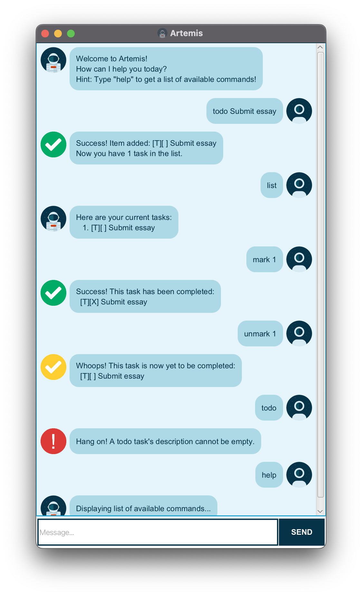
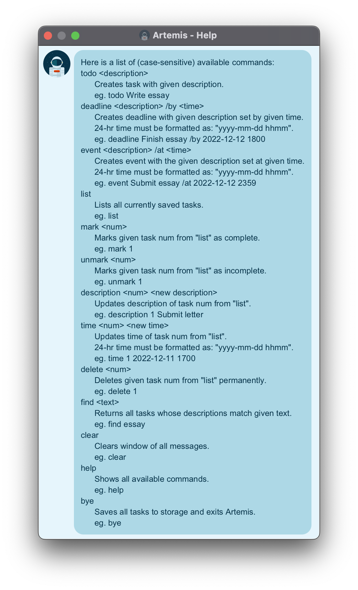

# User Guide

*Artemis* is a desktop **chatbot** that eases your mental load, keeping track of all of
your **tasks**, **events** and **deadlines**. *Artemis* is optimised for Command Line
Interface (CLI) inputs, combined with a Graphical User Interface (GUI) for easier access.
*Artemis* is suited for those with quick fingers, maximising productivity so that you can
spend more of your time actually working through those tasks!

## Contents

1. [History](#history)
2. [Quick Start](#quick-start)
3. [Features](#features)
4. [Usage](#usage)
5. [Command Summary](#command-summary)
6. [UI Screenshots](#ui-screenshots)

## History

Earlier versions of *Artemis* were named *Apollo*, in honor of the first manned missions
to the Moon. To honor NASA's latest venture to the Moon, *Apollo* was renamed to *Artemis*
for its latest version.

## Quick Start

1. Ensure you have `Java 11` installed on your computer.
2. Download the latest `duke.jar` from [here](https://github.com/kxrt/ip/releases).
3. Copy the file to the folder you want to use as your **home** folder for *Artemis*.
4. Navigate to the aforementioned folder via CLI and run `java -jar duke.jar`.
5. The GUI similar to the below image should appear.

   IMG HERE
6. Type your desired command in the message box and press `Enter` to execute it.  
   eg. Type `help` and press `Enter` to view a list of possible commands!

## Features

### Icons

*Artemis*' responses have different icons depending on the type of response generated. A
sample execution involving these screenshots is visible
under [UI Screenshots](#ui-screenshots). Here is a table summarising them:

| Icon                                                                             | Meaning                                                      |
|----------------------------------------------------------------------------------|--------------------------------------------------------------|
|                   | Normal responses (excluding task operations).                |
|               | Successful execution of task creation, updating or deletion. |
|                   | Failed execution, when the input is wrong.                   |
|  | Successful execution for `unmark` command.                   |
|                     | Messages sent by you, the user.                              |

### Available Commands

1. [Viewing list of available commands](#viewing-list-of-available-commands-help)
2. [Creating a task with a description](#creating-a-task-with-a-description-todo)
3. [Creating a task due at a specific time](#creating-a-task-due-at-a-specific-time-deadline)
4. [Creating an event taking place at a specific time](#creating-an-event-taking-place-at-a-specific-time-event)
5. [Viewing all tasks](#viewing-all-tasks-list)
6. [Marking a task as complete](#marking-a-task-as-complete-mark)
7. [Marking a task as incomplete](#marking-a-task-as-incomplete-unmark)
8. [Deleting a task](#deleting-a-task-delete)
9. [Searching for a task](#searching-for-a-task-find)
10. [Clearing screen of all messages](#clearing-screen-of-all-messages-clear)
11. [Deleting all tasks](#deleting-all-tasks-reset)
12. [Saving and exiting](#saving-and-exiting-bye)

### Editing, Exporting or Importing Saved Data

Saved data is stored in the `duke.txt` file, which itself is stored inside the `data`
folder present inside *Artemis*' home folder.

## Usage

### Viewing list of available commands: `help`

Shows all available commands in a new window, with a synopsis and usage example.  
Usage: `help`

### Creating a task with a description: `todo`

Creates a todo task.  
Note: Todo tasks have a description attached to them.  
Usage: `todo {description}`  
Example: `todo Submit essay`

### Creating a task due at a specific time: `deadline`

Creates a deadline task.  
Note: Deadline tasks have a time attached to them. This time **must** be entered in the
following 24-hour format: `yyyy-mm-dd hhmm`  
Usage: `deadline {description} /by {time}`  
Example: `deadline Submit essay /by 2022-12-12 1800`

### Creating an task taking place at a specific time: `event`

Creates an event task.  
Note: Event tasks have a time attached to them. This time **must** be entered in the
following 24-hour format: `yyyy-mm-dd hhmm`  
Usage: `event {description} /at {time}`  
Example: `event Essay submission /at 2022-12-12 1800`

### Viewing all tasks: `list`

Shows a list of all tasks stored in *Artemis*.  
Usage: `list`

### Marking a task as complete: `mark`

Marks a specified task as complete.  
Note: The number below refers to the task number visible through the `list` command.
Numbers that do not exist on this list or numbers less than or equal to 0 will result in
an error.    
Usage: `mark {number}`  
Example: `mark 1`

### Marking a task as incomplete: `unmark`

Marks a specified task as incomplete.  
Note: The number below refers to the task number visible through the `list` command.
Numbers that do not exist on this list or numbers less than or equal to 0 will result in
an error.  
Usage: `unmark {number}`  
Example: `unmark 1`

### Deleting a task: `delete`

Deletes a specified task from the list of all tasks.  
Note: The number below refers to the task number visible through the `list` command.
Numbers that do not exist on this list or numbers less than or equal to 0 will result in
an error.  
Usage: `delete {number}`  
Example: `delete 1`

### Searching for a task: `find`

Shows all tasks whose descriptions contain the specified text.  
Note: The specified text is case-sensitive, and takes all characters (including spaces)
into account.  
Usage: `find {text}`  
Example: `find Submit essay`

### Clearing screen of all messages: `clear`

Removes all messages from the application window.  
Usage: `clear`

### Deleting all tasks: `reset`

Deletes all tasks that *Artemis* is aware of.  
Note: This command is **nuclear**, and cannot be undone if saved. Please only use it if
deleting all tasks is your intended goal.  
Usage: `reset`

### Saving and exiting: `bye`

Saves and exits *Artemis*.  
Note: This command is important if task data is to be saved for the future.  
Usage: `bye`

# Command Summary

| Command                    | Description                                                          |
|----------------------------|----------------------------------------------------------------------|
| todo `desc`                | Creates a todo with the given description.                           |
| deadline `desc` /by `time` | Creates a deadline with the given description set by the given time. |
| event `desc` /at `time`    | Creates an event with the given description set at the given time.   |
| list                       | Lists all currently saved tasks.                                     |
| mark `num`                 | Marks task `num` from `list` as complete.                            |
| unmark `num`               | Marks task `num` from `list` as incomplete.                          |
| delete `num`               | Deletes task `num` from `list` permanently.                          |
| find `text`                | Returns all tasks whose descriptions match the exact text.           |
| clear                      | Clears window of all messages.                                       |
| reset                      | Deletes all tasks.                                                   |
| help                       | Shows all available commands.                                        |
| bye                        | Saves all tasks to storage and exits Artemis.                        |

# UI Screenshots

<h3 align="center">Main Window</h3>

<h3 align="center">Help Window</h3>

