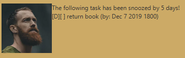
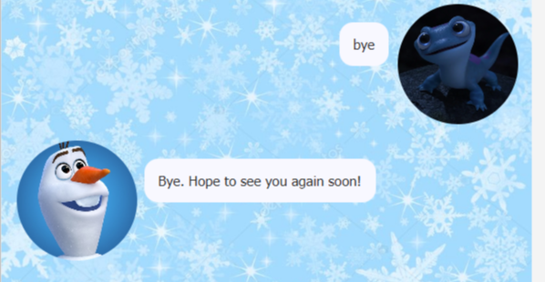

# User Guide

# Long Time No See (LTNS)

Long Time No See (LTNS) is an easy to use desktop app for tracking tasks. It uses an intuitive Graphical User Interface with an intuitive interface!

## Features

### Track Tasks 📙

Long time no see uses the interface of a chat bot for users to track tasks. These tasks are split into separate specific headers that will be explored further below! 😁

## Usage

### `todo` - Adding a task to do

Adds a task to be done 

Format: `todo <your task>`

Example of usage:

`todo` CS2103T homework

Expected outcome:

⬆️LTNS logs down the task to be done!

### `event` - set an event

Setting an event with a location

Format: `event <your event> /at <location>`

Example of usage:

`event` project meeting /at Mon 2-4pm

Expected outcome:

⬆️LTNS logs down the event with a stipulated location!

### `deadline` - set a task with deadline

Setting a task with a date

Format: `deadline <your task> /by <date (DD/MM/YYYY)> <time>`

Example of usage:

`deadline` return book /by 2/12/2019 1800

Expected outcome:

⬆️LTNS logs down the task with a stipulated date and time!

### `snooze` - to move the deadline further

To alter the dead set with deadline command

Format: `snooze <task number> <number of days>`

Example of usage:

`snooze` 6 5

Expected outcome:

⬆️LTNS allows you to procrastinate!

### `list` - lists all tasks previously set

To view all your tasks!

Format: `list`

Example of usage:

`list`

Expected outcome:

⬆️LTNS lists down all the tasks you set! 

### `mark` - to mark a task 

To distinguish a task by marking it

Format: `mark  <task number>`

Example of usage:

`mark` 3

Expected outcome:

⬆️LTNS allows you to distinguish tasks!

### `delete` - to delete a task

To remove tasks that were previously set

Format: `delete  <task number>`

Example of usage:

`delete` 3

Expected outcome:

⬆️remove tasks you set previously

### `find` - to find a task

Find your task in mind

Format: `find  <keyword>`

Example of usage:

`find` CS2103T 

Expected outcome:

⬆️LTNS lets you find the 1001 tasks you have!

### `bye` - to exit

This command lets you leave Duke 😔, luckily Duke helps you save your tasks for viewing next time!

Format: `bye`

Example of usage:

`bye`

Expected outcome:

⬆️LTNS let's you leave Duke!