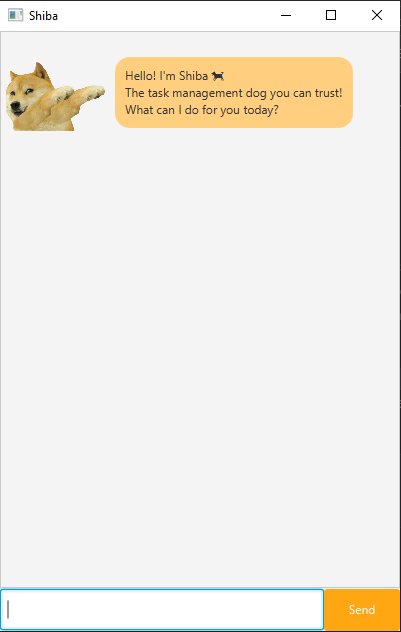

# Shiba - User Guide

Shiba is a **desktop app for managing tasks, deadlines and events, intended for use via a Command Line Interface** (CLI). 

## Quick Start

1. Ensure you have Java `11` or above installed in your computer.

2. Download the latest `Duke.jar` from [here](https://github.com/se-edu/addressbook-level3/releases).

3. Copy the file to the folder you want to use as the _home folder_ for your AddressBook.

4. Double-click the file to start the app. The GUI similar to the below should appear in a few seconds. Note how the app contains some sample data.<br>
   

5. Type the command in the command box and press Enter to execute it. e.g. typing **`help`**.<br>
   Some example commands you can try:

    * **`list`** : Lists all tasks.
    * **`todo`**`something` : Adds a todo named `something` to the list of tasks.
    * **`mark`**`1` : Marks task number `1` in the list of tasks as done.
    * **`bye`** : Exits the app.

6. Refer to the [features](#features) below for details of each command.

## Features 

1. Add task
   - Add ToDo: `todo`
   - Add Deadline: `deadline`
   - Add Event: `event`
2. List tasks: `list`
3. Mark tasks as done
   - Mark single task as done: `mark [number]`
   - Mark a range of tasks as done: `mark [start of range] - [end of range]`
   - Mark all tasks as done: `mark all`
4. Mark tasks as not done
   - Mark single task as not done: `unmark [number]`
   - Mark a range of tasks as not done: `unmark [start of range] - [end of range]`
   - Mark all tasks as not done: `unmark all`
5. Delete tasks
   - Delete a single task: `mark [number]`
   - Delete a range of tasks: `delete [start of range] - [end of range]`
   - Delete all tasks: `delete all`
6. Find task: `find`
7. Exit Shiba: `bye`

## Usage

<div markdown="block" class="alert alert-info">

**:information_source: Notes about the command format:**<br>

* Items in square brackets are the parameters to be supplied by the user.<br>
  e.g. in `todo [description]`, `description` is a parameter which can be used as `todo something`.

* Parameters must strictly be in order.<br>
  e.g. if the command specifies `deadline [description] /by [date] [time]`, order of parameters cannot be switched.

</div>

## 1. Add Task
### `todo` - Add ToDo task

Adds a **ToDo** to the list of tasks

Command format: `todo [description]`

Example of usage: 

* `todo buy groceries`
* `todo sleep`

Expected outcome:

Shiba will respond with

```
Woof! I managed to add this task: 
[T][ ] buy groceries 
Now you have 1 tasks in the list.
```

---
### `deadline` - Add Deadline task

Adds a **deadline** to the list of tasks

Command format: `deadline [description] /by [date] [time]`

Important note:
* `[date]` should be of the form `YYYY-MM-DD`.
* `[time]` should be in the 24-hour format without any dots or spaces <br> (i.e. 07.59 a.m. would be written as `0759`).

Example of usage:

* `deadline finish CS2103/T project /by 2022-09-16 2359`
* `deadline read CS2103/T lecture /by 2022-09-20 0600`

Expected outcome:

Shiba will respond with

```
Woof! I managed to add this task: 
[D][ ] finish CS2103/T project (by: Sep 16 2022 11.59p.m.) 
Now you have 1 tasks in the list.
```

---
### `event` - Add Event task

Adds an **event** to the list of tasks

Command format: `event [description] /at [date] [time]`

Important note:
* `[date]` should be of the form `YYYY-MM-DD`.
* `[time]` should be in the 24-hour format without any dots or spaces <br> (i.e. 07.59 a.m. would be written as `0759`).

Example of usage:

* `event attend CS2103/T lecture /at 2022-09-16 1600`
* `event recess week starts /at 2022-09-20 0600`

Expected outcome:

Shiba will respond with

```
Woof! I managed to add this event: 
[E][ ] attend CS2103/T lecture (at: Sep 16 2022 4.00p.m.)
Now you have 1 tasks in the list.
```

---

## 2. List Tasks

### `list` - Lists the current tasks

Shows the list of all the tasks (todo, deadline and event) in your current list of tasks.

Command Format: `list`

Example of usage: `list`

Expected outcome:

Shiba will respond with

```
Listed below are the tasks I remember: 
1.[E][ ] attend CS2103/T lecture (at: Sep 16 2022 4.00p.m.)
```
---
## 3. Mark Tasks as Done
### `mark [task number]` - Mark a specific task as done

Marks a specific task in the current list of tasks as done. The task is specified by providing the task order in the list.

Command Format: `mark [task number]`

Example of usage:

Suppose `list` provides us with the following output
```
Listed below are the tasks I remember: 
1.[T][ ] task A
2.[T][ ] task B
3.[T][ ] task C
```

Notice that task B appears as task number `2` in the given list. To mark task B as done, execute
 
`mark 2`

Expected outcome:

Shiba will respond with:

```
Woof! I managed to mark the following task(s) as done:
[T][X] task B
Now you have 3 tasks in the list.
```
---

### `mark [start of range] - [end of range]` - Mark a range of tasks as done

Marks a range of tasks in the current list as done. The task is specified by providing the order of the first task to be marked, followed by a hyphen and the order of the last task to be marked in the list.

Command Format: `mark [start of range] - [end of range]`

Example of usage:

Suppose `list` provides us with the following output
```
Listed below are the tasks I remember: 
1.[T][ ] task A
2.[T][ ] task B
3.[T][ ] task C
```

To mark task B and task C as done, run the command

`mark 2 - 3`

Expected outcome:

Shiba will respond with:

```
Woof! I managed to mark the following task(s) as done:
1.[T][X] task B
2.[T][X] task C
Now you have 3 tasks in the list.
```
---

### `mark all` - Mark all tasks as done

Marks all tasks in the current list as done.

Command format: `mark all`

Example of usage:

Suppose `list` provides us with the following output
```
Listed below are the tasks I remember: 
1.[T][ ] task A
2.[T][ ] task B
3.[T][ ] task C
```

To mark all tasks as done, run the command

`mark all`

Expected outcome:

Shiba will respond with:

```
Woof! I managed to mark the following task(s) as done:
1.[T][X] task A
2.[T][X] task B
3.[T][X] task C
Now you have 3 tasks in the list.
```
---


## 4. Mark Tasks as Not Done
### `unmark [task number]` - Mark a specific task as not done

Marks a specific task in the current list of tasks as not done. The task is specified by providing the task order in the list.

Command Format: `unmark [task number]`

Example of usage:

Suppose `list` provides us with the following output
```
Listed below are the tasks I remember: 
1.[T][X] task A
2.[T][X] task B
3.[T][X] task C
```

Notice that task B appears as task number `2` in the given list. To mark task B as not done, execute

`unmark 2`

Expected outcome:

Shiba will respond with:

```
Woof! I managed to mark the following task(s) as not done:
[T][ ] task B
Now you have 3 tasks in the list.
```
---

### `unmark [start of range] - [end of range]` - Mark a range of tasks as not done

Marks a range of tasks in the current list as not done. The task is specified by providing the order of the first task to be marked, followed by a hyphen and the order of the last task to be marked in the list.

Command Format: `unmark [start of range] - [end of range]`

Example of usage:

Suppose `list` provides us with the following output
```
Listed below are the tasks I remember: 
1.[T][X] task A
2.[T][X] task B
3.[T][X] task C
```

To mark task B and task C as not done, run the command

`unmark 2 - 3`

Expected outcome:

Shiba will respond with:

```
Woof! I managed to mark the following task(s) as not done:
1.[T][ ] task B
2.[T][ ] task C
Now you have 3 tasks in the list.
```
---

### `unmark all` - Mark all tasks as not done

Marks all tasks in the current list as not done.

Command format: `unmark all`

Example of usage:

Suppose `list` provides us with the following output
```
Listed below are the tasks I remember: 
1.[T][X] task A
2.[T][X] task B
3.[T][X] task C
```

To mark all tasks as not done, run the command

`unmark all`

Expected outcome:

Shiba will respond with:

```
Woof! I managed to mark the following task(s) as not done:
1.[T][ ] task A
2.[T][ ] task B
3.[T][ ] task C
Now you have 3 tasks in the list.
```
---


## 5. Delete Tasks
### `delete [task number]` - Delete a specific task

Removes a specific task from the current list. The task is specified by providing the task order in the list.

Command Format: `delete [task number]`

Example of usage:

Suppose `list` provides us with the following output
```
Listed below are the tasks I remember: 
1.[T][ ] task A
2.[T][ ] task B
3.[T][ ] task C
```

Notice that task B appears as task number `2` in the given list. To delete task B, execute

`delete 2`

Expected outcome:

Shiba will respond with:

```
Woof! I managed to delete the following task(s):
[T][ ] task B
Now you have 2 tasks in the list.
```
---

### `delete [start of range] - [end of range]` - Delete a range of tasks

Removes a range of tasks from the current list of tasks. The task is specified by providing the order of the first task to be deleted, followed by a hyphen and the order of the last task to be deleted in the list.

Command Format: `delete [start of range] - [end of range]`

Example of usage:

Suppose `list` provides us with the following output
```
Listed below are the tasks I remember: 
1.[T][ ] task A
2.[T][ ] task B
3.[T][ ] task C
```

To delete task B and task C, run the command

`delete 2 - 3`

Expected outcome:

Shiba will respond with:

```
Woof! I managed to delete the following task(s):
1.[T][ ] task B
2.[T][ ] task C
Now you have 1 tasks in the list.
```
---

### `delete all` - Delete all tasks

Removes all tasks from the current list of tasks.

Command format: `delete all`

Example of usage:

Suppose `list` provides us with the following output
```
Listed below are the tasks I remember: 
1.[T][ ] task A
2.[T][ ] task B
3.[T][ ] task C
```

To delete all tasks, run the command

`delete all`

Expected outcome:

Shiba will respond with:

```
Woof! I managed to delete the following task(s):
1.[T][ ] task A
2.[T][ ] task B
3.[T][ ] task C
Now you have 0 tasks in the list.
```
---

## 6. Find tasks
### `find` - Find task containing keyword

Finds the task containing a specific keyword. Keyword can be a string or a number.

<div markdown="span" class="alert alert-primary">:bulb: **Tip:**
The keyword is case sensitive. Proper capitalisation is advised when using this command.
</div>

Command format: `find [keyword]`

Example of usage: 
* `find B`
* `find CS2103`

Expected outcome:

Shiba will respond with:
```
Woof! Here's some results I found associated with "B": 
1.[T][ ] task B
```
---
## 7. Exit Shiba
### `bye` - Exits the Shiba app
Exits the Shiba app. Saves the current tasks in your computer for later use.

Command format: `bye`

Expected outcome:

Shiba will respond with:
```
Shiba hope you had a productive time today!
Don't forget to come and work with me again 
```