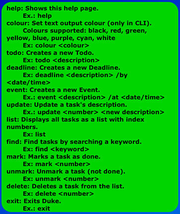

# User Guide

- Quick Start
- Features
  - Viewing help: [```help```](#viewing-help-help)
  - Changing colour: [```colour```](#changing-colour-colour)
  - Adding a Todo: [```todo```](#adding-a-todo-todo)
  - Adding a Deadline: [```deadline```](#adding-a-deadline-deadline)
  - Adding an Event: [```event```](#adding-an-event-event)
  - Listing all tasks: [```list```](#listing-all-tasks-list)
  - Finding tasks: [```find```](#finding-tasks-find)
  - Marking a task: [```mark```](#marking-a-task-mark)
  - Unmarking a task: [```unmark```](#unmarking-a-task-unmark)
  - Updating a task: [```update```](#updating-a-task-update)
  - Deleting a task: [```delete```](#deleting-a-task-delete)
  - Exiting the program: [```exit```](#exiting-the-program-exit)
  - Saving the data

## Quick Start
1. Ensure you have Java ```11``` or above installed in your Computer.
2. Download the latest ```Sus.jar``` from here.
3. Copy the file to the folder you want to use as the home folder for your Sus.
4. Double-click the file to start your app. The GUI similar to the below should 
appear in a few seconds.
5. Type the command in the input box and press Enter to execute it. e.g. typing ```help``` and
pressing enter will open the help window.
6. Refer to the [```features```](#features) below for details of each command.

## Features

### Viewing help: ```help```

Shows the list of available commands.


Format: ```help```

<br>

### Changing colour: ```colour```

Changes output of colour of the CLI output.

Colours supported: black, red, green, yellow, blue, purple, cyan, white.

Format: ```colour <colour>```

Example: ```colour blue```

<br>

### Adding a Todo: ```todo```

Adds a todo to the task list.

Format: ```todo <description>```
- Description cannot be empty.

Example: ```todo submit iP```

<br>

### Adding a Deadline: ```deadline```

Adds a Deadline to the task list.

Format: ```deadline <description> /by <time>```
- Description and time cannot be empty.
- Format of time is yyyy-mm-dd.

Example: ```deadline submit iP /by 2022-09-19```

<br>

### Adding an Event: ```event```

Adds an Event to the task list.

Format: ```event <description> /at <time>```
- Description and time cannot be empty.
- Format of time is yyyy-mm-dd.

Example: ```event submit iP /at 2022-09-19```

<br>

### Listing all tasks: ```list```

Lists all the task in the tasks list.

Format: ```list```

<br>

### Finding tasks: ```find```

Find tasks with a keyword.

Format: ```find <keyword>```
- Keyword cannot be empty.

Example: ```find book```

<br>

### Marking a task: ```mark```

Marks a task as done.

Format: ```mark <index>```
- Visible index in the task list.

Example: ```mark 1```

<br>

### Unmarking a task: ```unmark```

Unmarks a task, set is as not done.

Format: ```unmark <index>```
- Visible index in the task list.

Example: ```unmark 1```

<br>

### Updating a task: ```update```

Updates a task's description.

Format: ```update <index> <description>```
- Visible index in the task list.
- Description cannot be empty.

Example: ```update 1 new description```

<br>

### Deleting a task: ```delete```

Deletes a task from the task list.

Format: ```delete <index>```
- Deletes the person at the specified ```<index>```
- The index refers to the index number shown in the displayed person list.
- The index must be a positive integer 1, 2, 3, ...

Example: ```delete 1```

<br>

### Exiting the program: ```exit```

Exits the program.

Format: ```exit```

<br>

### Saving the data
SUS data are saved in the hard disk automatically after any command that 
changes the data. There is no need to save manually.
