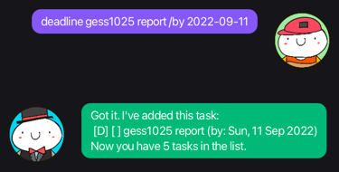
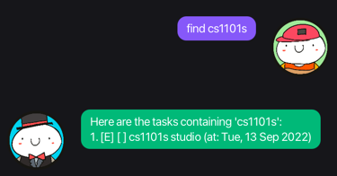

 

# User Guide

Lily is a desktop chatbot app for managing and storing tasks.

--------------------------------------------------------------------------------------------------------------------

## Getting Started
### Installation
1. Ensure you have Java `11` or above installed in your Computer.

2. Download the latest version from [here](https://github.com/lilythchu/ip/releases).

3. Copy the file to the folder you want to use as the home folder.

### Quick start
1. Double-click the file to start the app.
2. Type the command in the command box and press Enter or click send button to execute it.
3. You may want to entering `help` to see the list of supported commands.
4. Refer to the [Features](#features) below for more details.

--------------------------------------------------------------------------------------------------------------------

## Features

 

### Add a todo task: `todo`

Adds a todo task without date/time attached to the list. 
Format: `todo <decription>`

 

### Add a deadline task: `deadline`

Adds a task need to be done before a specific date to the list. 
Format: `deadline <decription> /by yyyy-mm-dd`

 

### Add an event task: `event`

Adds an event task that start at a specific date and time list. 
Format: `event <description> /at <time>`

 

### List all tasks: `list`

Shows the list of all the tasks stored. 
Format: `list`

 

### Mark a task as done: `mark`

Marks a task at the given index number in the list as done. 
Format: `mark <index>`

 

### Unmark a task: `unmark`

Mark status a task at the given index number in the list as not done. 
Format: `umark <index>`

 

### Delete a task: `delete`

Deletes a task from the list. 
Format: `delete <index>`

 

### Find tasks: `find`

Finds a task by searching for a keyword. 
Format: `find <keyword>`

 

### View help: `help`

Shows all available commands. 
Format: `help`

 

### Exit program: `bye`

Exits the program. 
Format: `bye`

--------------------------------------------------------------------------------------------------------------------

## Command summary

Action | Syntax and Examples
--------|------------------
**Todo** | `todo <description>`   e.g., `todo watch movies`
**Deadline** | `deadline <description> /by YYYY-MM-DD`   e.g., `deadline CS2103T quiz /by 2022-09-23`
**Event** | `event <description> /at <duration>`   e.g., `event team meeting /at 2022-10-10 19:00`
**List** | `list`
**Mark** | `mark <index>`  e.g., `mark 3`
**Unmark** | `unmark <index>`  e.g., `unmark 3`
**Delete** | `delete <index>`  e.g., `delete 3`
**Find** | `find <keyword>`  e.g., `find watch`
**Help** | `help`
**Exit** | `bye`

--------------------------------------------------------------------------------------------------------------------

## Demo

