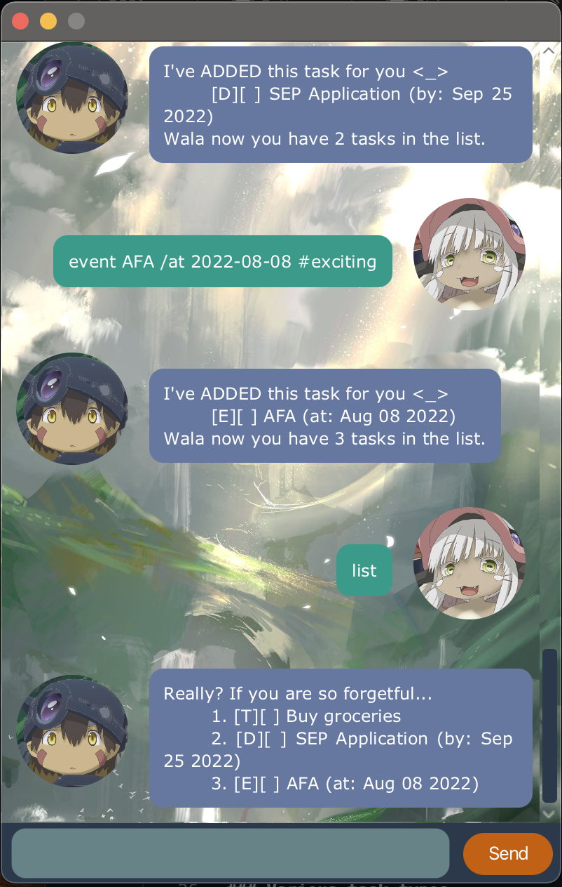

# User Guide

Zlimez is a task management chat bot application. Zlimez allows user to add, delete, tag and mark tasks. However he can be slightly grumpy if you ask too much of him.

## Get Started

Ensure you have Java 11 installed on your machine. Download the latest jar file release of Zlimez from [here](https://github.com/zlimez/ip/releases). Double click the jar file and you should see a chat window pop up.


Enter the following commands one after another into the text area to populate your todo list.
```
todo Buy groceries
deadline SEP Application /by 2022-09-25 #important #school
event AFA /at 2022-08-08 #exciting
```

After which, enter `list`, you should see



Enter `bye` to exit the application.

## Features

### Various task types

- Basic todos
- Tasks with deadlines
- Events

### Task addition and deletion

Users can add or remove a task of the three supported types to their todos.

### Task status

Users can mark a task in their todos as completed or mark a completed task as incomplete.

### Date support

For tasks with deadline or events, users can specify the relevant date.

### Tagging

Users can tag their tasks, like tagging an assignment as urgent and difficult.

### Task querying

Users can ask Zlimez to:
1. List all their tasks
2. List tasks on a specific date
3. List tasks that contains a given keyword
4. List tasks with a given tag

### Autosaving

The tasks you have added will be automatically whenever you ends a chat session.


## Usage

### `list (optional date)` - Lists the relevant tasks

List all tasks in the user's todo list. Shall a date be provided as an argument, only tasks with a matching deadline or events on that day will be shown.

Example of usage:

`list`
`list 2022-10-10`

Expected outcome:
```
Really? If you are so forgetful...
  1. [T][ ] Book restaurant
  2. [D][X] Math assignment (by: Sep 28 2022)
  3. [E][ ] AFA (at: Nov 05 2022)
```
```
These are your tasks for that day
  1. [E][ ] AFA (at: Nov 05 2022)
```

Description of the outcome.

```
[T][ ] Book restaurant
[D][X] Math assignment (by: Sep 28 2022)
```
The letter in the first set of square brackets indicate the task type:
- T for basic todos
- D for tasks with deadline
- E for events

The second square of square brackets indicate the completion status of the task. Completed tasks will be marked with an X.

After the second set of square bracket is the task name/description.

For date sensitive tasks there will be a pair of brackets at the end that displays the date associated.

### `todo TASKNAME (optional tags)`

Adds a basic todo type task with the given task name to the user's todo list.

Example of usage:

`todo Buy groceries #chores`

Expected outcome:
```
I've ADDED this task for you <_>
  [T][ ] Buy groceries
Wala now you have 5 tasks in the list.
```

### `deadline TASKNAME /by (ISO-DATE) (optional tags)`

Adds a deadline type task with the given name and deadline to the user's todo list.

Example of usage:

`deadline SEP Application /by 2022-09-25 #important #school`

Expected outcome:
```
I've ADDED this task for you <_>
  [D][ ] SEP Application (by: Sep 25 2022)
Wala now you have 4 tasks in the list.
```

### `event TASKNAME /at (ISO-DATE) (optional tags)`

Adds an event with the given name and date to the user's todo list.

Example of usage:

`event Birthday celebration /at 2022-08-08 #expensive`

Expected outcome:
```
I've ADDED this task for you <_>
  [E][ ] Birthday celebration (by: Aug 08 2022)
Wala now you have 6 tasks in the list.
```

### `delete INDEX`

Removes the task at the given index (as per the ordering displayed when 'list' is executed).

Example of usage:

`delete 3`

Expected outcome:
```
YES, I've removed this task for YOU:
  [T][X] Buy groceries
Wala now you have 5 tasks in the list.
```

### `mark INDEX`

Marks the task at the given index (as per the ordering displayed when 'list' is executed) as complete.

Example of usage:

`mark 1`

Expected outcome:
```
-_-, I've unmarked this task for YOU AGAIN:
  [D][ ] SEP Application (by: Sep 25 2022)
```

### `unmark INDEX`

Marks the task at the given index (as per the ordering displayed when 'list' is executed) as incomplete.

Example of usage:

`unmark 2`

Expected outcome:
```
Wellz, I've marked this task for YOU
  [E][ ] Birthday celebration (by: Aug 08 2022)
```

### `find KEYWORD`

Find tasks in the todo list that contains the given keyword.

Example of usage:

`find celeb`

Expected outcome:
```
These are the tasks that match your incomplete description
  1. [E][ ] Birthday celebration (by: Aug 08 2022)
```

### `listtags`

List all tags that user have attached thus far to the tasks in the todo list.

Example of usage:

`listtags`

Expected outcome:
```
These are all the tags you gave so far
  1. important
  2. urgent
  3. school
  4. chores
```

### `findtag TAG`

List all tasks that have the given tag.

Example of usage:

`findtag important`

Expected outcome:
```
These are your tasks with the given tag
   1. [D][ ] SEP Application (by: Sep 25 2022)
```

### `bye`

Exits the application.

Example of usage:

`bye`

Expected outcome:
```
Bye. zzz FINALLY~~ <_>
```
The application should close.

## _Enjoy chatting with Zlimez_ 😏