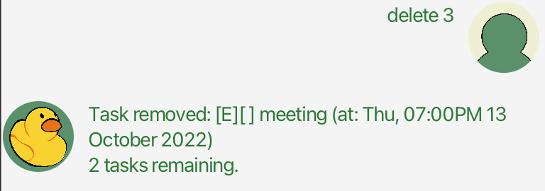
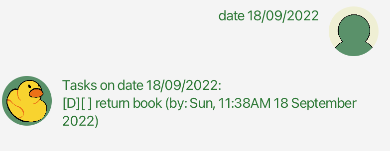

# User Guide
Duke is a chatbot which helps you keep track of your tasks.

## Features 

### Manage your tasks

Duke helps you manage 3 types of tasks: todos, deadlines, and events. You can add and delete tasks from your list, as well as mark them as done or not done.

### Save your task list

Duke automatically saves your task list after you exit the program. It will load the list the next time you open Duke.

## Usage
- Words in UPPER_CASE are parameters to be supplied by you. 
  - e.g. in `todo DESCRIPTION`, `DESCRIPTION` is a parameter which can be used as `todo borrow book`.
- Any times on dates (specified as `DATETIME`) should be supplied in the format `DD/MM/YYYY HH:MM`.
  - e.g. 2.22pm, 8 September 2022 should be typed as `08/09/2022 14:22`.
- Any dates without times (specified as `DATE`) should be supplied in the format `DD/MM/YYYY`.
  - e.g. 8 September 2022 should be typed as `08/09/2022`.

### `todo DESCRIPTION` - Add a todo
Adds a todo with the given description.

Example of usage: 

`todo borrow book`

Expected outcome:

The todo will be added to the task list.

### `deadline DESCRIPTION /by DATETIME` - Add a deadline
Adds a deadline with the given description and date.

Example of usage:

`deadline return book /by 18/09/2022 11:38`

Expected outcome:

The deadline will be added to the task list.

### `event DESCRIPTION /at DATETIME` - Add an event
Adds an event with the given description and date.

Example of usage:

`event meeting /at 13/10/2022 19:00`

Expected outcome:

The event will be added to the task list.

### `list` - Show the task list
Shows all the tasks in the list with their index.

Example of usage:

`list`

Expected outcome:

### `delete INDEX` - Delete a task from the list
Deletes the task with the given index (to view the index, use `list`).

Example of usage:

`delete 3`

Expected outcome:

The task will be deleted from the list.

### `mark INDEX` - Mark a task as done
Marks the task with the given index (to view the index, use `list`) as done.

Example of usage:

`mark 2`

Expected outcome:

The task will be marked as done.

### `unmark INDEX` - Mark a task as not done
Marks the task with the given index (to view the index, use `list`) as not done.

Example of usage:

`unmark 2`

Expected outcome:

The task will be marked as not done.

### `date DATE` - Show all the tasks for a date
Shows the tasks that occur on the given date.

Example of usage:

`date 18/10/2022`

Expected outcome:

All the tasks (deadlines and events) on the given date will be shown.

### `find KEYWORD` - Search for a task using a keyword
Finds all tasks which description contains the given keyword.

Example of usage:

`find book`

Expected outcome:

### `reminder` - Show unfinished upcoming tasks
Shows all upcoming deadlines and events that are not done.

Example of usage:

`reminder`

Expected outcome:

