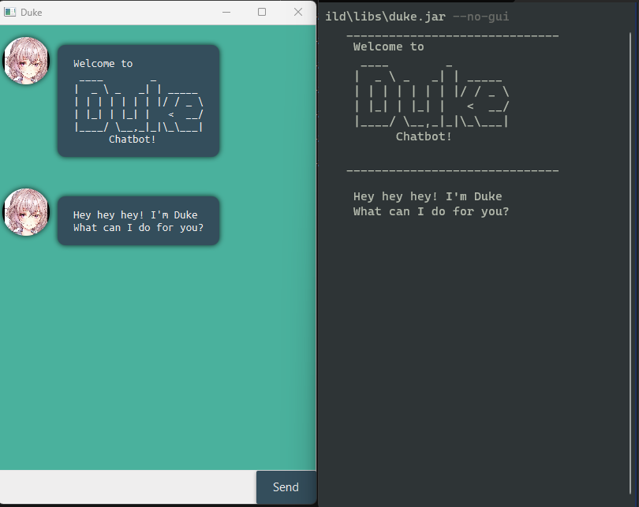

Duke is a desktop app for managing task **optimized for both GUI and CLI usage**! Packaged like a chat bot, Duke will provide you with a personalised service to help you track and manage your tasks.
* Table of Contents
{:toc}

--------------------------------------------------------------------------------------------------------------------

---

# Quick Start

1. Ensure you have Java `11` or above installed on your Computer.

2. Download the latest `duke.jar` from [here](https://github.com/Eclipse-Dominator/ip/releases).

3. You can now choose to keep the jar file in a specified folder you wish to use for your Task tracker OR specify a location for your save data

4. Double click the file to start the app. (Or launch it via a terminal).

   

   5. Type the command in the command box for the GUI or via the terminal and click send on GUI or enter on CLI to execute them!

      Here are some of the basic commands that you can try:

      - `list`: List all added tasks
      - `todo <description>`: Create a `todo` task with the description
      - `deadline <description> /by <time/detail>`: create a deadline task with the description
      - `bye`: to exit Duke

   6. Refer to features below for all the commands and their usage.

# Features

## Additional Launch flags

Need speed? Launch Duke in CLI mode and enjoy blazing smooth user experience with CLI or enjoy a clean flat look with the GUI.

Launch Duke using `java -jar duke.jar` as you can pass in the addition flag displayed above.

### Launching in GUI mode

- `-g` or `--gui` Launches the app in GUI mode

### Launching in CLI mode

- `-ng` or `--no-gui` Launches the app in CLI mode

### Specifying save file

- `-s` or `--use-save` allows you to specify/create a specific save file for your Duke session.

### Icon Replace Us

Tired of seeing the same icon every time, get a fresh icon with a simple command.

Sampled from fake images generated using a GAN, you will hardly see the same icons ever again!

## Creating Tasks

Duke supports creation of 3 different kind of tasks: todo, deadline, event.

### Task todo

 Use todo for less urgent tasks / tasks of lower priority.

- `todo [Task description]` : Adds a todo task to the task list

### Task deadline

 Use deadline for task of higher priority, you can add a specific date modifier to it or just keep the extra information as a String

- `deadline [task description] /by [completion time/other information]`: Adds a deadline task to the task list

### Task event

 Use event to mark things that are going to happen, you can add a specific date modifier to it or just keep the extra information as a String

- `event[task description] /by [event date/other information]`: Adds a event task to the task list

## Listing all tasks

 To view all currently added tasks, use:

- `list` : Prints out all tasks

## Marking Tasks

### Mark

To mark task as completed:

- `mark [task id]`: to mark the task with the specified id from `list` as marked

### Unmark

To mark task as incomplete:

- `unmark [task id]`: to unmark the task with the specified id from `list` as marked

## Searching For Tasks

### By keywords

 To filter the current list using keywords, use the `find` command

- `find [search pattern]`: prints out all the tasks that have the specified pattern.

  

### By Date

 To see all the tasks that have an attached date before certain period, use:

- `by [datetime pattern]`: prints out all tasks that have an attached datetime before the given one.

## Deleting Tasks

To delete a task from the list, you can use the `delete` keyword:

- `delete [task id]`: removes the task with the corresponding id from the task list.

## Changing Icons

To spice up your experience you can randomise you and Duke's icons. These AI generated images are free to use while being unique!

! note this feature required GUI and an internet connection

- `replaceUs`: replaces you and Duke's icon. This is a non-blocking command so you can still do other tasks while Duke tries to download the images.

  

## Renaming Commands

To define an alias for existing commands to make your life easier, use `alias`, `rmalias` and reset with `resetAlias`

### Adding Alias

- `alias [New Command]->[Current Command]`: allows the new commands to have the same functionality as the current command

  

### Removing Alias

- `rmalias [Command]`: removes the user added Command from Duke

  

### Resetting Alias

- `resetAlias`: resets all user added commands to the default controls

  

## Exiting Duke

- `bye`: To exit duke. (Note there will be a 2 second buffer for your to read the message before exiting on GUI)

  

# Command Summary

Action | Format, Examples
--------|------------------
`bye` | `bye` 
`list` | `list` 
`mark` | `mark [task index]`  e.g. `mark 1`, ` mark 4` 
`unmark` | `unmark [task index]`  e.g. `unmark 1`, ` unmark 4` 
`delete` | `delete [task index]`  e.g. `delete 1`, ` delete 4` 
`find` | `find [search string]`  e.g. `find CS2103T, find CS3230` 
`by` | `by [date time/date]`  e.g. `by Oct 20 2022`, `by 05/12/2023` 
`todo` | `todo [task description]`  e.g. `todo cook dinner, todo revise for midterm` 
`deadline` | `deadline [task description] /by [datetime/string]`  e.g. `deadline CS2109S ps3 /by This friday, deadline CS2109S ps3 /by 02/05/2022` 
`event` | `event [task description] /at [datetime/string]`   e.g. `event meeting up /at 03/04/2023 13:23, event Sports Finals /at Indoor sports hall` 
`alias` | `alias [new command] -> [old command]`  e.g. `alias t->todo, alias d->delete`
`rmalias`|`rmalias [command]`,   e.g. `rmalias d`
`resetAlias`|`resetAlias`
`replaceUs`|`replaceUs` 
