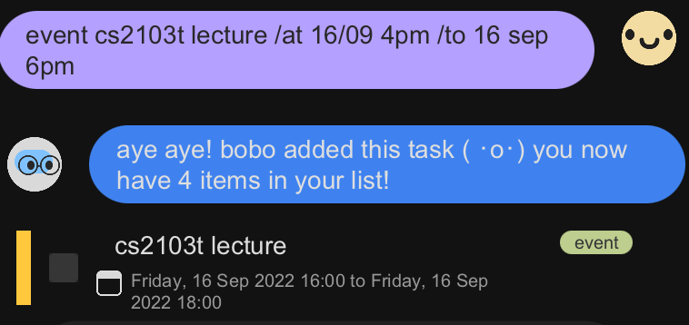
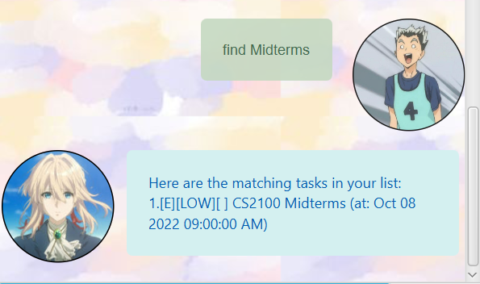

# DukePro User Guide
DukePro is an ALL-IN-ONE task manager application that can help you keep track of all the tasks that you have.

Why should you use DukePro?
1. Easy to Use
2. Comprises of all the information you need
3. Fast
4. Saves your information so that when you return, your tasks are still present!

So what are you waiting for? Download DukePro [here](https://github.com/prit3010/ip) and get started on your tasks!

## Features 

### Todo

Add your Todo.

### Event

Add Event.

### Deadline

Add Deadline.

### Mark

Mark Task completed.

### Unmark 

Unmark Task as uncompleted

### List

List all the Tasks that you have so far!

### Delete

Delete the task that you want to delete

### Find

Find tasks with similar types of task description

### Bye

Exits the application

## Usage

### `Todo` - Adds a Todo task to your list

Format is as such: `todo %s` where `%s` is your task

Example of usage: 

`todo homework`

Expected outcome:

Todo task added to your list!

### `Event` - Adds a Event task to your list

Format is as such: `event %s /at %d` where `%s` is your task  
and `%d` is the date in the format `YYYY-MM-DD`

Example of usage:

`event concert /at 2022-10-12`

Expected outcome:

Event task added to your list with the specified date! 

### `Deadline` - Adds a Deadline task to your list

Format is as such: `deadline %s /by %d` where `%s` is your task  
and `%d` is the date in the format `YYYY-MM-DD`

Example of usage:

`deadline assignment /by 2022-09-20`

Expected outcome:

Deadline task added to your list with the specified date! 
> **Note**
You will not be allowed to add a task with the same description as it will be treated as duplicate.

### `Mark` - Marks specified task as completed

Format is as such: `mark %i` where `%i` is your positive integer corresponding to the task

Example of usage:

`mark 1`

Expected outcome:

The first task is marked as completed.

### `Unmark` - Unmarks specified task as completed

Format is as such: `unmark %i` where `%i` is your positive integer corresponding to the task

Example of usage:

`unmark 1`

Expected outcome:

The first task is marked as incompleted.

### `List` - Lists all the tasks so far

Example of usage:

`list`

Expected outcome:

All the tasks that you have so far is listed.

### `Delete` - Deletes specified task as completed

Format is as such: `delete %i` where `%i` is your positive integer corresponding to the task

Example of usage:

`delete 2`

Expected outcome:

The second task is deleted from the list.

### `Find` - Finds similar tasks based on description

Format is as such: `find %s` where `%s` is the task description you want to find.   The task description does not need to be matching. As long as there is matching segments, it will be returned.

Example of usage:

`find book`

Expected outcome:

All tasks which has the substring book will be shown.

### `Bye` - Exits the Application

Example of usage:

`bye`

Expected outcome:

You exit out of the application. Click the red cross at the top right to close the window.