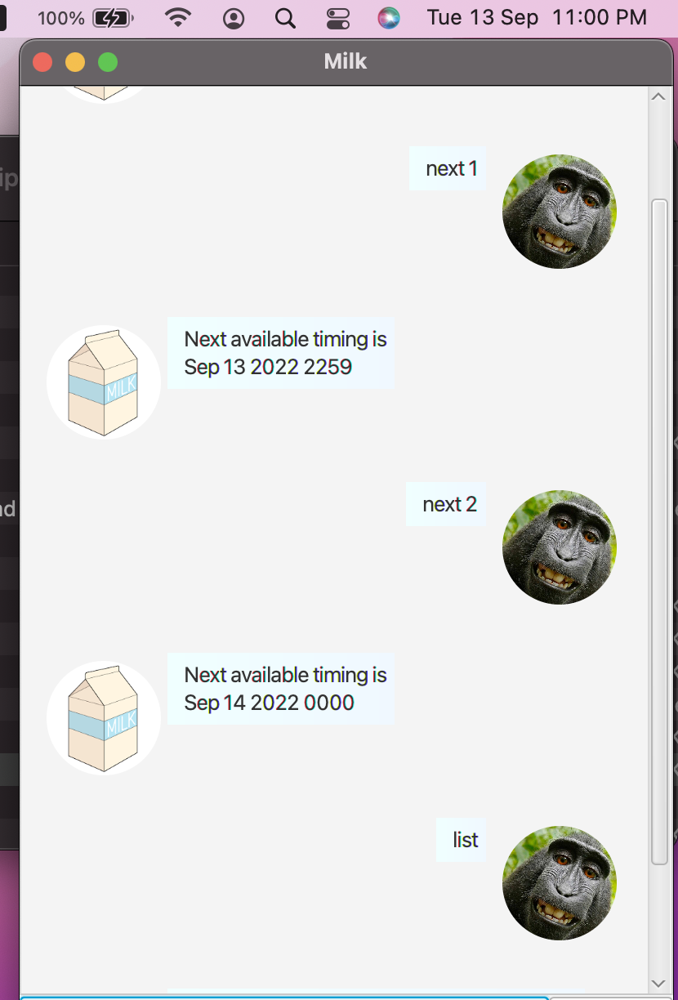

# User Guide
Milk is a desktop application which is primarily used for Graphical user interface(GUI). It is a task management system which allows users to easily add their tasks into the system.

## Features 
There are 3 types of tasks available - ```todo```, ```deadline```, ```event```.

1. Load existing tasks
2. Add tasks:
    - Todo: ```todo```
    - Deadline: ```deadline```
    - Event: ```event```
3. Mark / Unmark tasks 
    - mark: ```mark```
    - unmark: ```unmark```
4. List all added tasks: ```list```
5. Delete task: ```delete```
6. Find keyword in tasks: ```find```
7. Find free times: ```next```
8. Exit the application: ```bye```

### Feature 1 Load existing tasks

The previous tasks you added should be saved automatically in your local computer. After exiting the application and reopening it, the tasks will still be there.

### Feature 2 Add tasks

Adds a task, storing it in the application. Type ```<taskType> <description> <time(if applicable>``` in the textbox and press enter/click send.

Example of usage: 
```
todo <description>
Eg: todo ST2334 Homework
```

Expected outcome:


Example of usage: 
```
deadline <description> /by <date in yyyy/MM/dd HHmm format>
Eg: deadline homework /by 2022/09/14 0000
```

Expected outcome:


Example of usage: 
```
event <description> /at <date in yyyy/MM/dd HHmm format>
Eg: event presentation /at 2022/09/14/1800
```

Expected outcome:


### Feature 3 Mark/Unmark tasks

Marks specific tasks in the list as done.

Example of usage: 
```
mark <index of item starting from 1>
Eg: mark 1

unmark <index of item starting from 1>
Eg: umark 1
```

Expected outcome:


### Feature 4 Delete tasks

Deletes specific tasks in the list.

Example of usage: 
```
delete <index of item starting from 1>
Eg: delete 1
```

Expected outcome:


### Feature 5 List all tasks

List all existing tasks.

Example of usage: 
```
list
```

Expected outcome:


### Feature 6 Find tasks

Search tasks by a given keyword. The returned tasks would be all the tasks that contains the keyword.

Example of usage: 
```
find <description>
Eg: find homework
```

Expected outcome:


### Feature 7 Find free times

Find next free time among the tasks. 

Example of usage: 
```
next <hours of freetime>
Eg: next 1
```

Expected outcome:



### Feature 8 Exit the application
Exits the application after 800ms.

Example of usage: 
```
bye
```

Expected outcome:


