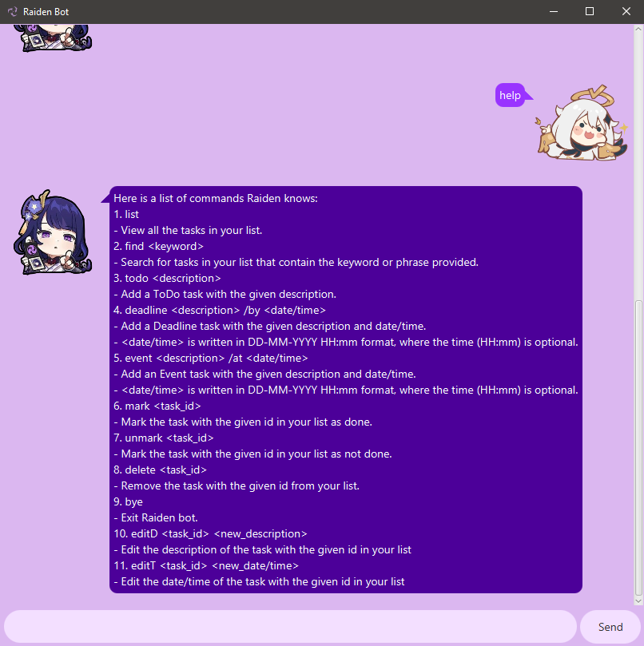
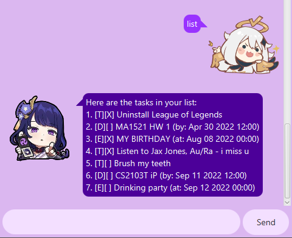
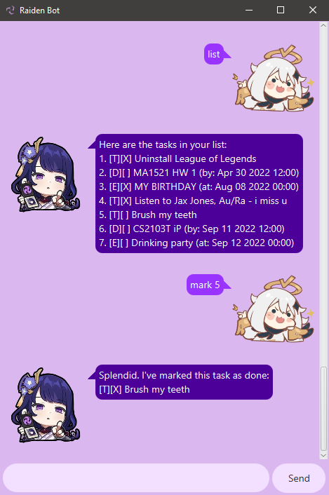
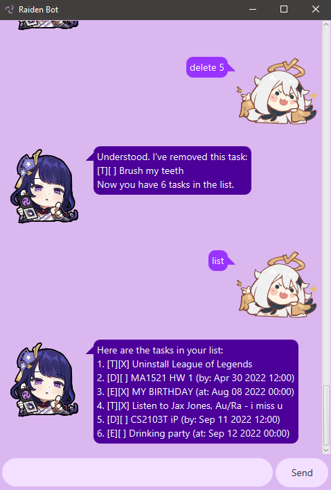
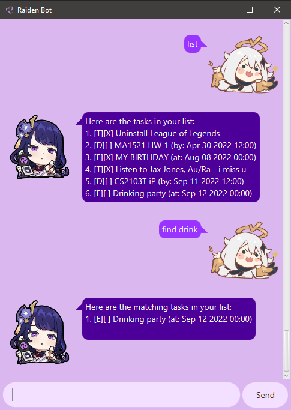
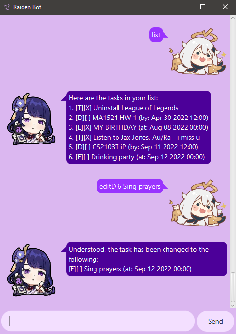
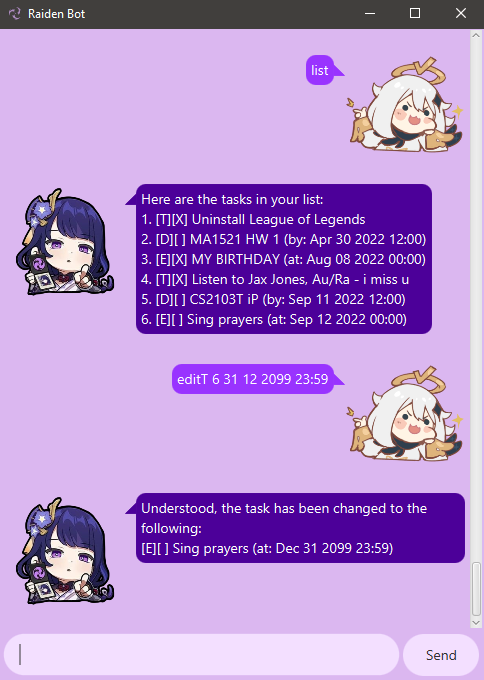

# Raiden Bot User Guide
Raiden is an interactive chat-bot that manages your tasks for you!

# Features
## View Help
Displays a help message with the list of every command Raiden knows, including the description and the syntax to use
the commands.
### Usage
`help` - Displays all the commands available.

<b>Example Usage:</b> 
`help`

<b>Expected Outcome:</b> 
A list of all the commands Raiden knows will be displayed.

## Add Tasks
Adds a new task, which is either a ToDo, Deadline or Event, to the list of tasks.

Tasks have a completion status which indicates if the task has done or not. By default, the task is not completed.

Deadline and Event tasks have date and time information.
### Usage
`todo <description>` - Adds a ToDo task with the given description the task list.

`deadline <description> /by <date/time>` - Adds a Deadline task with the given description and date/time to the task list.

`event <description> /at <date/time>` - Adds a Deadline task with the given description and date/time to the task list.

### Note on Date/Time Format:
The following formats for date/time are available to be typed. Providing the time is optional, and it will be 00:00 by
default. Every alphabet is to be replaced with an integer of value 0-9.
<blockquote>
DD-MM-YYYY HH:mm 
DD/MM/YYYY HH:mm 
DD MM YYYY HH:mm 
DD-MM-YYYY 
DD/MM/YYYY 
DD MM YYYY
</blockquote>

<b>Legend:</b>
- DD - day
- MM - month
- YYYY - year
- HH - hour
- mm - minutes

<b>Example Usages:</b>

`todo Brush my teeth`

<b>Expected Outcome:</b> 
Adds a ToDo task with the description "Brush my teeth"

`deadline CS2103T iP /by 11 09 2022 12:00`

<b>Expected Outcome:</b> 
Adds a Deadline task with the description "CS2103T iP" and deadline at 11 September 2022, 12:00pm.

`event Drinking party /at 12 09 2022` 

<b>Expected Outcome:</b> 
Adds an Event task with the description "Drinking party" with the date at 12 Sep 2022.

## List Tasks
Displays all the current tasks in the list with their descriptions, completion status and date/time (for Deadline and Event tasks).

### Usage
`list` - Displays all the tasks in the list.

<b>Example Usages:</b> 
`list`

<b>Expected Outcome:</b> 
The list of all the current tasks will be displayed.

## Mark Tasks
Marks and displays a task as completed. A task's id is its position in the list.
### Usage
`mark <task_id>` - Marks the task of the given id in the list as completed.

<b>Example Usages:</b> 
`mark 5`

Marks the 5th task in the list as completed.

## Unmark Tasks
Unmarks and displays a task as uncompleted. A task's id is its position in the list.
### Usage
`unmark <task_id>` - Marks the task of the given id in the list as not completed yet.

<b>Example Usages:</b> 
`unmark 5`

<b>Expected Outcome:</b> 
Marks the 5th task in the list as not completed yet.

## Delete Tasks
Removes a task from the list. The task to be removed is indicated by its id, which is its position in the list.
### Usage
`delete <task_id>` - Removes the task of the specified id from the list.

<b>Example Usages:</b> 
`delete 5`

<b>Expected Outcome:</b> 
Deletes the 5th task from the list.

## Find Tasks
Searches for tasks that contain a keyword or phrase specified by the user.
### Usage
`find <keyword>` - Finds tasks with descriptions that match the keyword provided.

<b>Example Usages:</b> 
`find drink`

<b>Expected Outcome:</b> 
Searches for tasks with the keyword "drink" in the description.

## Edit Tasks' Descriptions
Edits the description of a task.
### Usage
`editD <task_id> <new_description>` - Replaces the description of the task of the given id in the list with the new description.

<b>Example Usages:</b> 
`editD 6 Singing prayers`

<b>Expected Outcome:</b> 
Edits and changes the description of the 6th task in the list to "Singing prayers".

## Edit Tasks' Date/Time
Edits the date/time of a deadline or event task.
### Usage
`editT <task_id> <new_description>` - Replaces the date/time of the task of the given id in the list with the new date/time.

<b>Example Usages:</b> 
`editT 6 31 12 2099 23:59`

<b>Expected Outcome:</b> 
Edits and changes the date and time of the 6th task in the list to 31 December 2099, 11:59pm.

## Exit
Closes the bot when user wishes to exit. Say goodbye to Raiden!

### Usage
`bye` / `exit` - Closes the bot immediately with either command.

<b>Example Usages:</b> 
`bye`

`exit`

<b>Expected Outcome:</b> 
Raiden closes.