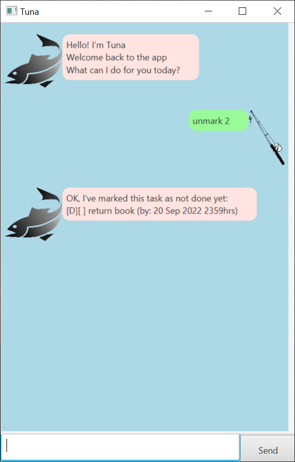
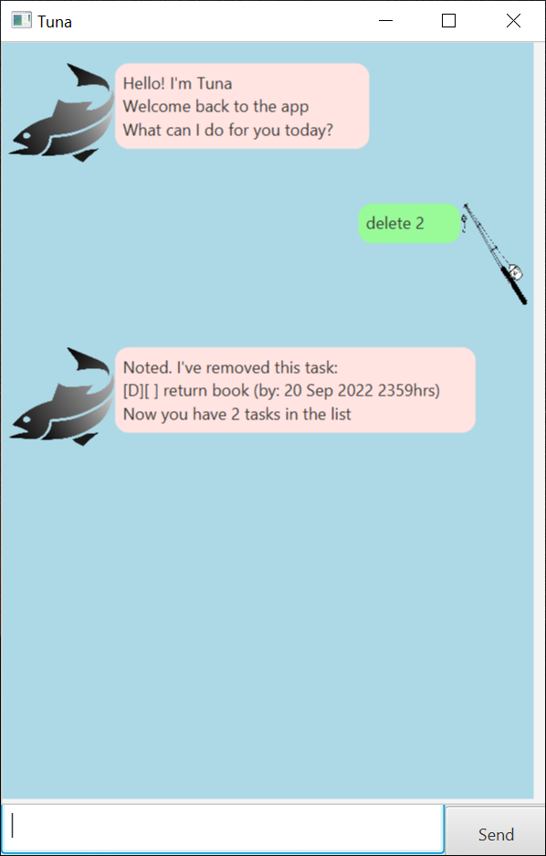

# _Jarvis_ User Guide

_Jarvis_ is a Personal Assistant Chatbot🤖 that helps you to keep track of various tasks so that you won't forget them.

## Features

### Task type support

1. `todo`: A simple task to do, no specified time 
2. `event`: A event with a date and time of occurring
3. `deadline`: A task with a due date 

### Chat box command based 💬

You can use _Jarvis_ simply by entering keywords and descriptions in a message

### Search 🔍
You can look up your tasks easily with `find` command

### Basic CRUD

- Create: Add 3 different type of tasks
- Read: View all tasks you saved in a list
- Update: Mark/Unmark tasks as done/not done yet
- Delete: Remove tasks from your list

### Resizable UI
You can stretch the window vertically to view more message in the same screen

## Usage

_Note: The arguments in the commands below are all required by default, unless specified as optional_

### `todo` - Add a simple todo task

Format: `todo {description}`

Example of usage:
`todo borrow book`

Expected outcome:
- A todo is added to the task list. Jarvis responses with a representation of the todo starting with [T]
- Jarvis tells you how many tasks there are after adding

 
 

### `event` - Add an event with time

Format: `event {description} /at {startTime} ~ {endTime}` 
Optional argument: `{endTime}` 
Date and time format: `yyyy-MM(Month)-dd hh:mm(min)`

Example of usage: 
`event test1 /at 2022-09-09 18:00` 
`event test2 /at 2022-09-09 18:00 ~ 2022-09-09 20:00`

Expected outcome:
- A todo is added to the task list. Jarvis responses with a representation of the event starting with [E]
- The time format shown hh:mm, dd MMM yyyy
- Time of the event is shown in parentheses
- Time for events with starting time only is shown after "at:"  For events with starting and ending time,
starting time is shown after "from:", ending time is shown after "to:"
- Jarvis tells you how many tasks there are after adding

 

 
 

### `deadline` - Add an task with deadline

Format: `deadline {description} /by {date and time}` 
Date and time format: `yyyy-MM(Month)-dd hh:mm(min)`

Example of usage: 
`deadline ddl /by 2022-09-10 18:00` 

Expected outcome:
- A todo is added to the task list. Jarvis responses with a representation of the event starting with [D]
- The time format shown hh:mm, dd MMM yyyy
- Time of the event is shown in parentheses
- Time for events with starting time only is shown after "at:"  For events with starting and ending time,
  starting time is shown after "from:", ending time is shown after "to:"
- Jarvis tells you how many tasks there are after adding

 
 

### `list` - View all the tasks saved
Format: `list`

Example of usage: `list`

Expected outcome:
- You can see all the tasks in the current task list
- Completed tasks will show a "X" in its second square "[X]", meaning the task is done, 
while the second square "[ ]" for incomplete task is empty
- The tasks are grouped by their types, with __deadlines__ on top, __events__ in the middle and __todo__ at the bottom
- __Deadlines__ are sorted by their time from earliest to latest, 
__events__ are sorted by starting time, __todos__ are sorted by the alphabetical order of their description
- Tasks are numbered

 
 

### `mark` - Mark a task as done
Format: `mark {index}`

Example of usage: `mark 2`

Expected outcome:
- The task with the corresponding index is marked as done, as represented by the "X" sign
- Jarvis responses with the full information of the task being marked

 
 

### `unmark` - Unmark a task as not done yet
Format: `unmark {index}`

Example of usage: `unmark 4`

Expected outcome:
- The task with the corresponding index is unmarked, as represented by the " "(empty) sign
- Jarvis responses with the full information of the task being unmarked

 
 

### `delete` - Delete a task from the task list
Format: `delete {index}`

Example of usage: `delete 3`

Expected outcome:
- The task with the corresponding index is deleted from the task list and the database
- Jarvis responses with the full information of the task being deleted

 
 

### `find` - Search for tasks whose description contains the given keyword
_Note: This search is case-sensitive_

Format: `find {keyword}`

Example of usage: `find test`

Expected outcome:
- Jarvis responses with a list of tasks that match the keyword
- The list is displayed in a similar manner when we do `list`

 
 

### `help` - Get help when you start or forget some command format

Format: `help`

Example of usage: `help`

Expected outcome:
- A command summary is displayed, containing all commands and their formats

 
 