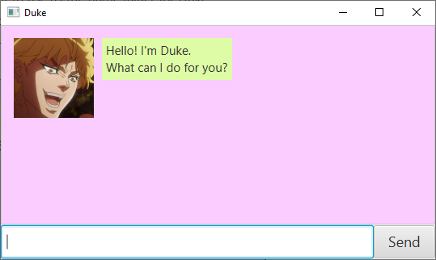
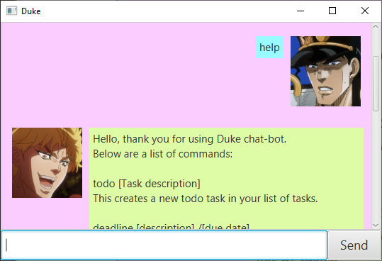

# User Guide for Duke

Duke is a **Command Line Interface (CLI) based application** for managing your tasks. If you are familiar with CLI, 
you will find that this is faster than traditional GUI task managers.

- [Quick start](#quick-start)
- [Features](#features)
  - [Viewing help: `help`](#viewing-help-help)
  - [Listing tasks: `list`](#listing-tasks-list)
  - [Add todo task: `todo`](#add-todo-task-todo)
  - [Add deadline task: `deadline`](#add-deadline-task-deadline)
  - [Add event: `event`](#add-event-event)
  - [Mark task as done: `mark`](#mark-task-as-done-mark)
  - [Unmark done task: `unmark`](#unmark-done-task-unmark)
  - [Delete task: `delete`](#delete-task-delete)
  - [Find task by keyword: `find`](#find-task-by-keyword-find)
  - [Close the app: `bye`](#close-the-app-bye)

- [FAQ](#faq)
- [Command summary](#command-summary)

---

## Quick Start

1. Ensure you have Java `11` or above installed in your Computer.
2. Download the latest `duke.jar` from [here](https://github.com/Bacon-Strips/ip/releases)
3. Copy the file to the folder you want to use as the _home folder_ for Duke.
4. Double-click the file to start the app. The GUI below should appear in a few seconds. 

> If you are experiencing issues with opening the app through double-clicking the file, you may alternatively open it by
>  going into command prompt, navigating to the home folder of the app and using `java -jar duke.jar` to open it.

5. Type the command in the text box and press Enter to execute it. e.g. typing <code><b>help</b></code> and pressing 
Enter will reveal the command guide. 
   
   Some example commands you can try:
   - <code><b>list</b></code>: Lists all your current tasks
   - <code><b>todo</b> Go to the beach with family</code>: Adds a todo task to the list of tasks
   - <code><b>delete</b> 2</code>: Deletes the 2nd task shown in the task list
   - <code><b>bye</b></code>: Exits the app

6. Refer to the [Features](#features) below for detail of each command.

---

## Features

> Notes about the command format:
> - All commands are in `smaller_case`, and are separated from parameters by a white space.
> - Words in `UPPER_CASE` are parameters to be supplied by the user.
> - For commands that do not take in parameters (such as `help`, `list` and `bye`), parameters that follow the command
> will be ignored

### Viewing help: `help`
Shows a message displaying various possible commands and what they do.

Format:`help`

### Listing tasks: `list`

Lists all your current tasks from the app.

Format:`list`

### Add todo task: `todo`

Adds a todo task to your list of tasks. This task will be unmarked when added to the list.

Format: <code><b>todo</b> TASK_DESCRIPTION</code>

Examples:
- <code><b>todo</b> Go to Egypt with grandfather</code>
- <code><b>todo</b> Buy a gift for Mom</code>

### Add deadline task: `deadline`

Adds a deadline task to your list of tasks. This task will be unmarked when added to the list.

Format: <code><b>deadline</b> TASK_DESCRIPTION /YYYY-MM-DD</code>

Examples:
- <code><b>deadline</b> Software Engineering individual project /2022-09-16</code>
- <code><b>deadline</b> Complete tutorial worksheet /2022-09-14</code>

### Add event: `event`

Adds an event task to your list of tasks. This task will be unmarked when added to the list.

Format: <code><b>event</b> TASK_DESCRIPTION /YYYY-MM-DD</code>

>You cannot add an Event that is on the same day as an existing Event.

Examples:
- <code><b>event</b> Examination /2022-10-03</code>
- <code><b>event</b> Birthday party /2022-10-15</code>

### Mark task as done: `mark`

Marks one of the task within your list of tasks by index. Marked task will be indicated by a `X`.

Format: <code><b>mark</b> INDEX_OF_TASK</code>

Example: <code><b>mark</b> 4</code>

### Unmark done task: `unmark`

Unmarks one of the task within your list of tasks by index. Unmarked task will lose their mark `X`.

Format: <code><b>unmark</b> 5</code>

### Delete task: `delete`

Deletes a task from your list of tasks by index.

Example: <code><b>delete</b> 6</code>

### Find task by keyword: `find`

Find tasks based on given keyword. This command will display every task that contain the keyword.

>The keyword is **case sensitive**.

Format: <code><b>find</b> KEYWORD</code>

Example: <code><b>find</b> Finish</code>

### Close the app: `bye`

Exits the application.

Format: `bye`

---

## FAQ
**Q:** How do I transfer my data to another computer?

**A:** After starting the app on the other computer, overwrite their empty data folder with the data folder from 
your previous Duke home folder.

---

## Command summary

| **Command** | **Format** |
| --- | --- |
| <code><b>help</b></code> | `help` |
| <code><b>list</b></code> | `list` |
| <code><b>todo</b></code> | `todo DESCRIPTION` |
| <code><b>deadline</b></code> | `deadline DESCRIPTION /YYYY-MM-DD` |
| <code><b>event</b></code> | `event DESCRIPTION /YYYY-MM-DD` |
| <code><b>mark</b></code> | `mark INDEX` |
| <code><b>unmark</b></code> | `unmark INDEX` |
| <code><b>delete</b></code> | `delete INDEX` |
| <code><b>find</b></code> | `find KEYWORD` |
| <code><b>bye</b></code> | `bye` |
