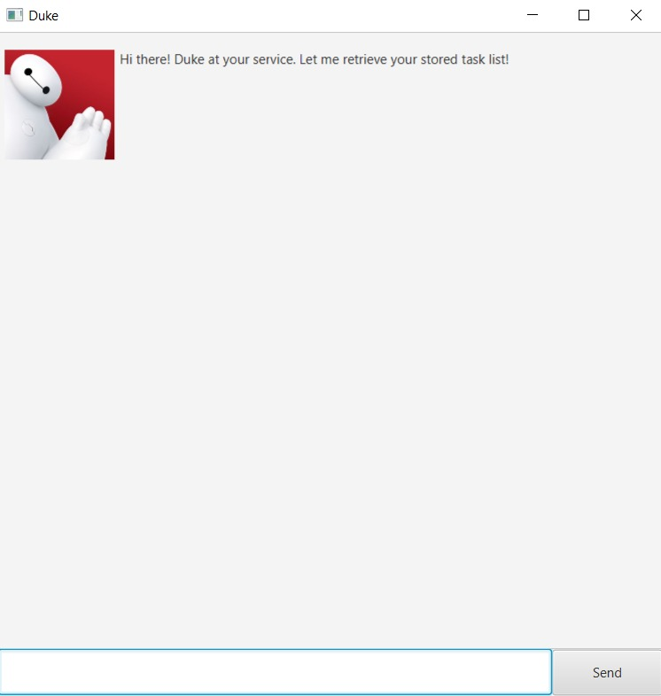
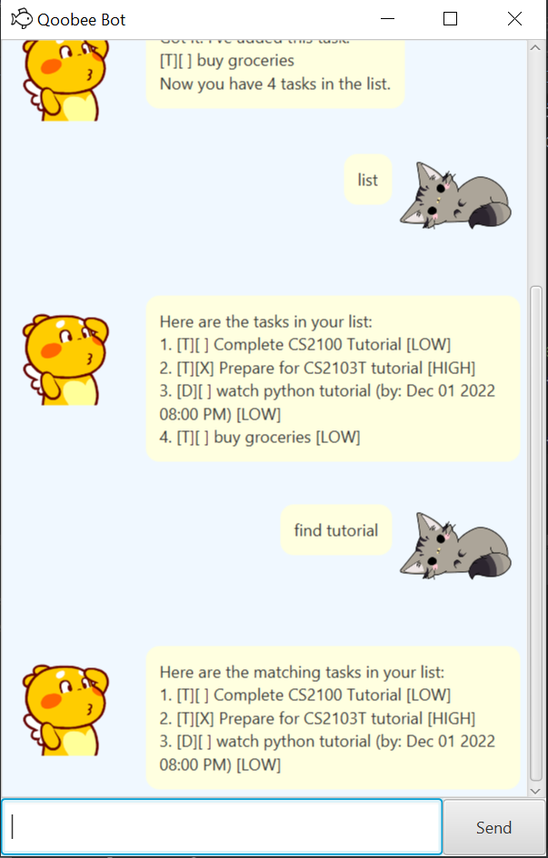

# [Duke](https://github.com/JonathanWiguna/ip)
***

# User Guide
Duke is a Command Line Application to help you manage your tasks better.
- Quick Start Guide
- Features
***

## Quick Start Guide
1. Ensure you have Java `11` or above installed in your Computer.
2. Download the latest `duke.jar` from [here](https://github.com/JonathanWiguna/ip/releases).
3. Copy the file to the folder you want to use as the _home folder_ for your Duke.
4. Double-click the file to start the application. The GUI similar to the one below should appear.

5. Type the command in the input box at the bottom of the window and press Enter to execute it. e.g. typing `list` and 
pressing Enter will show the current list of tasks. Some example commands you can try:
   - `todo read book`: Adds a simple todo task to the task list.
   - `delete 1`: Deletes the 1st task in the current list.
   - `bye`: Saves the current task list into the local storage and exits the app.
6. Make sure to close the app by using the `bye` command instead of by pressing the X button at the top right of the 
window. Closing the app with the X button will not save the changes you made in that session.
7. Refer to the [Features](https://jonathanwiguna.github.io/ip/#features) below for details of each command.
***
## Features 

> **Notes about the command format:**
> - Words in `UPPER_CASE` are the parameters to be supplied by the user. 
> e.g. in `todo DESCRIPTION`, `DESCRIPTION` is a parameter which can be used as `todo do laundry`.

### Adding a ToDo Task: `todo`
Adds a ToDo task to the task list. 
Format: `todo DESCRIPTION` 
Examples:
- `todo cook dinner`
- `todo jog`

### Adding a Deadline Task: `deadline`
Adds a Deadline task to the task list. 
Format: `deadline DESCRIPTION /by DATE TIME`. 
`DATE` must be in `dd/MM/yyyy` format and `TIME` must be in `HHmm` format. 
Examples:
- `deadline return textbook to the library /by 21/12/2022 1700`
- `deadline apply for internship /by 01/01/2023 0800`

### Adding an Event Task: `event`
Adds an Event task to the task list. 
Format: `event DESCRIPTION /at DATE TIME`. 
`DATE` must be in `dd/MM/yyyy` format and `TIME` must be in `HHmm` format. 
Examples:
- `event Ed Sheeran concert /at 24/06/2023 2000`
- `event NUS Career Fair /at 12/10/2022 1400`

### Adding a Recurring Task: `recurring`
Adds a Recurring task to the task list. 
Format: `recurring DESCRIPTION /every DAY /at TIME`. 
`DAY` must be spelled in full, e.g. monday, and `TIME` must be in `HHmm` format. 
Examples:
- `recurring weekly project meeting /every friday /at 1130`

### Listing task list: `list`
Shows all the current tasks in the task list.
Format: `list`

### Finding a task: `find`
Finds the task that fits the given description. 
Format: `find DESCRIPTION`. 
Examples:
- `find textbook`

### Marking a task as done: `mark`
Marks the task at the specified index as done. 
Format: `mark INDEX`. 
Examples:
- `mark 1`

### Marking a task as not done: `unmark`
Marks the task at the specified index as not done. 
Format: `unmark INDEX`. 
Examples:
- `mark 2`

### Deleting a task: `delete`
Deletes the task at the specified index. 
Format: `delete INDEX`. 
Examples:
- `delete 4`

### Exiting the app: `bye`
Exits the app and saves the data to the local storage. 
Format: `bye`

### Saving the data
The task list made by Duke are saved in the hard disk whenever the command `bye` is called.
