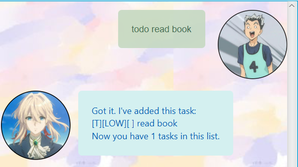
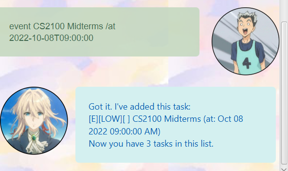
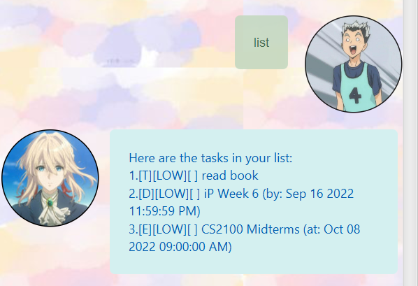
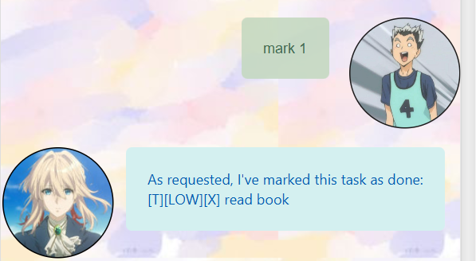

# Violet User Guide
**Violet** is here to help manage and store your tasks!:purple_heart:

**Violet** is an *interactive chat bot* application that helps to **manage and store tasks**, optimized for 
users who are comfortable with **Command Line Interfaces (CLI)** with the benefits of a 
**Graphical User Interface (GUI)**.

# Quick Start
1. Ensure you have Java `11` or above installed in your Computer.
2. Download the latest `violet.jar` from [here](https://github.com/jeromehjj/ip/releases).
3. Copy the file into the folder you want to use as the _home folder_ for Violet.
4. Double-click to start the app. The GUI should be similar to the one shown below after starting.


5. Type the command in the box and press Enter to execute it. e.g. typing `help` and pressing Enter
   will cause Violet to list the supported commands.

Some example commands you can try:
* `list`: Lists all tasks.
* `todo` `<description>`: Adds a task with `<description>` to the list.
* `delete 3`: Deletes the 3rd task shown in the current list.
* `help`: Displays the list of commands Violet supports.
* `bye`: Closes the application.

# Features

## Getting Help from Violet
For new users to Violet, you can get help by entering `help` into the command box to
trigger Violet to list out the commands she understands
### Usage
**`help`- Display a list of commands available.**

Expected outcome:


## Adding Tasks
There are 3 types of tasks that Violet is able to understand.
They are **Todo(s), Deadlines and Events**.

1. **Todo(s)** are tasks that have no date and time specified.
2. **Deadlines** are tasks that have a due date and time.
3. **Events** are tasks that start at a specific date and time.

When tasks are added to the list, the **completion status**
and **priority** of the task will be set to _undone_ and _LOW_ respectively.

To toggle the completion status and priority, refer to the Marking Tasks and Prioritising Tasks
sections found below.

### Usage
**`todo`- Adds the todo task to the list**

Example of usage:`todo read book`

Expected outcome:



**`deadline`- Adds a deadline with a due date and time to the list.**

Example of usage: `deadline iP Week 6 /by 2022-09-16T23:59:59`

Expected outcome:


**`event`- Adds an event that starts at a specific date and time to the list.**

Example of usage: `event CS2100 Midterms /at 2022-10-08T09:00:00`

Expected outcome:



### Notes about the date/time format
There is only 1 format that Violet recognises for specifying a date and
time of an **event** or a **deadline**.

Format: `YYYY-MM-DDTHH:mm:ss`

Legend:
```
Y - Year
M - Month
D - Day
H - Hour
m - minute
s - second
```

## Listing Tasks
In order to keep track of the numerous tasks that Violet has been asked to manage, you can request Violet
to list down the tasks that she has remembered using the `list` keyword.

### Usage
**`list`- Shows the list of tasks**

Example of Usage: `list`

Expected outcome:



## Finding Tasks
Violet can help you find tasks in the list by specifying the keyword that you want Violet to search for.

### Usage
**`find [KEYWORD]`- Finds the task with the given keyword**

Example of Usage: `find Midterms`

Expected outcome:


### Notes about `KEYWORD`
The keyword to be specified is case-sensitive.

In the example above, doing `find midterms` with a small "m" will result in Violet not being able
to find the task.


## Prioritising Tasks
Violet allows you to set priorities to individual tasks by using the `priority` keyword.

There are 3 levels of priority that can be set - namely **LOW, MEDIUM** and **HIGH**.

In order for Violet to know which priority level and task to change priority,
the **index** and **priority level** must be specified.

### Usage
**`priority [INDEX] [PRIORITY LEVEL]`- Sets the priority of the task to the specified priority level**

Example of Usage: `priority 2 high`

Expected outcome:


### Notes about `PRIORITY LEVEL`
The priority level is not case-sensitive. So, doing `priority 2 HiGh`
or `priority 2 HIGH` will still change the priority of the 2nd task.


## Marking Tasks
When a task is completed, Violet helps you to toggle its completion status by using the `mark` keyword.

Specify the task to be marked as completed by including the index of the task in the current list.

### Usage
**`mark [INDEX]`- Marks the task as completed**

Example of Usage: `mark 1`

Expected outcome:



## Unmarking Tasks
In case you want to mark a task as uncompleted after finding out that there is more to do,
Violet can help you to unmark it by using the `unmark` keyword.

Specify the task to be unmarked by including the index of the task in the current list.

### Usage
**`unmark [INDEX]`- Marks the task as undone**

Example of Usage: `unmark 1`

Expected outcome:


## Deleting Tasks
After completing a task, you might want to remove it from the list. Violet is able to delete a task by
specifying the `delete` keyword.

Specify the task to be deleted by including the index of the task in the current list.

### Usage
**`delete [INDEX]`- Deletes the task from the current list.**

Example of Usage: `delete 1`

Expected outcome:


## Closing the application
To close the application, use the `bye` keyword.

Format: `bye`

## Saving data
Violet saves the data of the current list automatically in the hard disk once the
application closes.

Therefore, there is no need to manually save the data.

However, if you close the application without the `bye` keyword, any changes to the list will not be saved.
