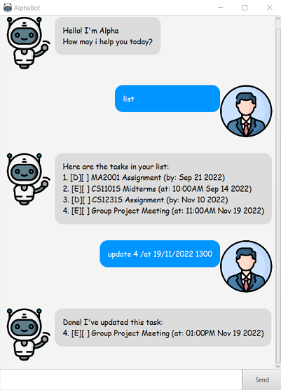

# User Guide

**AlphaBot** is a desktop application that can help you manage a schedule, edit it and stores it for future use. It is super simple and easy to use!

## Quick start

1. Ensure you have Java 11 or above installed in your Computer.

2. Download AlphaBot.jar from [here](https://github.com/L1uY1jun/ip/releases/tag/A-Release) in case you have yet to do so!

3. When you start up the application, a GUI similar to below should appear in a few seconds.  
  

4. There 3 types of tasks you can create on this application:
   * **ToDo**: A task with a short description on the details.
   * **Deadline**: A task with a short description and a due date specified by user.
   * **Event**: A task with a short description and the time and date of the event.

5. Refer to the [Features](#features) section below for more details on the commands available for you to schedule your tasks!

## Features
> **Notes on the features before you get started**
* Words encased in braces `{ }` are `{parameters}` to be input by the user for each command.
* Inputs must follow order and specification of command parameters.   Otherwise the inputs will not be recognised by the bot.
* The date specifier `/by` and datetime specifier `/at` are only specific to [Deadline](#creating-a-deadline-task-deadline) and [Event](#creating-an-event-task-event) tasks respectively. Using them on other types of tasks would result in errors.

### Creating a ToDo task: `todo`
> Creates a task to be done with an optional short description on the details.

Format: `todo {description}` 
Example: `todo Buy lunch`

### Creating a Deadline task: `deadline`
> Creates a task to be done by specified due date with an optional short description on the details.  
> Note that date must be in format: ***dd/mm/yyyy***.

Format: `deadline {description} /by {date}`  
Example: `deadline Assignment /by 21/09/2022`

### Creating an Event task: `event`
> Creates a task specifying date and time of the task with an optional short description of the details.  
> Note that date and time (in 24hr) must be in format: ***dd/mm/yyyy HHmm*** with only one whitespace.

Format: `event {description} /at {date} {time}` 
Example: `event Project group meet up /at 10/11/2022 1000`

### Listing all the tasks: `list`
> List all the task stored on AlphaBot

Format: `list`

### Mark a task as done: `mark`
> Mark the specified task stored on AlphaBot as completed.  
> Note that index must be a positive integer.

Format: `mark {index}`  
Example: `mark 2` --> Marks the 2nd task as done

### Unmark a done task: `unmark`
> Unmarks the specified task stored on AlphaBot as not yet completed.  
> Note that index must be a positive integer.

Format: `unmark {index}`  
Example: `unmark 2` --> Marks the 2nd task as not done yet

### Find tasks using keyword: `find`
> Find and list all tasks which description contains keyword.  
> Note that find is case-insensitive, e.g. "test" will match "TEST".
> Note that keyword need not be full words.

Format: `find {keyword}`  
Examples: `find assignment`  

Demonstration of **find** command:  
  

### Delete a task: `delete`
> Delete the task based on index specified by user input.

Format: `delete {index}`  
Example: `delete 1` --> Delete and remove the 1st task from AlphaBot

### Updating a task: `update`
> Updates a task based on input specified by user. You can choose to update description and/or
> date/datetime.   
> This means that task description/date/datetime can be updated individually. 
> Note that description will not be updated if it is left empty.

Format: `update {index} {description} /by {date}` or `update {index} {description} /at {date} {time}`  
Examples: `update 2 /by 17/12/2022` --> Only updates date of the 2nd deadline task.  
  
Demonstration of **update** command:  
  

### Exits application: `bye`
> Exits the application

Format: `bye`
