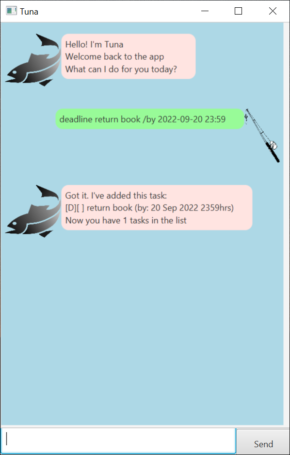
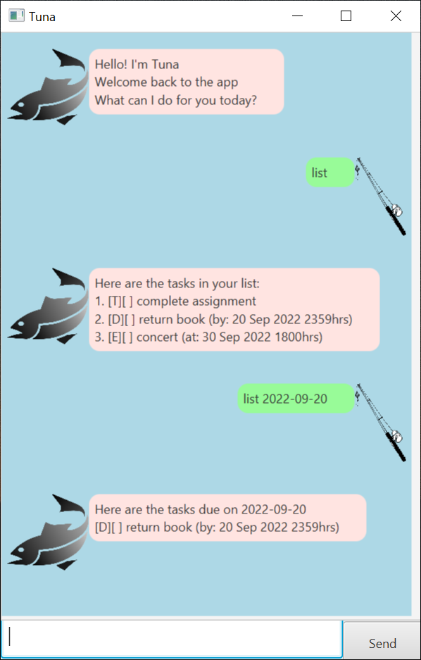
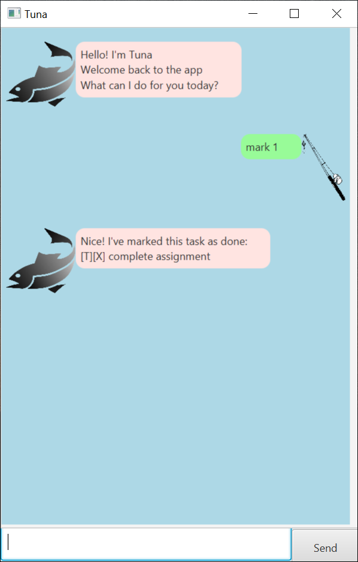
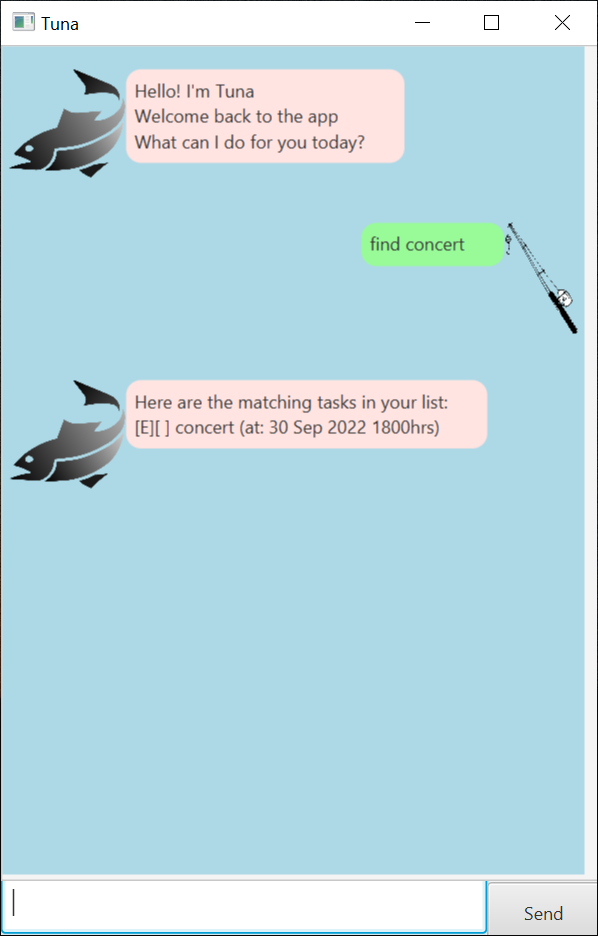

# User Guide
Tuna is a desktop app for managing tasks, optimised for use via a ChatBot GUI.

## Features
1. Add Todo, Deadline and Event tasks.
2. List all tasks.
3. List tasks that occur on a specified date.
4. Delete a task.
5. Mark and Un-mark tasks when they are completed.
6. Sort tasks in chronological order.
7. Find tasks that contain a specified keyword.
8. Load and save data into the hard disk.

## Usage

### Notes about the command format:

- Words in `UPPER_CASE` are the parameters to be supplied by the user. e.g. in todo `TASK_DESCRIPTION`, 
`TASK_DESCRIPTION` is a parameter which can be used as `todo complete assignments`.
- Items in square brackets are optional.
- For commands that involve date and time, the symbols are representated as such:
  - `Y`: Year
  - `M`: Month
  - `D`: Day
  - `H`: Hour
  - `m`: Minute

### Adding a todo task - `todo`

Adds a todo task to the list.

Format: `todo TASK_DESCRIPTION`

Example of usage:

### Adding a deadline task - `deadline`

Adds a deadline task to the list.

Format: `deadline TASK_DESCRIPTION /by DEADLINE_OF_TASK`
- `DEADLINE_OF_TASK` has to be formatted as such: `YYYY-MM-DD HH:mm`

Example of usage:

### Adding an event task - `event`

Adds an event task to the list.

Format: `event EVENT_DESCRIPTION /at DATE_AND_TIME_OF_EVENT`
- `DATE_AND_TIME_OF_EVENT` has to be formatted as such: `YYYY-MM-DD HH:mm`

Example of usage:

### Listing all tasks - `list`

Shows a list of all tasks in the task list.

Format: `list [DATE]`
- If `DATE` is not provided, all tasks will be shown. 
If `DATE` is provided, only tasks that occur on the same date as `DATE` will be shown.

Example of usage:

### Deleting a task - `delete`

Deletes the task at the specified index.

Format: `delete INDEX`
- Deletes the task at the specified `INDEX`.
- The index must be a positive integer.
- The index must be within the range of 1 to the total number of tasks.

Example of usage:

### Marking a task - `mark`

Marks the task at the specified index as done.

Format: `mark INDEX`
- Marks the task at the specified `INDEX`.
- The index must be a positive integer.
- The index must be within the range of 1 to the total number of tasks.

Example of usage:

### Un-marking a task - `unmark`

Un-marks the task at the specified index as done.

Format: `unmark INDEX`
- Un-marks the task at the specified `INDEX`.
- The index must be a positive integer.
- The index must be within the range of 1 to the total number of tasks.

Example of usage:

### Sorting all tasks - `sort`

Sorts all tasks in the task list in chronological order.

Format: `sort`
- Event and Deadline tasks will be sorted to the top of the list, while Todo tasks will be sorted to the bottom.

Example of usage:

### Finding a task - `find`

Finds all tasks which contains the specified keyword.

Format: `find KEYWORD`
- Only the task description is searched
- The search is case-sensitive e.g. `Homework` will not match `homework`.
- Only full words will be matched e.g. `movie` will not match `movies`.

Example of usage:

### Exiting the program - `bye`

Exits the program and saves the data into the data file.

Format: `bye`

### Saving the data

Tuna data are saved in the hard disk automatically after `bye` is entered.

### Editing the data file

Tuna data are saved as a .txt file in `[JAR FILE LOCATION]/data/tuna.txt`
>**Caution**: If your changes to the data file makes it format invalid, Tuna will no longer run 
>To fix this, delete the data file and run the program again, Tuna will create a blank data file.
