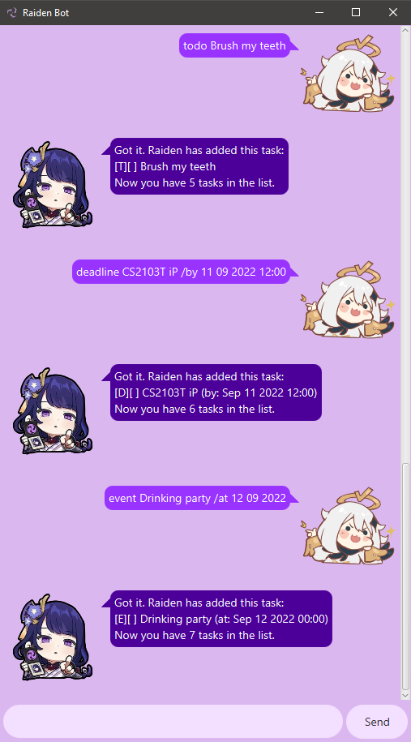

# Raiden User Guide
✨⚡**Raiden is an interactive chat-bot that manages your tasks for you!** ⚡✨ 

⚡**Raiden**⚡ is a **desktop chat-bot app** for **managing and storing tasks**, optimised for use
with the benefits of a **responsive Graphical User Interface (GUI)!** 

# Quick Start
1. Ensure you have `Java 11` installed.
2. Download the latest version of Raiden from [here](https://github.com/HowSuen/ip/releases).
3. Copy the `jar` file to the folder you wish to use for Raiden.
4. Double click the `jar` file to start the app.

# Features
Raiden handles 3 types of tasks:
- **ToDos**: tasks without any date/time attached to it
- **Deadlines**: tasks that need to be done before a specific date/time
- **Events**: tasks that occur at a specific date/time

Your tasks are also automatically saved locally, so you can continue where you left off with your tasks! 
The save file can be located in the same folder with the Raiden `jar` file.

> "Don't try and get me to cook. I can take care of anything else, but not that." - Raiden

## Help with Commands
Displays a help message with the list of every command Raiden knows, including the description and the syntax to use
the commands.
### Usage
`help` - Displays all the commands available.

**Example Usage:** `help` 
**Expected Outcome:** A list of all the commands Raiden knows will be displayed.

## Add Tasks
Adds a new task, which is either a **ToDo, Deadline** or **Event**, to the list of tasks. 
Tasks have a completion status which indicates if the task has done or not. By default, the task is not completed. 
Deadline and Event tasks have date and time information.
### Usage
`todo <description>` - Adds a ToDo task with the given description the task list. 
`deadline <description> /by <date/time>` - Adds a Deadline task with the given description and date/time to the task list. 
`event <description> /at <date/time>` - Adds an Event task with the given description and date/time to the task list.

### Note on Date/Time Format:
The following formats for date/time are available to be typed. Providing the time is optional, and it will be 00:00 by
default. Every alphabet is to be replaced with an integer of value 0-9.
<blockquote>
DD-MM-YYYY HH:mm 
DD/MM/YYYY HH:mm 
DD MM YYYY HH:mm 
DD-MM-YYYY 
DD/MM/YYYY 
DD MM YYYY
</blockquote>

**Legend:**
- DD - day
- MM - month
- YYYY - year
- HH - hour
- mm - minute

**Example Usage:** `todo Brush my teeth` 
**Expected Outcome:** Adds a ToDo task with the description "Brush my teeth"

**Example Usage:** `deadline CS2103T iP /by 11 09 2022 12:00` 
**Expected Outcome:** Adds a Deadline task with the description "CS2103T iP" and deadline at 11 September 2022, 12:00pm.

**Example Usage:** `event Drinking party /at 12 09 2022` 
**Expected Outcome:** Adds an Event task with the description "Drinking party" with the date at 12 Sep 2022.

## List Tasks
Displays all the current tasks in the list with their descriptions, completion status and date/time (for Deadline and Event tasks).

### Usage
`list` - Displays all the tasks in the list.

**Example Usage:** `list` 
**Expected Outcome:** The list of all the current tasks will be displayed.

## Mark Tasks
Marks and displays a task as completed. A task's id is its position in the list.
### Usage
`mark <task_id>` - Marks the task of the given id in the list as completed.

**Example Usage:** `mark 5` 
**Expected Outcome:** Marks the 5th task in the list as completed.

## Unmark Tasks
Unmarks and displays a task as uncompleted. A task's id is its position in the list.
### Usage
`unmark <task_id>` - Marks the task of the given id in the list as not completed yet.

**Example Usages:** `unmark 5` 
**Expected Outcome:** Marks the 5th task in the list as not completed yet.

## Delete Tasks
Removes a task from the list. The task to be removed is indicated by its id, which is its position in the list.
### Usage
`delete <task_id>` - Removes the task of the specified id from the list.

**Example Usages:** `delete 5` 
**Expected Outcome:** Deletes the 5th task from the list.

## Find Tasks
Searches for tasks that contain a keyword or phrase specified by the user.
### Usage
`find <keyword>` - Finds tasks with descriptions that match the keyword provided.

**Example Usage:** `find drink` 
**Expected Outcome:** Searches for tasks with the keyword "drink" in the description.

## Edit Tasks' Descriptions
Edits the description of a task.
### Usage
`editD <task_id> <new_description>` - Replaces the description of the task of the given id in the list with the new description.

**Example Usage:** `editD 6 Singing prayers` 
**Expected Outcome:** Edits and changes the description of the 6th task in the list to "Singing prayers".

## Edit Tasks' Date/Time
Edits the date/time of a deadline or event task.
### Usage
`editT <task_id> <new_description>` - Replaces the date/time of the task of the given id in the list with the new date/time.

**Example Usages:** `editT 6 31 12 2099 23:59` 
**Expected Outcome:** Edits and changes the date and time of the 6th task in the list to 31 December 2099, 11:59pm.

## Exit
Closes the Raiden chat-bot when user wishes to exit. Say goodbye to Raiden!

### Usage
`bye` / `exit` - Closes the chat-bot immediately with either command.

**Example Usages:**`bye` or `exit` 
**Expected Outcome:** Raiden closes.