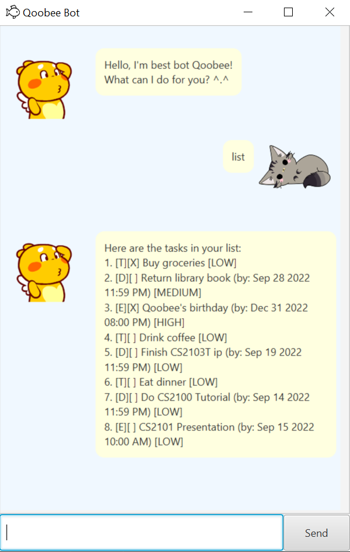

# Qoobee User Guide
>"Deciding what NOT to do is as important as deciding what to do." - Steve Jobs [(source)](https://www.linkedin.com/pulse/deciding-what-do-important-steve-jobs-alex-tsouloftas#:~:text=%E2%80%9CDeciding%20what%20not%20to%20do,what%20to%20do%E2%80%9D%20%2D%20Steve%20Jobs)

🤩Qoobee🤩 is a **chatbot app for managing and storing tasks, optimised 
for used via a command line interface** (CLI) while
still having the benefits of a Graphical User Interface (GUI).

## Quick Start
1. Ensure you have Java `11` installed.
2. Download the latest version of Qoobee [here](https://github.com/CedricChia123/ip).
3. Copy the `jar` file to the folder you would like to use Qoobee in.
4. Double click the `jar` file to run it.

## Features 
Qoobee records 3 types of tasks:

- ToDos: Tasks that do not have a specific due date.
- Deadlines: Tasks to be done before a specified date and time.
- Events: Tasks that will occur at a date and time.

Qoobee saves the list of tasks as a `.txt` file in the same folder
location, which can be loaded the next time you reopen
the app!

In addition to recording tasks, Qoobee has features to mark and unmark
tasks as completed/not completed, along with marking the priority
level of each task.

## Add Tasks

Adds a Todo, Deadline or Event task to the list, represented
by `[T]`, `[D]` or `[E]` respectively.
By default, each task will be marked as undone in the checkbox
beside it. The default priority level of each task is `LOW` as well.

### Usage
`todo <description>` - Adds a ToDo with description to the task list.  
`deadline <description> /by <date/time>` - Adds a Deadline with specified description
and date/time to the task list.  
`event <description> /by <date/time>` - Adds an event with the
specified description and date/time to the task list.

### Date/Time format
Qoobee supports the following date/time formats:

- `yyyy-MM-dd HH:mm`

- `yyyy-MM-dd` (if time is not specified, default time will be 12:00 AM)

Example usage: `todo Eat dinner`  
Expected Outcome: adds a ToDo task with description "Eat dinner".

Example usage: `deadline Do CS2100 Tutorial /by 2022-09-14 23:59`  
Expected Outcome: adds a deadline task with description "Do CS2100 Tutorial" and
date/time of 14 September 2022, 11:59 PM

Example usage: `event CS2101 Presentation /at 2022-09-15 10:00`  
Expected Outcome: adds an event task with description "CS2101 Presentation" and date/time
of 15 September 2022, 10:00 AM

## List Tasks
Lists the tasks that are currently in the task list. 

### Usage
`list` - Displays the list of tasks.

## Mark Tasks
Marks the task given a specified index in the task list.

### Usage
`mark INDEX` - Marks the task of the given index as completed.

Example usage: `mark 3`  
Expected Outcome: marks the 3rd task in the task list as completed.

## Unmark Tasks
Unmarks the task given a specified index in the task list.

### Usage
`unmark INDEX` - Unmarks the task of the given index as not done.

Example usage: `unmark 3`  
Expected Outcome: unmarks the 3rd task in the task list as not done.

## Prioritise Tasks
Sets the priority of the task at a specified index in the task list to be
low, medium or high. By default, all tasks will have low priority
upon creation.

### Usage
`priority INDEX <low>` - Changes the priority of the task of the given index as low.  
`priority INDEX <medium>` - Changes the priority of the task of the given index as medium.  
`priority INDEX <high>` - Changes the priority of the task of the given index as high.

Example usage: `priority 3 low`  
Expected Outcome: changes the priority of the 3rd task to low.  

Example usage: `priority 1 medium`  
Expected Outcome: changes the priority of the 1st task to medium.

Example usage: `priority 5 high`  
Expected Outcome: changes the priority of the 5th task to high.

## Delete Tasks
Deletes the task given a specified index of the task list.

### Usage
`delete INDEX` - Deletes the task at the given index.

Example usage: `delete 2`  
Expected Outcome: deletes the 2nd task in the task list.

## Find Tasks
Finds the task in the task list given a keyword.

### Usage
`find <keyword>` - Finds the task with the given keyword.

Example usage: `find buy`  
Expected Outcome: the list of tasks with keyword "buy" will be displayed.

## Exit
Exits the chatbot. Thanks for hanging out with Qoobee!

### Usage
`bye` - Exits the chatbot app.

Example usage: `bye`  
Expected Outcome: exits the chatbot app.