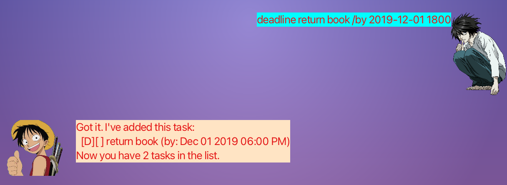

# User Guide

This is Duke, a chat bot to help you track your tasks.

## Features 

- Adding a Todo task: `todo`
- Adding an Event task: `event`
- Adding a Deadline task: `deadline`
- Listing all tasks : `list`
- Locating task by keyword: `find`
- Deleting a task : `delete`
- Marking a task as done: `mark`
- Marking a task as not done: `unmark`
- Tagging a task: `tag`
- Exiting the program : `bye`

### `todo DESCRIPTION` - Adds a todo task with the specified description.

Example of usage: 

`todo TODO EXAMPLE`

Expected outcome:

```

```
### `event DESCRIPTION /at DATE` - Adds an event task with the specified description and date.
- Ensure date is in format <YYYY-MM-DD>

Example of usage:

`event EVENT EXAMPLE /at 2022-04-20`

Expected outcome:

```

```

### `deadline DESCRIPTION /by DATE` - Adds a deadline task with the specified description and date.
- Ensure date is in format <YYYY-MM-DD>

Example of usage:

`deadline DEADLINE EXAMPLE /by 2022-04-20`

Expected outcome:

```

```

### `list` - Lists all tasks currently saved in the list.

Example of usage:

`list`

Expected outcome:

```

```

### `find KEYWORD` - Returns a list of tasks containing the keyword specified.

Example of usage:

`find Bob`

Expected outcome:

```

```

### `delete INDEX` - Deletes the task in the list at that given index.

Example of usage:

`delete 4`

Expected outcome:

```

```

### `mark INDEX` - Marks the task as done in the list at that given index.

Example of usage:

`mark 2`

Expected outcome:

```

```

### `unmark INDEX` - Marks the task as not done in the list at that given index.

Example of usage:

`unmark 2`

Expected outcome:

```

```

### `tag INDEX #HASHTAG` - Tags a task with a #hashtag at that given index.

Example of usage:

`tag 2 #TheFirstBob`

Expected outcome:

```

```

### `bye` - Saves your current list and then closes the program.

Example of usage:

`bye`

Expected outcome:

```
The program terminates by itself.
```

