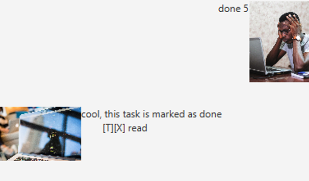

# User Guide
Introducing RoboTask, our friendly robot that helps you manage and keep track of your tasks 

## Features 

### GUI Based Application

Simple to use GUI-Based command line experience

### Task flexibility

Compatible with 3 types of tasks - Todos, Deadlines, and Events.

### Easy task management
Add, delete, find and mark tasks as complete with simple commands

## Usage

### `list` - Displays list of tasks

Example of usage: 

`list`

Expected outcome:

RoboTask provides a list of tasks

### `todo` - Creates a new todo task

Example of usage:

`todo ES2660 Assignment`

Expected outcome:

RoboTasks creates a new todo

### `deadline` - Creates a new deadline

Creates a new deadline task with a provided date and time

Example of usage:

`deadline Assignment /by 2022-09-20 23:59`

Expected outcome:

RoboTask creates a new deadline

### `event` - Creates a new event

creates a new event with a provided date and time

Example of usage:

`event homecoming /at 2022-02-02 12:00`

Expected outcome:

Robotask creats a new event

### `delete` - Deletes a task from the list

Example of usage:

`delete 3`

Expected outcome:

Robotask deletes the task

### `done` - Marks a task as complete

Example of usage:

`done 2`

Expected outcome:

RoboTask marks a task as complete

### `find` - Finds tasks with names matching keywords

Finds any tasks with keyword provided.

Example of usage:

`find homework`

Expected outcome:

Robotask finds tasks with matching keyword

### `view` - Views the schedule of each day

Finds any task scheduled on a specified date

Example of usage:

`keyword (optional arguments)`

Expected outcome:

RoboTask shows the tasks occuring on the date

