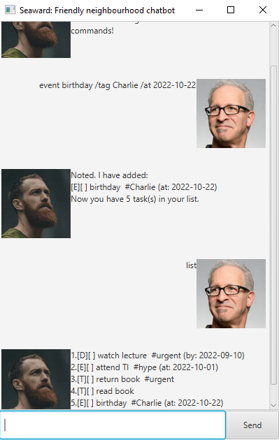

# User Guide
Duke is a Command Line Interface (CLI) based chatbot with a simplistic GUI 
which helps you keep track of different tasks, such as things to do, 
events and deadlines.



- [Getting Started](#getting_started)
- [List of Commands:](#commands)
    - [Add a todo task: `todo`](#todo)
    - [Add a deadline task: `deadline`](#deadline)
    - [Add an event task: `event`](#event)
    - [List all tasks: `list`](#list)
    - [Mark a task as done: `mark`](#mark)
    - [Mark a task as not done: `unmark`](#unmark)
    - [Delete a task: `delete`](#delete)
    - [Find tasks by keyword: `find`](#find)
    - [Exit the program: `bye`](#bye)

# Getting Started <a name="getting_started"></a>
- Ensure you have Java 11 or above installed.
- Download the latest jar from [here](https://github.com/ConradLew/ip/releases/).
- Copy the file to a home folder for the chatbot.
- Double-click the file to start the app. A GUI similar to the one above should 
appear shortly.
- Type your desired commands (See [List of Commands](#commands)) into the textbox.

# List of Commands <a name="commands"></a>

## Add a todo : `todo TASK_DESCRIPTION` <a name="todo"></a>
Adds a task to the list with the specified `TASK_DESCRIPTION`.

**Example:**
```
todo feed cat
Task added. You now have 1 tasks in the list.
```

## Add a deadline : `deadline TASK_DESCRIPTION /by DATETIME` <a name="deadline"></a>
Adds a task with the specified `TASK_DESCRIPTION` and deadline `DATETIME`.
Note that the format of `DATETIME` is as follows: `yyyy-mm-dd`.

**Example:**
```
deadline submit assignment /by 2022-09-15
Task added. You now have 2 tasks in the list.
```

## Add an event: `event TASK_DESCRIPTION /at EVENT_TIME` <a name="event"></a>
Adds an event with the specified `TASK_DESCRIPTION` occurring at `EVENT_TIME`.
Note that the `EVENT_TIME` does not have to follow the `yyyy-mm-dd` format and
can be freely specified.

**Example**:
```
event book fair /at 4pm
Task added. You now have 3 tasks in the list.
```

## List all tasks: `list` <a name="list"></a>
Display all the tasks currently in the task list.

**Example:**
```
list
Here are the tasks in your list:
1. [T][] feed cat
2. [D][] submit assignment (by: Sep 15 2022)
3. [E][] book fair (at: 4pm)
```

## Mark a task as done: `mark TASK_NUMBER` <a name="mark"></a>
Marks the task with the given `TASK_NUMBER` as specified by `list` as done.

**Example:**
```
mark 1
Nice! I've marked task 1 as done.

list
1. [T][X] feed cat
2. [D][] submit assignment (by: Sep 15 2022)
3. [E][] book fair (at: 4pm)
```

## Mark a task as not done: `unmark TASK_NUMBER` <a name="unmark"></a>
Marks the task with the given `TASK_NUMBER` as specified by `list` as not done.

**Example:**
```
list
1. [T][X] feed cat
2. [D][] submit assignment (by: Sep 15 2022)
3. [E][] book fair (at: 4pm)

unmark 1
OK, I've marked task 1 as not done yet.

list
1. [T][] feed cat
2. [D][] submit assignment (by: Sep 15 2022)
3. [E][] book fair (at: 4pm)
```

## Delete a task: `delete TASK_NUMBER` <a name="delete"></a>
Deletes the task with the given `TASK_NUMBER`

**Example:**
```
delete 2
Noted. I've removed task 2.
Now you have 2 tasks in the list.

list
1. [T][] feed cat
2. [E][] book fair (at: 4pm)
```

## Find tasks matching query: `find QUERY` <a name="find"></a>
Displays all tasks with descriptions that match (case-sensitive) the given `QUERY`.

**Example of usage:**
```
find cat
Here are the matching tasks in your list:
1. [T][] feed cat
```

## Exit the program: `bye` <a name="bye"></a>
Closes the chatbot.